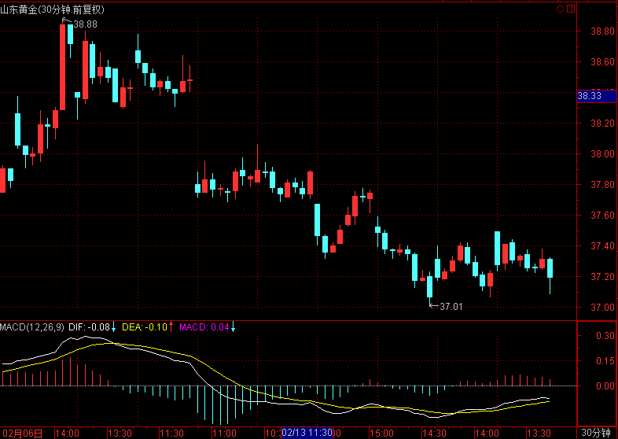

# 2017.2.17 交易总结

------

## 大盘走势

今天大盘在高位走出大幅阴线，早上跳空低开开盘在3227.71点，然后随证券板块拉升到日内最高3238.40点，再开始单边下跌，最低跌至3199.42点，最终收盘3202.08点，全天下跌-27.54点，跌幅-0.85%，总成交额为2485.73亿元，比昨天放大。今天的阴线将前面三根小幅度K线吞没，形成短期顶部形态，后市向下运行的概率较大。

## 交易情况

账户情况：

成交情况：

账号当天盈亏：-1.3%，累计盈亏：-13.5%

------

600547 山东黄金前一天买入，高开后没有及时卖出，之后小反弹后卖出，只赚了几个价位。山东黄金还在下降通道，走得比较弱，所以即使价格相对较低，但仍然较难盈利。

------

603800 道森股份在开盘走强、小回调时买入，在35.77买入。买入时是前面一波走势的合适位置，但放眼全天，就不合适了，当天大盘在11点后开始了单边下跌，所以个股普遍伴随着下跌一波。而道森股份在后面仍然能收阳线，是买入股票中较强的品种。

------

002797 第一创业是券商板块股票。券商板块在开盘后走得较强，在回调至均价线下，觉得不能下跌时买入。买入后价格持续下跌，收盘时再跌去了1块多。第一创业在券商板块当天属于中下强度的股票，前面一波上涨较快，之后全部升幅都收回，周一出现反弹时可以考虑卖出。

------

000672上峰水泥在前一天12.44价位抄底买入，但周五低开并且低走，于是马上卖出。之后有反弹回成本附近，后面随大盘继续下跌，走得比较弱。在30分钟周期是一个三角形走势，目前靠近顶点附近，需要选择方向。

------

300023 宝德股份在前一天形成疑似双底二次确认形态，但今天开盘就开始走弱，于是在18.90卖出。宝德股份在日线上还处在下降通道，在年线和半年线下方，属于较弱的品种，应该等其站上年线，或者开始转为上升时再介入。

------

000786 北新建材这两天都没什么行情，波动较小，开盘冲高回落时卖出。

------

002140 东华科技开盘后走得较强，在回踩均价线转头向上时在15.05买入。结果当时大盘开始下跌，之后价格下跌了2%，之后有重新拉高，收盘在14.91。

------

000776 广发证券在开盘时随证券板块上涨了一波，之后跌破均价线，下跌转头时，在18.20买入，但之后一直走弱，最后收盘收在接近最低价的17.84，浮亏比较大。

------

300313 天山生物今天跳空低开并低走，于是开盘后就卖出，卖出价格19.70。之后价格一直走低，最低至19.01。但个股走势仍然健康，在19附近形成了5分钟底背驰。

------

002105 信隆健康是今天买得比较失败的票。开盘走强时在13.23介入，以为13.00附近是近期的一个低位，能形成支撑，结果买入后一直走弱，最低跌至12.65，浮亏了4个多点。

------

000878云南铜业在开盘略微拉升、回踩均价线后买入，但买入后随大盘下跌了一波，尾盘仍然收在当天的靠低位附近。个股的买入时间没有契合大盘的走势，导致在一个很小级别的反弹中介入，从而没有成本优势。

------

002599 盛通股份前一天收盘前已经走弱，今天继续低开低走，开盘继续下跌时就在41.71卖出。

------

## 交易总结

今天最大的感受是：靠近顶部时，要非常注意大盘走势。今天的自选股走势基本随大盘一致，大盘从顶点下跌1%的过程中，很多个股都有2-3%的跌幅，早盘较强的股票在收盘时很多都转为绿色。现在回头看，今天早盘走强的证券等板块是卖点而非买点，大盘下跌的过程中，没有看到站稳迹象时，不应该买入股票，观望反而是更好的选择。

今天大盘在30分钟周期已经可以看到呈顶背驰的状态，越往上涨，下跌的可能越大。到3238的时候，开始一波单边下行的走势。但在盘中看个股时，并未能及时察觉，部分在早上买入的股票，到下午已经下跌了一段。

今天得到的教训是：

1. 开盘后半小时到一小时内不买入股票，除非在交易计划中已经写好需要开盘抢入的股票。在这段时间需要先处理手头的股票，大盘冲高时先卖出个股。
2. 买入时机：
  - 买入当天上涨股票：在个股的买入前，要选择开始走强，并能出现回调到均价线附近走势的个股，不要直接追入；
  - 买入均价线下方，当天形成二次低位的股票；
  - 买入的逻辑只有一个：买在当天接近最低价位附近

## 交易计划

- 大盘午后走了一段单边下跌，开盘出现反弹的话先处理手头的股票，明确大盘走势后，再买入。

- 开盘一小时内不买入股票。

- 重新选择走势较强的自选股。

