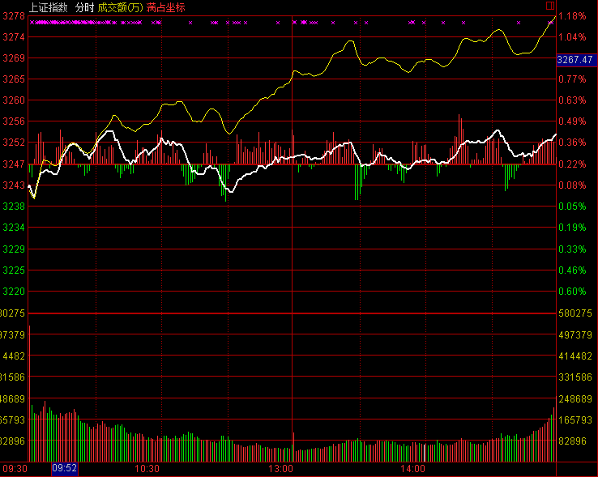

# 2017.2.21 交易总结

------

## 大盘走势

今天大盘在高位走出大幅阴线，早上跳空低开开盘在3227.71点，然后随证券板块拉升到日内最高3238.40点，再开始单边下跌，最低跌至3199.42点，最终收盘3202.08点，全天下跌-27.54点，跌幅-0.85%，总成交额为2485.73亿元，比昨天放大。今天的阴线将前面三根小幅度K线吞没，形成短期顶部形态，后市向下运行的概率较大。

## 交易情况

账户情况：

成交情况：

账号当天盈亏：0.1%，累计盈亏：-13.8%

------

002466 天齐锂业在30分钟出现买入信号，价格站在5日和10日均线上，在34.49买入。

------

000401 冀东水泥在前天就出现买入信号，今天继续还有上涨，在14.61买入。今天开盘水泥有走强的迹象，等回调就买入了，但买入后全天横盘。

------

600585 海螺水泥在今天早盘时走强，在回调时于20.81买入。之后一直走低，下跌一个点。

------

600188 兖州煤业开盘出现了30分钟周期的买点，在11.11买入，中间有一个迅猛的拉升，随后回落，收盘涨不到1%。

------

601020 华钰矿业今天在30分钟周期出现买入信号，在35.45买入，之后一直单边上涨。这只股票是今天买入的多只股票中涨势最好的一个。

------

600295 鄂尔多斯属于有色小金属板块，最近都比较活跃。今天早上出现买入信号，在10.57买入，买入后价格没有波动，基本平盘。

------

002182 云海金属是昨天尾盘出现30分钟的买点，价格区域在18.10-18.20，今天开盘就拉升，后面在平盘时买入，买入价格18.62。

------

## 今天异动股票

300175 朗源股份，开盘后持续强势，之后拉到涨停。关注到时已经升到15以上，超过5%的涨幅，所以没有追入。

300466 赛摩电气今天涨停，关注到时也是涨了很多，不敢追高。

600188 兖州煤业中间一度拉升到超过4%，之后回落。

## 交易总结

- 今天大盘领先比大盘强，走势在午后持续扩大，今天中小板涨得较好。

- 今天大盘走强，所以选择了持续买入

- 所有的买入都根据30分钟周期的动量信号买入股票

- 昨天的讨论后，选择酒类、机械、船舶、建材、家用电器、煤炭钢铁等几个板块的强势股票作为自选股

## 交易计划

- 明天大盘可能走出背驰段，需要密切关注5分钟周期的走势

- 盘后继续筛选可能在30分钟出现买点的股票，放入明天的盘中监控，重点关注

- 开盘1小时，股票有冲高并出现回落迹象的，可以先卖出，低位重新接回

- 继续检验选股+动量信号的结合，可以复用自己之前的交易经验

