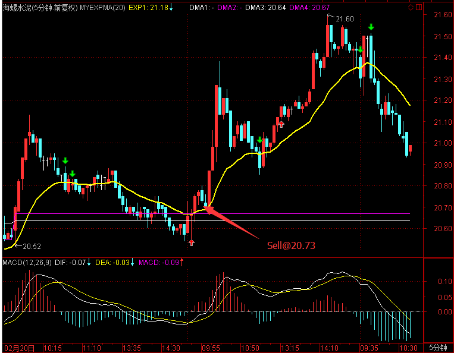

# 2017.2.22 交易总结

------

## 大盘走势

大盘仍然是高位震荡，开盘在3252.69点，盘中最低回落到3243.84点，下午建材板块带动向上，尾盘接近最高收盘，收盘在3261.22点，全天上涨7.89点，涨幅0.24%，总成交额变化略有减少2348.15亿元。大盘目前仍是高位震荡，并且尾盘强势收光头小阳，并且在收盘前30分钟仍然继续往上，后市预期较强。

## 交易情况

账户情况：

成交情况：

账号当天盈亏：0.1%，累计盈亏：-13.8%

------

601020 华钰矿业在涨停时见到快要打开前卖出，在38.90接回。

------

000401 冀东水泥在开盘拉升回头时卖出，卖出价格14.96。从后续的行情看，今天是建材板块的活跃日，水泥相关股票都大涨，卖出有点早。

------

600585 海螺水泥在今天早盘时走走弱，在20.73卖出了。卖出后上涨了一波大的，太急着卖出导致错过了一波行情。

------

600188 兖州煤业开盘平盘，跌破均线时在11.13平仓。

------

600702 沱牌舍得在尾盘25.11买入

------

600295 鄂尔多斯没有波动，在10.59卖出。

------

002182 云海金属开盘冲高过程中卖出，卖得过早，卖。

------

## 今天异动股票

300175 朗源股份，开盘后持续强势，之后拉到涨停。关注到时已经升到15以上，超过5%的涨幅，所以没有追入。

300466 赛摩电气今天涨停，关注到时也是涨了很多，不敢追高。

600188 兖州煤业中间一度拉升到超过4%，之后回落。

## 交易总结

- 大盘仍然强势，感觉离调整越来越近，控制了买入的数量。

- 板块很重要，踩准板块的节奏比较难，但持续地关注，可以慢慢培养出对的感觉。

## 交易计划

- 明天大盘可能走出背驰段，需要密切关注5分钟周期的走势

- 盘后继续筛选可能在30分钟出现买点的股票，放入明天的盘中监控，重点关注

- 开盘1小时，股票有冲高并出现回落迹象的，可以先卖出，低位重新接回

- 继续检验选股+动量信号的结合，可以复用自己之前的交易经验

