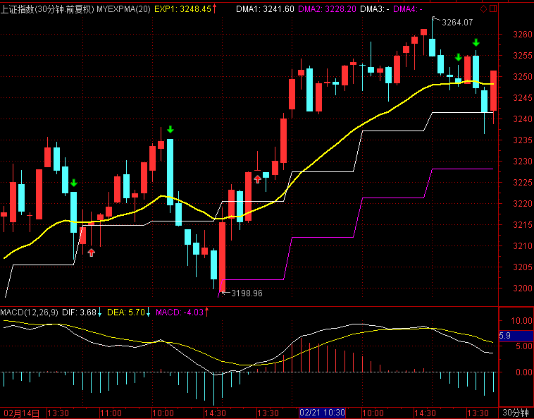
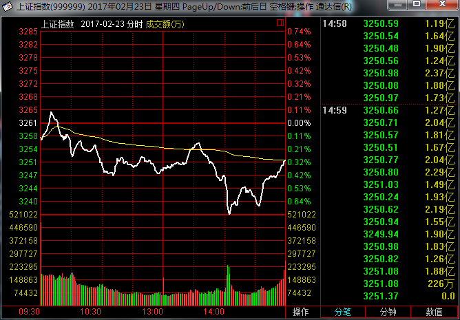
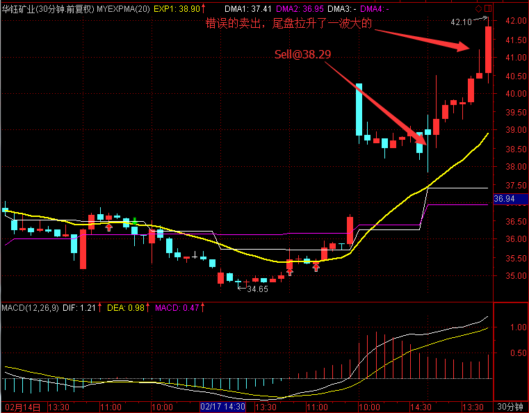
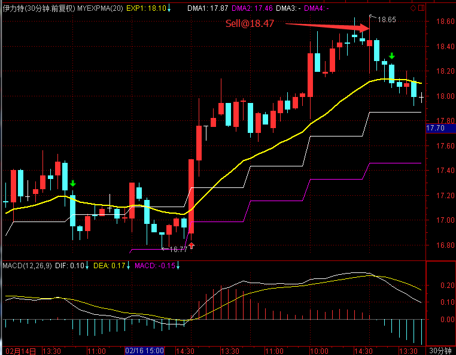
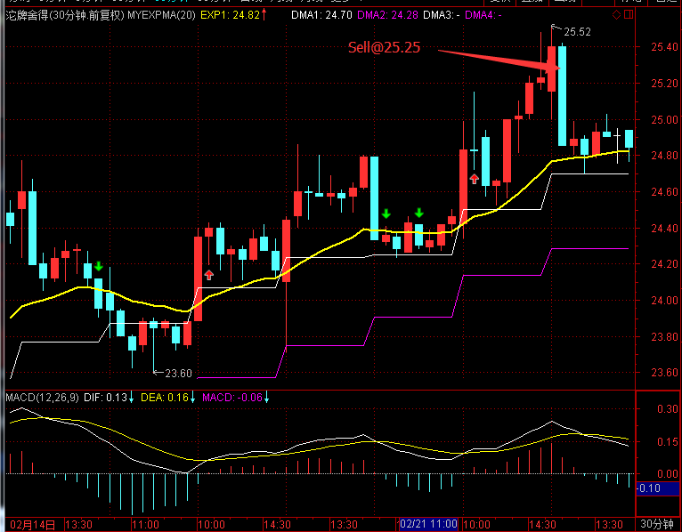
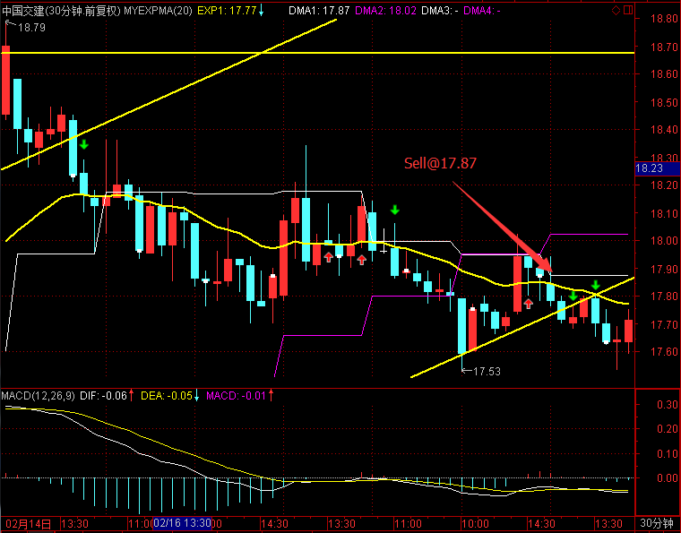
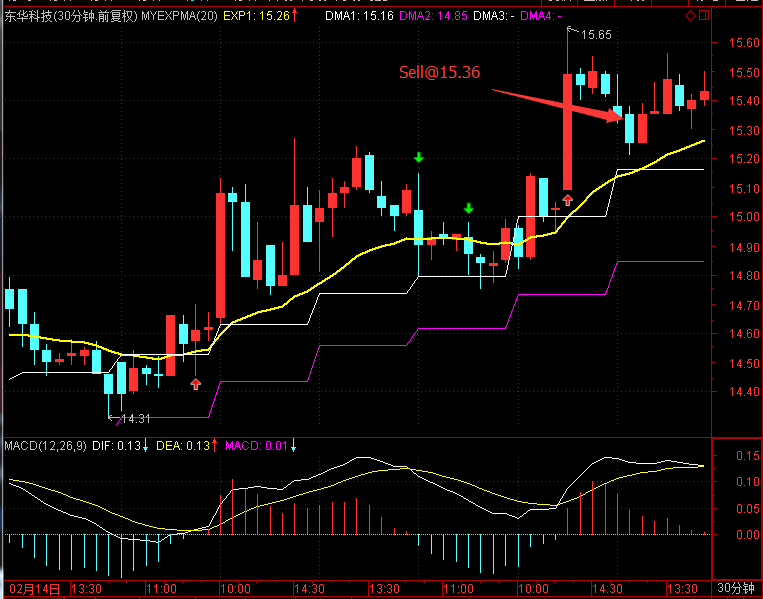
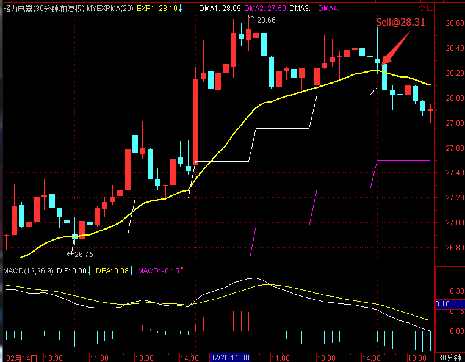

# 2017.2.23 交易总结

------

## 大盘走势

今天大盘跳空低开在3258.53点，开盘小段冲高后震荡下跌，最低在盘中打破3240到3236.36点，经两次回踩确认又拉到3240支撑之上，在尾盘向上收升在3251.38点，全天下跌-9.84点，下跌-0.30%，总成交额为2368.23亿元。大盘目前在高位收出一根带下影线的阴线，需要等待市场方向的选择。

## 交易情况

账户情况：

成交情况：

账号当天盈亏：-0.1%，累计盈亏：-13.9%

------

------

------

------

------

------

------

## 交易总结

- 今天大盘一路走弱，没有找到合适的买点，所以早盘卖出股票，之后没有买回

- 早盘卖出的位置还比较好，之后大盘下跌，个股也随之下跌，但资金没有受损

- 选择酒类、机械、船舶、建材、家用电器、煤炭钢铁等几个板块的强势股票作为自选股

## 交易计划

- 明天大盘可能走弱，需要密切关注5分钟周期的走势

- 开盘1小时，股票有冲高并出现回落迹象的，可以先卖出

- 继续检验选股+动量信号的结合，可以复用自己之前的交易经验

