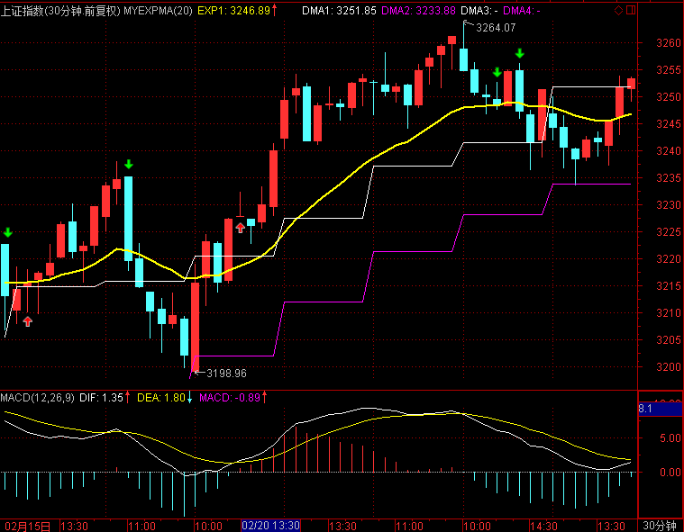
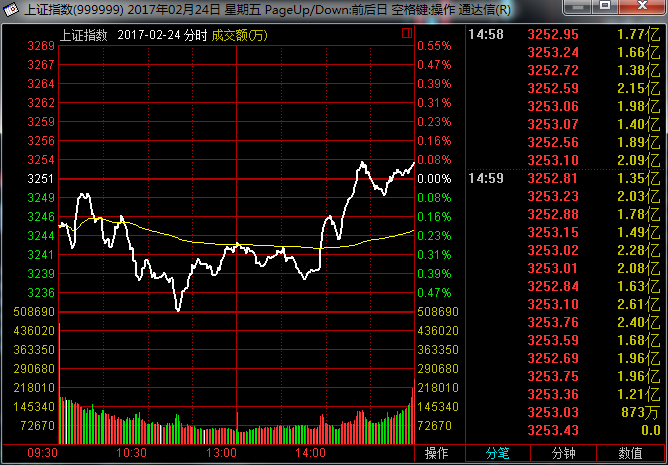
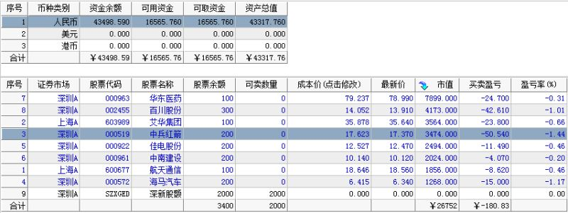
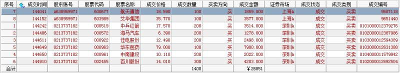
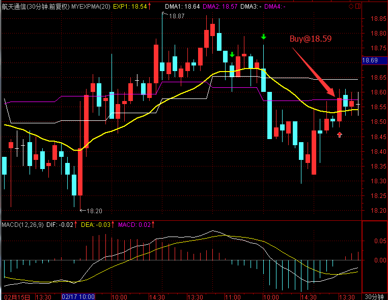
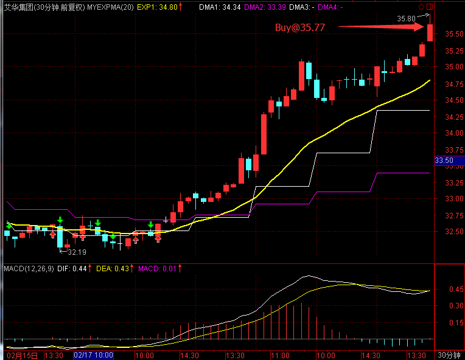
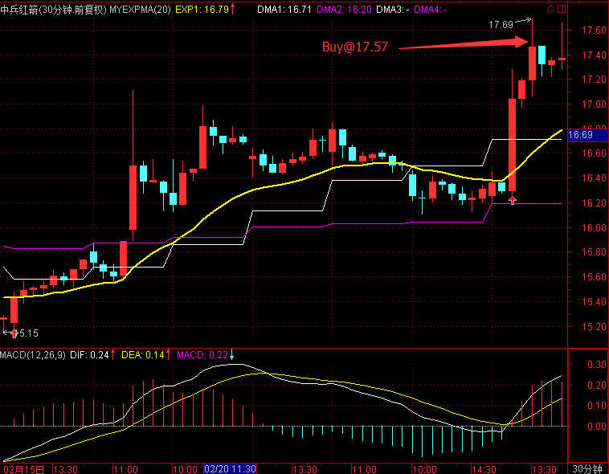
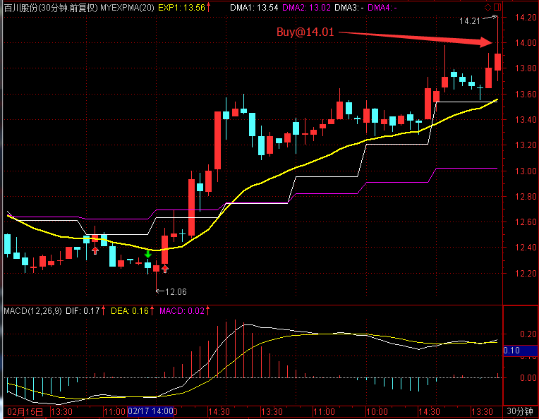
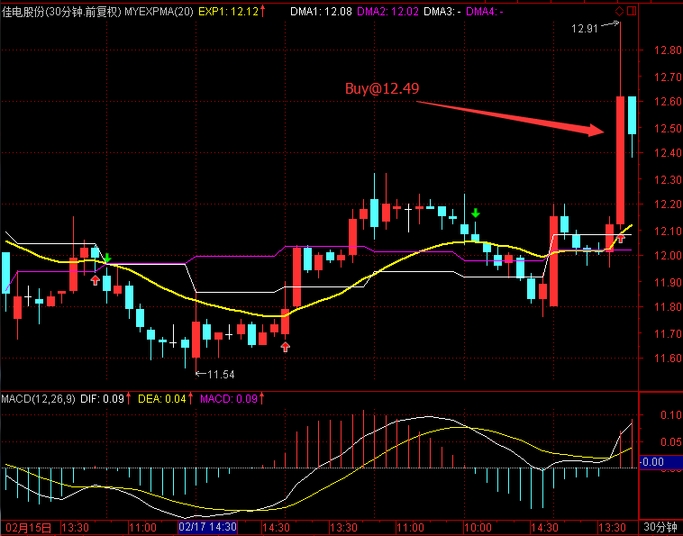
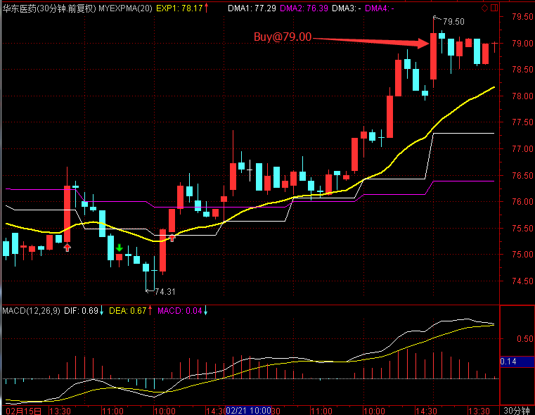

# 2017.2.24 交易总结

------

## 大盘走势

延续昨天大盘下跌，大盘开盘在3246.86点，一段下跌达到日内最低点3233.53点，在3230附近再次获得支撑，然后开始向上最高拉到3253.96点，收盘也收在3253.43点，全天上涨2.05点，涨幅0.06%，成交2138.39亿元，比前两天略微回落。目前上涨节奏仍然健康，保持在上升趋势线之上，3240~3230一线的支撑比较明显。

## 交易情况

账户情况：

成交情况：

账号当天盈亏：-0.4%，累计盈亏：-13.3%

------

 

------

 

603989 艾华集团走势流畅，在尾盘追入。

------

 

------

 

------

 

------

 

------

 

------

 

------

## 交易总结

- 今天都选择了在今天的日线或者前两天有动量买入信号的股票进行买入，并且股票选择在5日线和10日线上。但有部分股票错过了买点，导致买入价格比信号位置高出不少。
- 视下一交易日情况，如果开盘就走弱，可以先考虑平仓，重新寻找位置进入。

## 交易计划

- 明天大盘可能走出背驰段，需要密切关注5分钟周期的走势

- 视下一交易日情况，如果开盘就走弱，可以先考虑平仓，重新寻找位置进入。

- 开盘1小时，暂不买入股票

