# 2017.2.28 交易总结

------

## 大盘走势

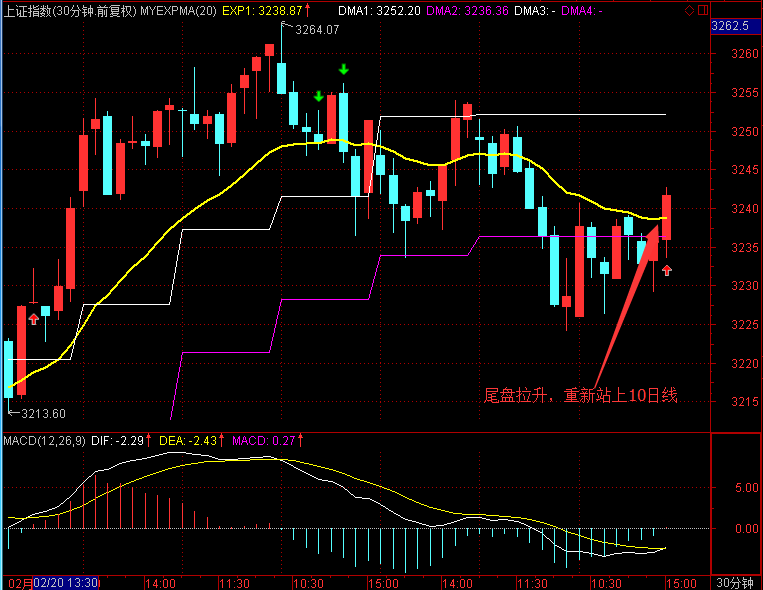

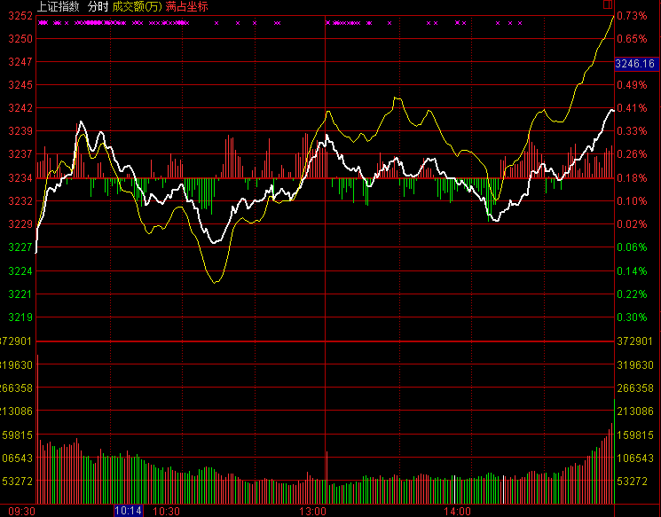

大盘跳空低开在3249.19点，早盘就形成了最高点在3251.65点，指数本来在5日、10日均线中间选择方向，早盘在这个区间里震荡后，下午选择向下突破，盘中低点达到3224.09点，最终收在3228.66点，全天下跌-24.77点，跌幅-0.76%，成交总额与之前比变化不大2113.96亿元。目前大盘向下已经跌破了10日均线的支撑，也打破了上升趋势线，明天走势偏空。

## 交易情况

账户情况：
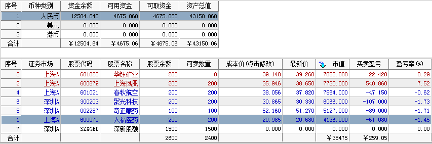

成交情况：
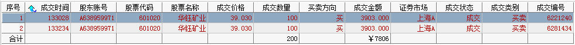

账号当天盈亏：0.6%，累计盈亏：-13.7%

------

### 卖出操作

今天没有达到止盈止损，没有卖出操作。

------

### 买入操作

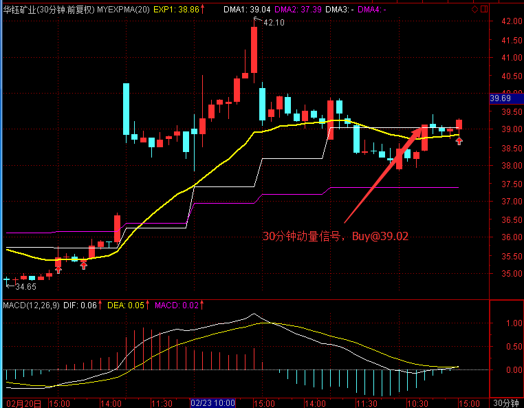

601020 华钰矿业在30分钟出现买入信号，在39.02买入

------

### 持仓股票

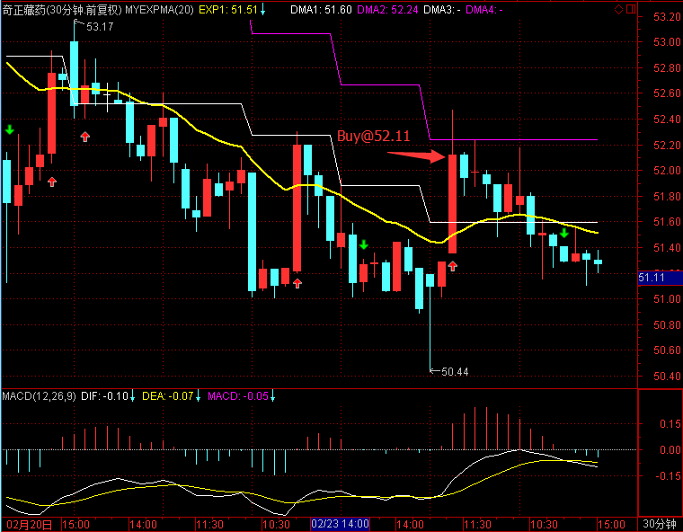

002287 奇正藏药

昨天计划：止损设置：50.50，前低附近，止盈设定在55.33，第一观察位置是前面的高点54.50。今天没有达到，没有操作。

------

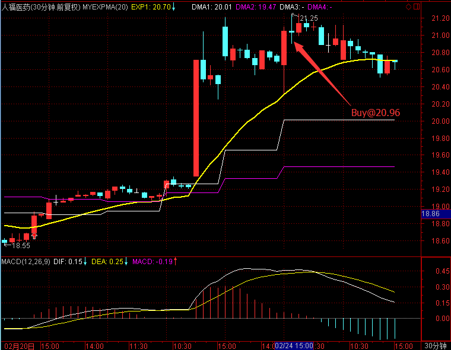

600079 人福医药 之前开仓的是日线级别信号，所以止损设定会有点大，需要耐心等待。

昨日计划：今天医药板块早盘上涨，在20.96买入，止损20.50。今天虽然回落，但没有达到止损，价格仍站在10日线上，没有操作。

------

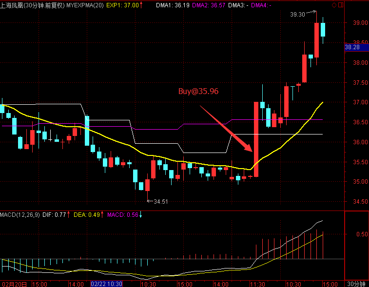

600679 上海凤凰 

昨日计划：止损设置34.46，在前低下方，止盈设定在38.84，接近前高附近。第一观察点是37.57附近的缺口。今天没有达到，没有操作。

------

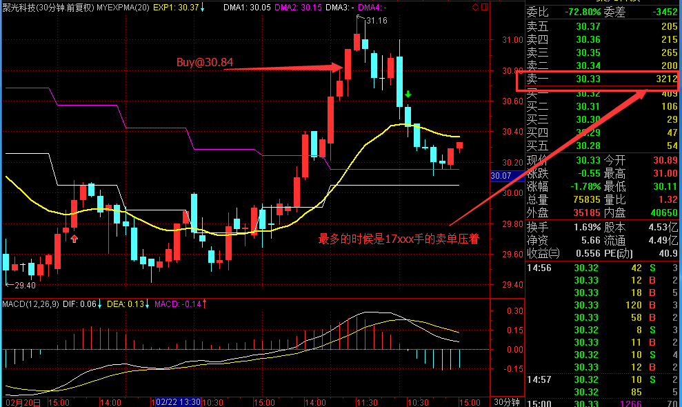

300203 聚光科技

昨日计划：止损设在29.10，在前几天的低点下方，止盈设在34.44，接近前面高点。今天没有达到，没有操作。

------

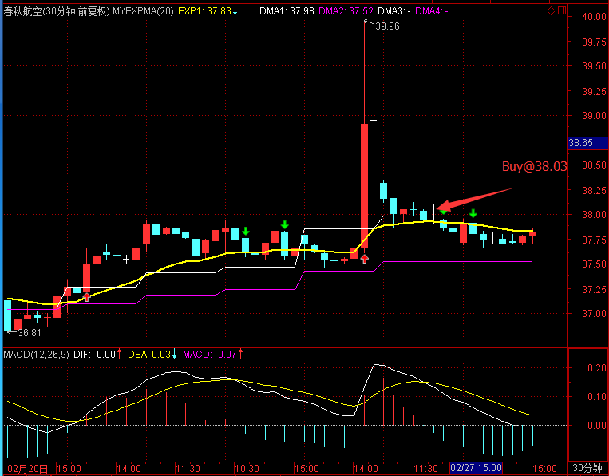

601021 春秋航空 

昨日计划：止损设置在37.00，止盈设在39.10。今天尾盘重新到均线附近，并在10日线上，看明天能否发力往上。

------

## 今天异动股票

002352 顺丰控股今日继续涨停，圆通速递在开盘后也迅速拉升到涨停。

600679 上海凤凰盘中继续拉升，之后有回落

000401 冀东水泥开盘就跌超过5%，一直持续到收盘。水泥板块

## 板块情况

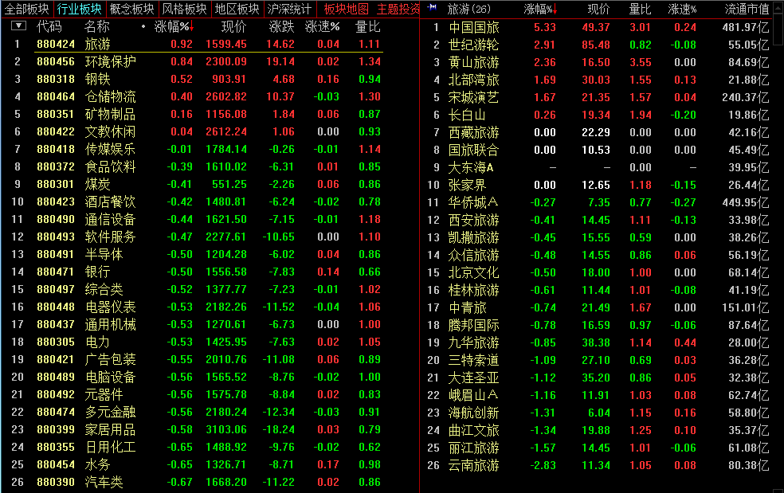

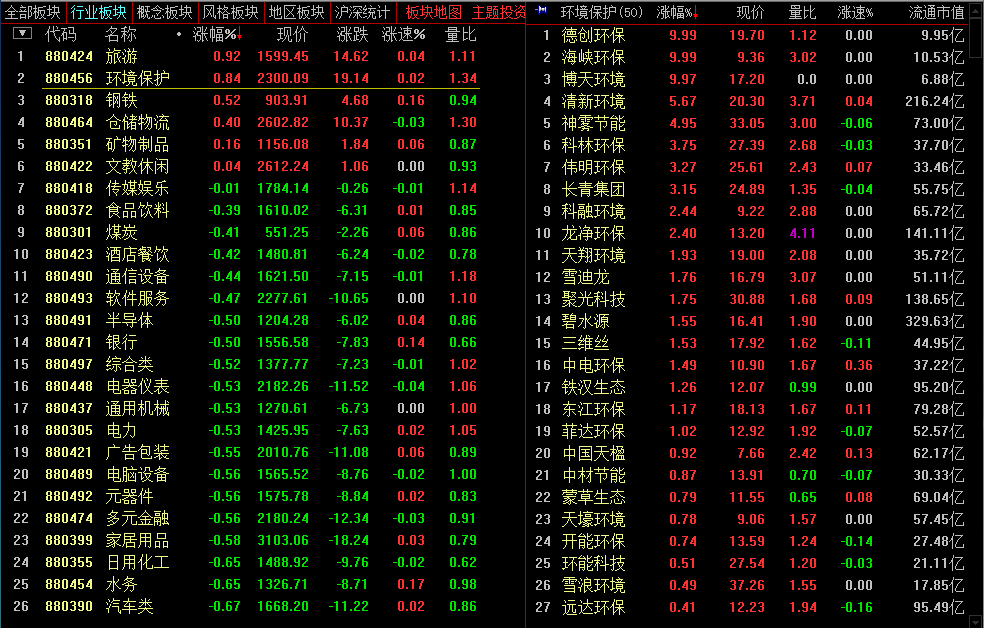

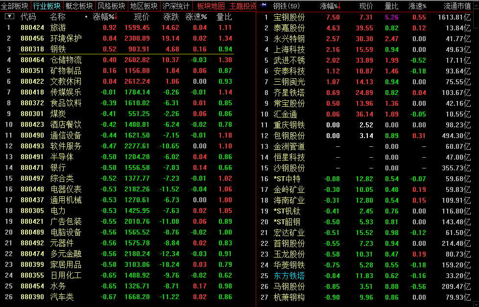

今天旅游、环保股票领涨，钢铁在宝钢复盘大涨的带领下也排到前3，而酿酒、建材、保险则普遍下跌。环保板块中，长青集团、聚光科技、三聚环保等都已放入自选股中，有合适的交易信号时就可以买入。

## 交易总结

- 上周五的股票买入信号是根据之前日线出现的信号，在中途买入时位置不好，今天大部分低开，于是较多在开盘附近就进行了平仓。从股票走势看，华东医药和中兵红箭可以继续关注。

- 等待交易信号更重要，之前参考的级别太小，持仓时心态容易不好，无论盈亏都想及时卖出

- 预先设定好止盈止损位置，根据计划操作

## 交易计划

- 持仓股票根据上面的价格进行止损设定，人福医药视情况进行平仓

- 自选股中股票出现30分钟动量信号的，进行买入

- 大盘可能还会继续下跌，没有达到止损位置就继续持仓。

