#20170216交易总结： 

##一、	当天走势概况
大盘延续昨天的下跌，开盘跳空低开在3210.36点，然后震荡上行，最高上冲到3230.28点，在下午再次向下回调，达到3216点再转头收回调整跌幅，最终收盘在日内高点附近3229.62点，全天成交总额较上个交易日略低2265.88亿元。整体上分析大盘把昨天长上影小阴线的影响消除不少，短期仍然是保持上涨强势；
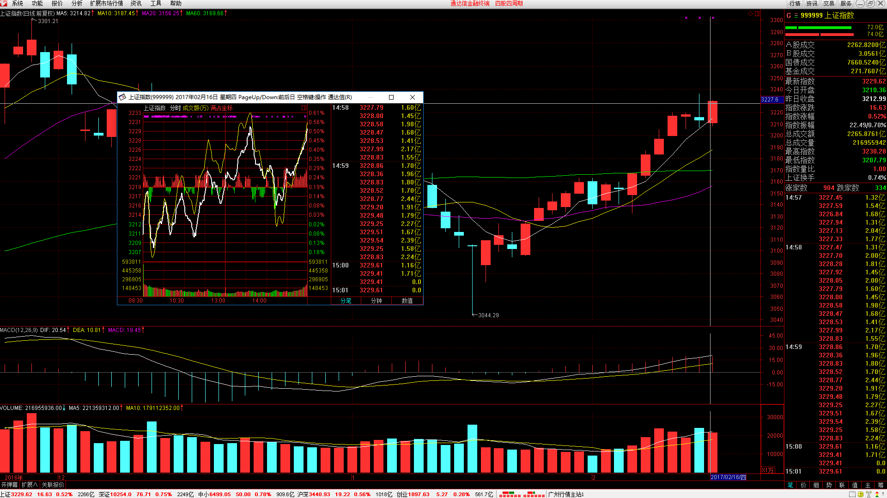

##二、	交易明细
###1、	买卖点截图
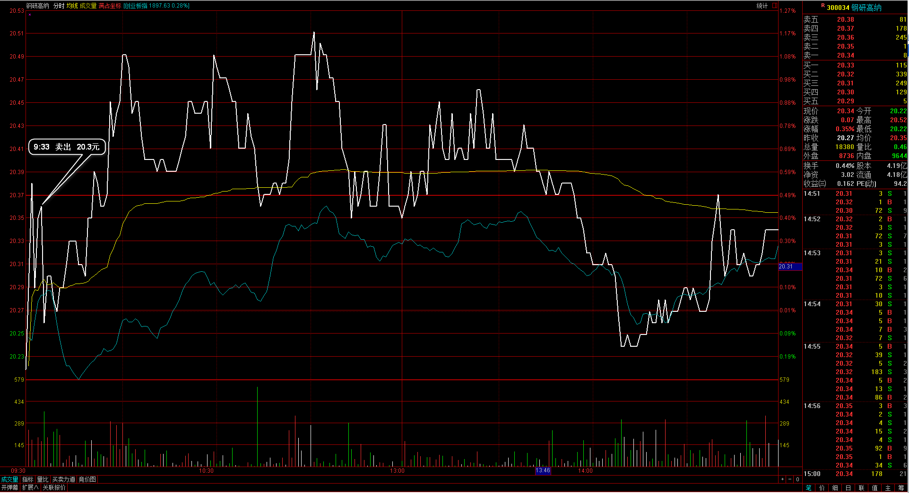
钢研高纳：昨天尾盘的下跌已经打破预期，早盘反弹时处理清仓；
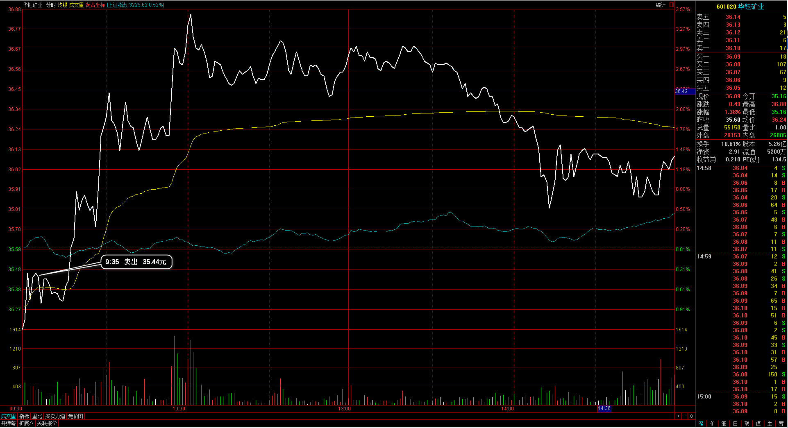
华钰矿业：同样是昨天的下跌已经超过自己的止损幅度，早盘反弹清仓处理；
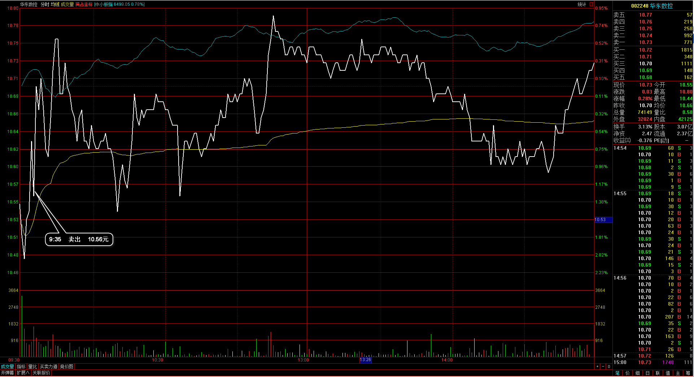 
华东数控：开盘的跳空低开已经打破设定止损，同样是向上反弹过程清仓出局；
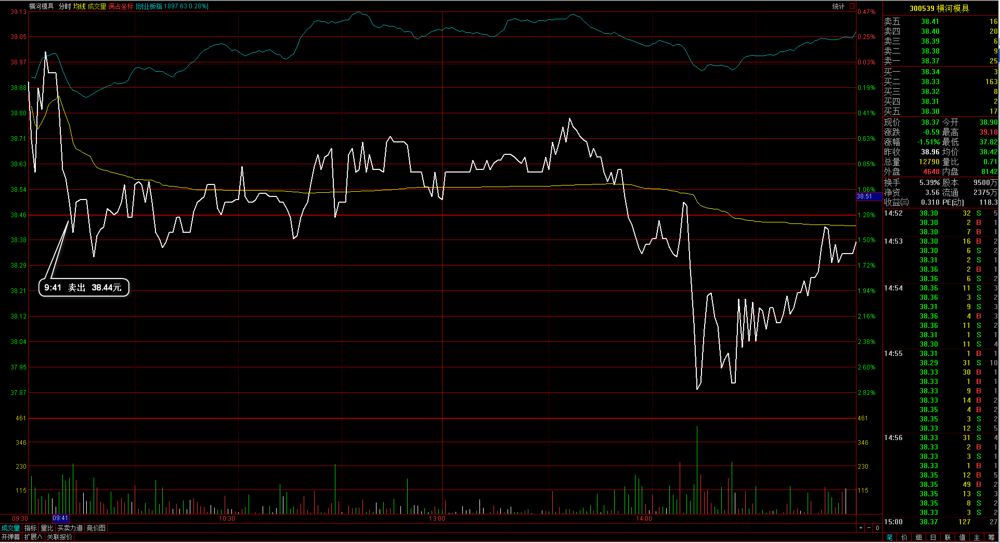 
横河模具：早盘显得弱势，打破了今天的预期，早盘低价被下破，止盈出局；
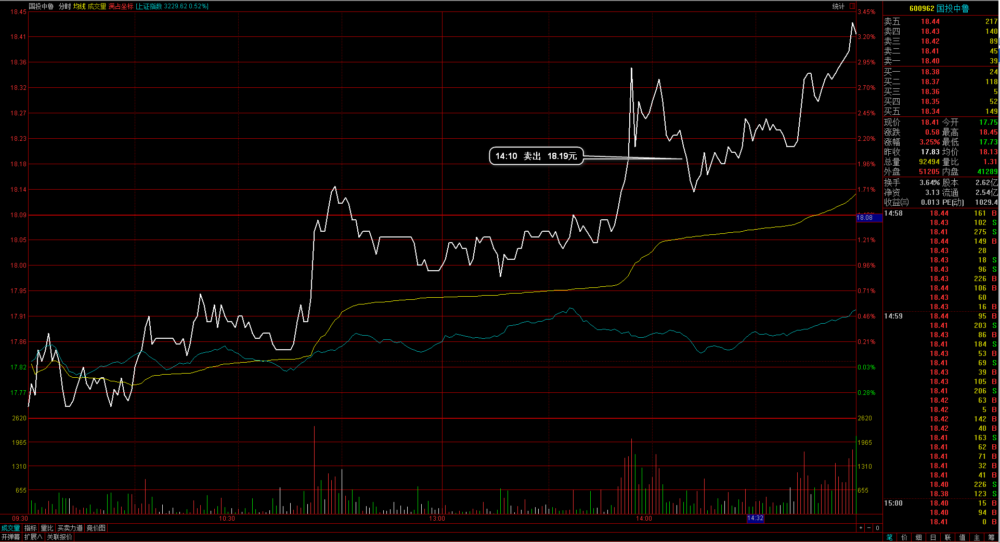 
国投中鲁：本意是瞄着平台上面高点的突破，但发现打到附近无法再向上，回落的过程小平台被下破，于是平仓出局；
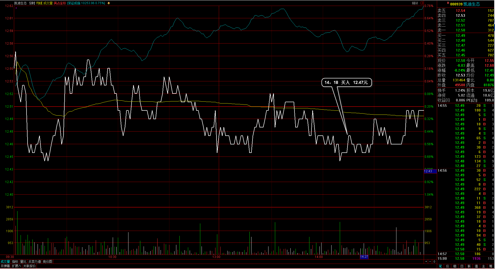 
凯迪生态：大盘低点回升的可能增大，个股低点，于是建仓买入；
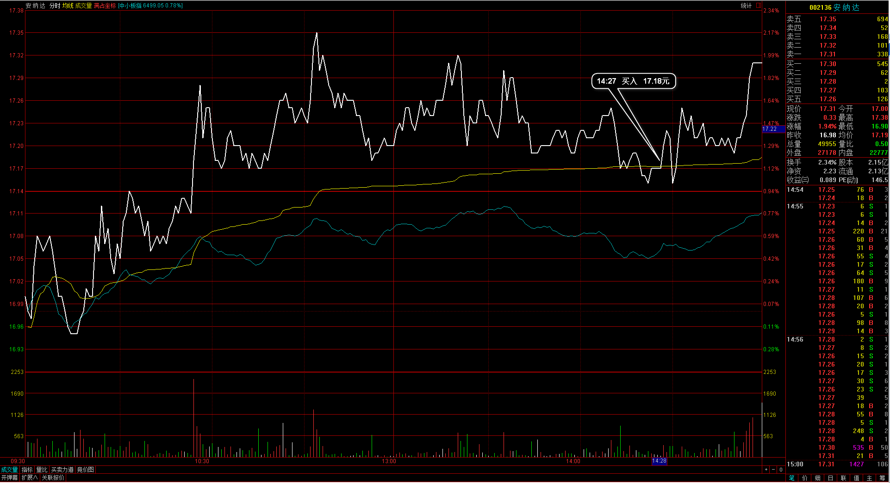 
安纳达：个股下跌到支撑均价线附近，大盘也是回档低位，建仓入场；
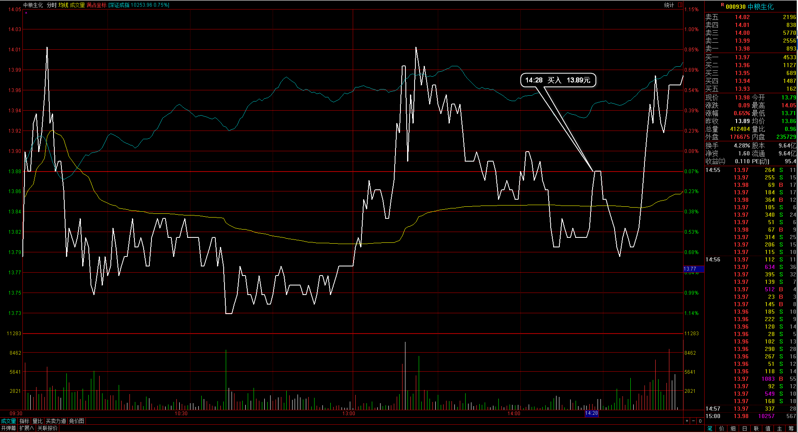 
中粮生化：下午在5日均线位置企稳，大盘也在这里反弹，于是在均价线附近入场；
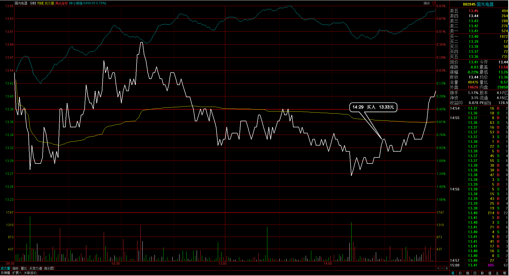 
国光电器：日内双底位置，大盘正好在向上段，预期与大盘同步于是入场；

###2、	成交记录截图
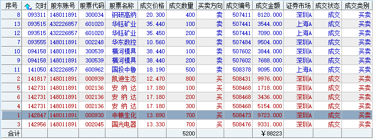

##三、	具体每一轮交易及盈亏情况
###1、	各股交易、持仓明细
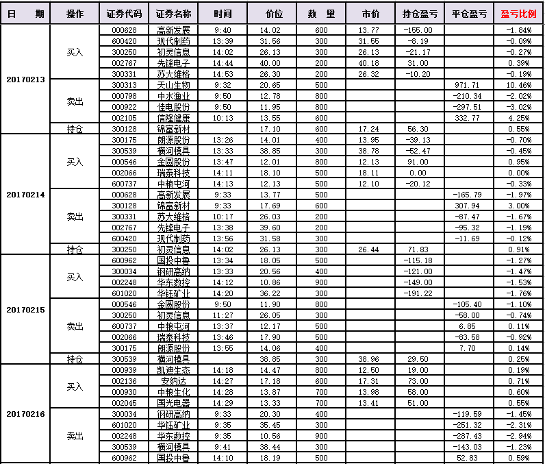 

###2、	平仓分布
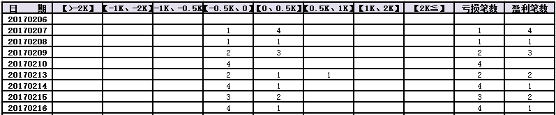

###3、	盈亏比和成功率
 

###4、	账户总计
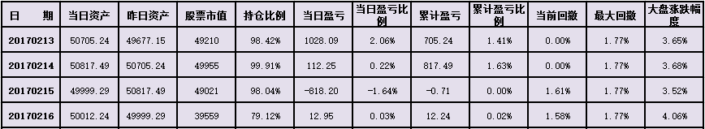

##四、	其他及总结
1、	数据是需要沉淀的，总结的交易方式需要通过一段时间的交易检验，而不是一两天的结果来决定，所以在复盘自己的交易时，要长期的汇总格局来看，看总体的盈利情况，而不是某一两笔或一两个交易日大盈亏决定；
2、	今天下午才开始建仓个股，当时觉得大盘可能是日内相对低点，拉出日内新高的回调后，好多个股在日内低点位置，这个时候的“时机”就已经确定，所以相对于大盘、板块的格局来说，大盘整体环境更适合买入个股时机；
3、	保持在相对低点，日内的低点接单入场，以尽量的高点出局解决交易，每次盈利赚取的就是这样的节奏利润；
4、	昨天的个股在尾盘时已经亏透了，盘后有写交易清单，今天开盘有些个股直接打穿了止损位，直接执行砍单出局，最后有些个股甚至已经拉到了昨天的成本价之上，首先一个执行止损是绝对正确的，后面的情况无法预期，另一个就是昨天大盘向下杀这样的一段，一夜没有什么消息影响（美股继续上涨），一个低开的波动是很正常的，这个在收盘前需要有一定的预计；

 

##五、	收盘后账户截图
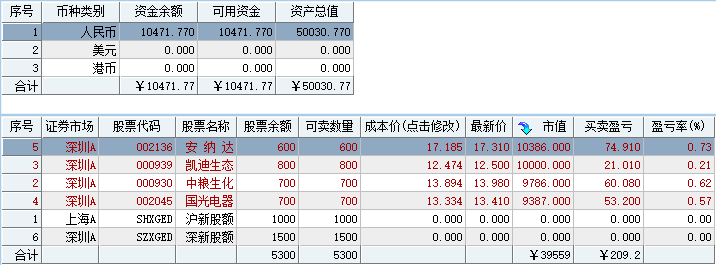