#20170217交易总结： 

##一、	当天走势概况
今天大盘在高位走出大幅阴线，早上跳空低开开盘在3227.71点，然后受证券板块拉升影响直接冲高到日内最高3238.40点，再被整体偏空氛围拖累，单边下跌到3199.42点，在3200位置上有过抵抗争夺，最终收盘3202.08点，全天下跌-27.54点，跌幅-0.85%，总成交额变化不2485.73亿元。因为这一根阴线把前面三根小幅度K线吞没，形成短期顶部形态比较明显，后市向下运行的概率较大，但3200~3170一线的支撑也很关键；
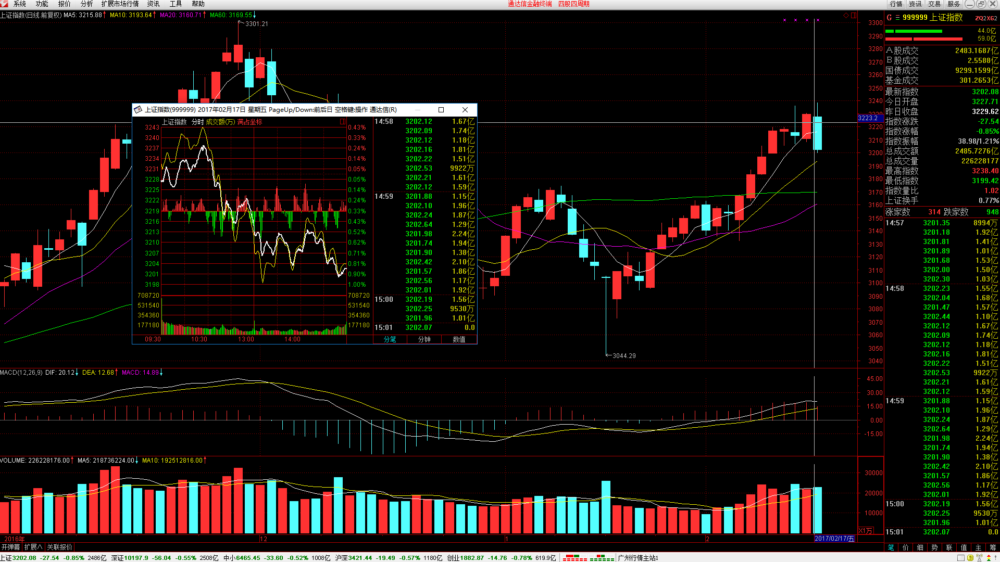

##二、	交易明细
###1、	买卖点截图
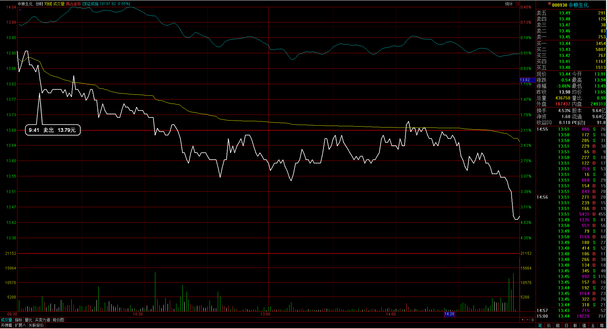
中粮生化：下跌打破了设定止损位，清仓出局；
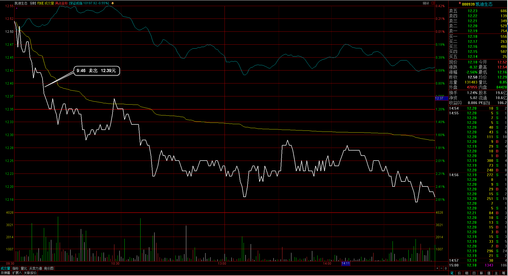
凯迪生态：同样是下跌达到止损，清仓出局；
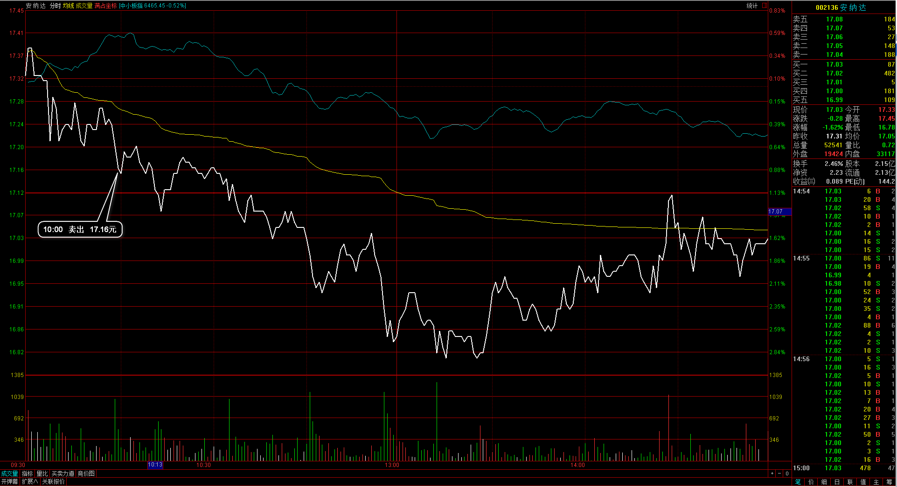 
安纳达：早盘弱势，达到开仓成本附近，清仓出局；
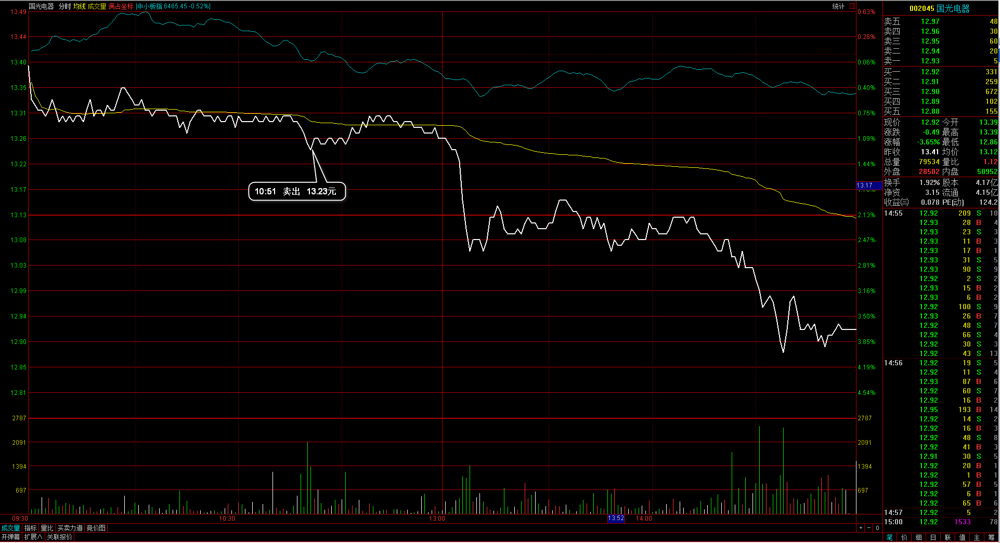 
国光电器：开盘一直被均价线压制，达到出局设定价格，清仓出局；
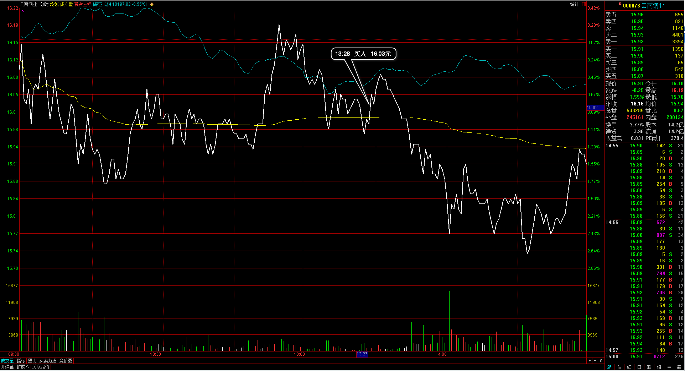 
云南铜业：预期大盘下跌到这个位置企稳，于是建仓个股，云南铜业正好在均价线附近受到支撑；
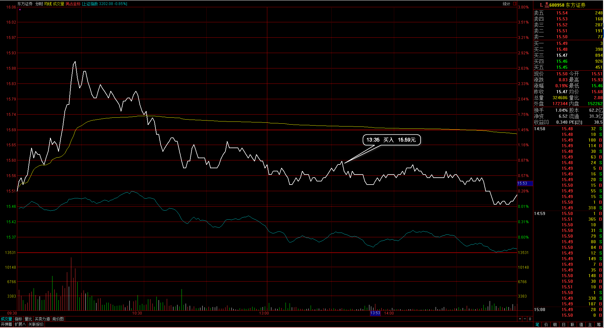 
东方证券：证券板块早盘较强，大盘的抗跌主力板块，回落时在低位接单进场；
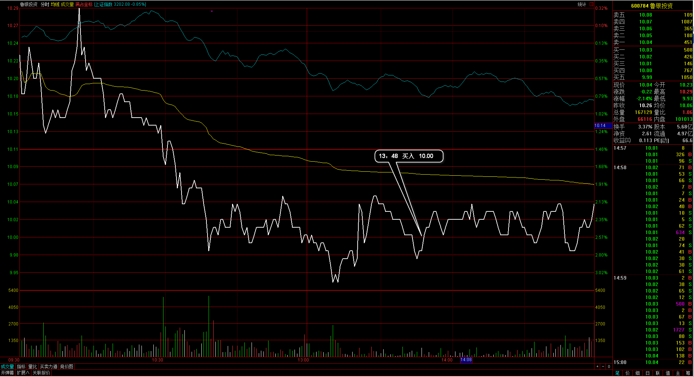 
鲁银投资：大盘下跌较大幅度在低位横盘，在个股止跌位置尝试建仓入场；
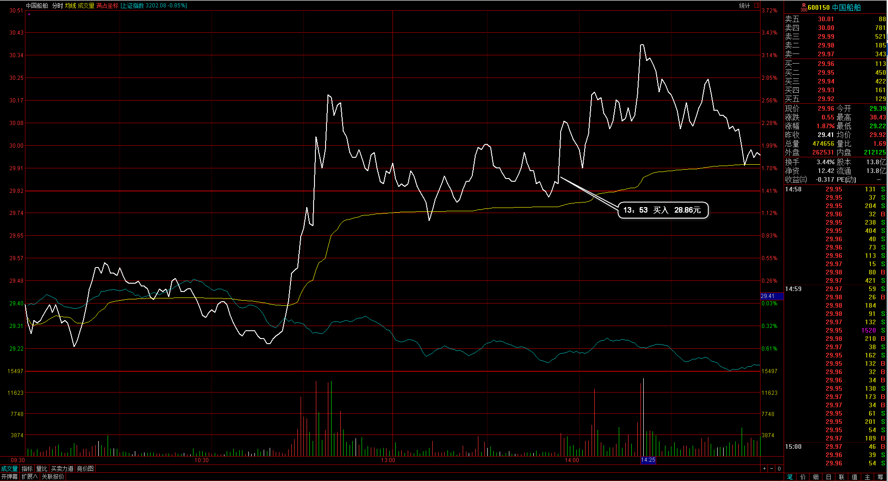 
中国船舶：船舶板块是盘中突然拉起来的异动，中国船舶在高位附近有上突破可能，于是跟着大盘回落在均价线附近入场；

###2、	成交记录截图
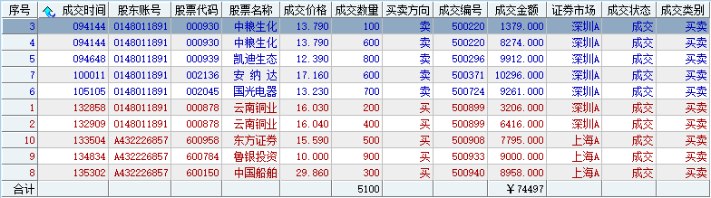

##三、	具体每一轮交易及盈亏情况
###1、	各股交易、持仓明细
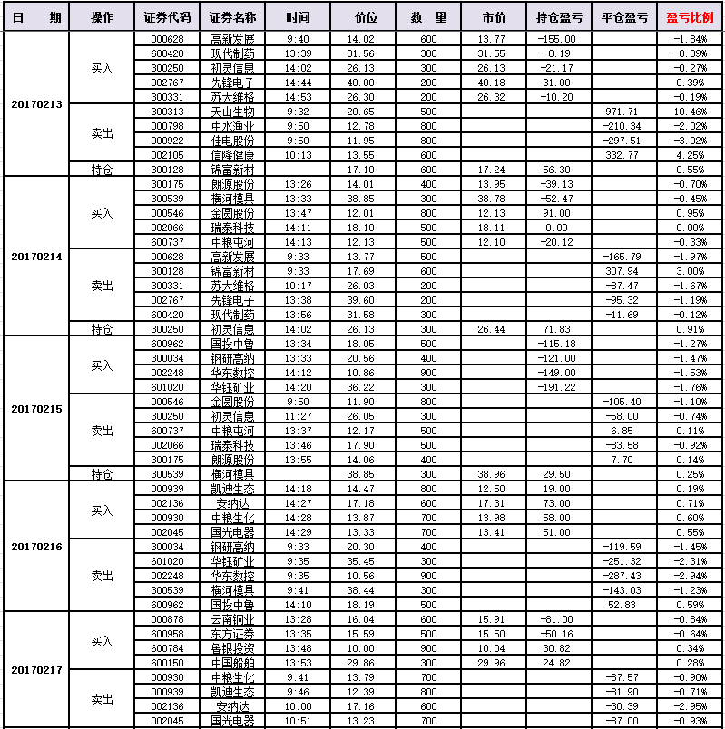 

###2、	平仓分布
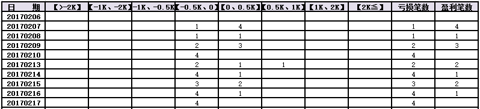

###3、	盈亏比和成功率
 

###4、	账户总计
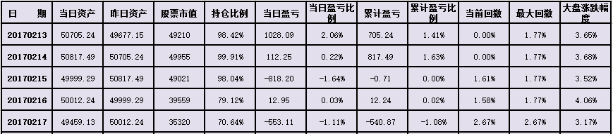

##四、	其他及总结
1、	大盘在高位产生巨幅反转阴线，本来在这个位置自己看多意愿十分强，觉得走出顶部的节奏可能是向上加速段最终留下长上影线，但实际是自己的主观意愿预测行情，今天的极端在盘中也有感觉，本来股指开放政策的出台可能会是利多情况，结果只有证券、保险板块向上强势，但整体的氛围偏空，这部分没有一个分析的框架结合，所以板块的整体情况没能打到节奏上；
2、	入场云南铜业时在30分钟周期已经出现了顶背驰，这个在入场前没有留意到，在5分钟周期当时也没有达到10日均线支撑位，反而是在日内均价线附近支撑住时入场，这样在入场级别上就偏小了，后面有一个10日均线的支撑位置，这个位置的止损也会比较合理，另外这一波的下跌是通过5分钟60均线的压制向下的，所以最终的博弈在5分钟60均线与10日均线之间，而没有均价线这个级别的影响；
3、	整体上留意到跟随着大盘的节奏拐点去捕捉个股的买点，这个有一定的参考性，大盘整体向下也会拖累个股的轨迹，大盘向上冲高过程只要不是特别的强势，都应尽量等待回调拐点；
4、	以后入场前需要留意到30分钟和5分钟两个级别周期MACD的背驰情况；

 

##五、	收盘后账户截图
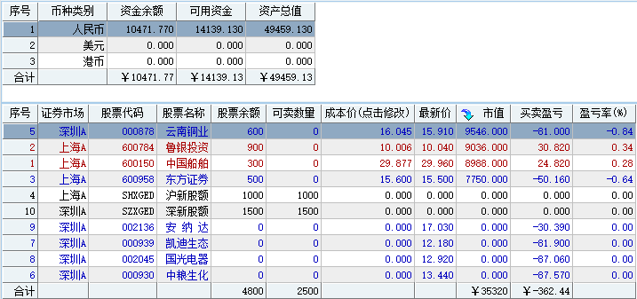