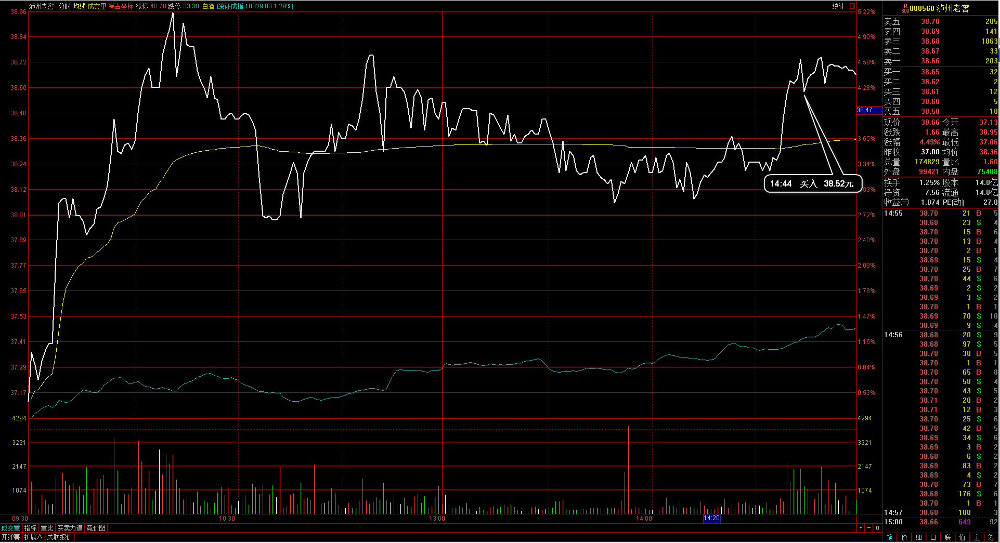

#20170220交易总结： 

##一、	当天走势概况
大盘今天小幅低开在3198.96点，然后整天都是强势上涨，盘中收盘在最高3241.46点，全天上涨37.88点，涨幅1.18%，盘中大盘股和中小盘股两极分化，大盘股较强势拉动上涨，中小盘股早盘有一段较大的向下运动。全天成交总额2502.76亿元，与最近的成交变化不大。通过今天大盘的强势收阳，上个交易周形成的顶分形又被破坏，成为了一个横盘震荡区间，那后市的上涨势头则仍会保持；

##二、	交易明细
###1、	买卖点截图

东方证券：上周五买入后浮亏，早盘低开达到止损目标位，清仓出局；

中国船舶：早盘向上冲高，大盘的节奏更强，在5分钟里有一个顶背驰结构，破开盘低点出局；
 
鲁银投资：这个计划是在9.9止损的，最终打完止损出局就直接拉起来，其实后面看在均价线附近止损更合理，当时在5分钟受60均线压制走下；
 
云南铜业：5分钟里有一段底背驰支撑走向上，出场当时大盘在高位横盘，预期可能大盘日内见顶于是回落下破均价线出局；
 
泸州老窖：今天酿酒板块比较强势，在尾盘仍然被向上拉升，于是建仓入场；
 
冀东水泥：尾盘整体拉升，冀东水泥在支撑附近拉起，于是尾盘买入；
 
名家汇：日线在均线之上收出阳包阴，预期明天高开情况较大，尾盘时买入；

###2、	成交记录截图

##三、	具体每一轮交易及盈亏情况
###1、	各股交易、持仓明细
 

###2、	平仓分布

###3、	盈亏比和成功率
 

###4、	账户总计

##四、	其他及总结
1、	大盘在高位产生巨幅反转阴线，本来在这个位置自己看多意愿十分强，觉得走出顶部的节奏可能是向上加速段最终留下长上影线，但实际是自己的主观意愿预测行情，今天的极端在盘中也有感觉，本来股指开放政策的出台可能会是利多情况，结果只有证券、保险板块向上强势，但整体的氛围偏空，这部分没有一个分析的框架结合，所以板块的整体情况没能打到节奏上；
2、	入场云南铜业时在30分钟周期已经出现了顶背驰，这个在入场前没有留意到，在5分钟周期当时也没有达到10日均线支撑位，反而是在日内均价线附近支撑住时入场，这样在入场级别上就偏小了，后面有一个10日均线的支撑位置，这个位置的止损也会比较合理，另外这一波的下跌是通过5分钟60均线的压制向下的，所以最终的博弈在5分钟60均线与10日均线之间，而没有均价线这个级别的影响；
3、	整体上留意到跟随着大盘的节奏拐点去捕捉个股的买点，这个有一定的参考性，大盘整体向下也会拖累个股的轨迹，大盘向上冲高过程只要不是特别的强势，都应尽量等待回调拐点；
4、	以后入场前需要留意到30分钟和5分钟两个级别周期MACD的背驰情况；

 

##五、	收盘后账户截图
