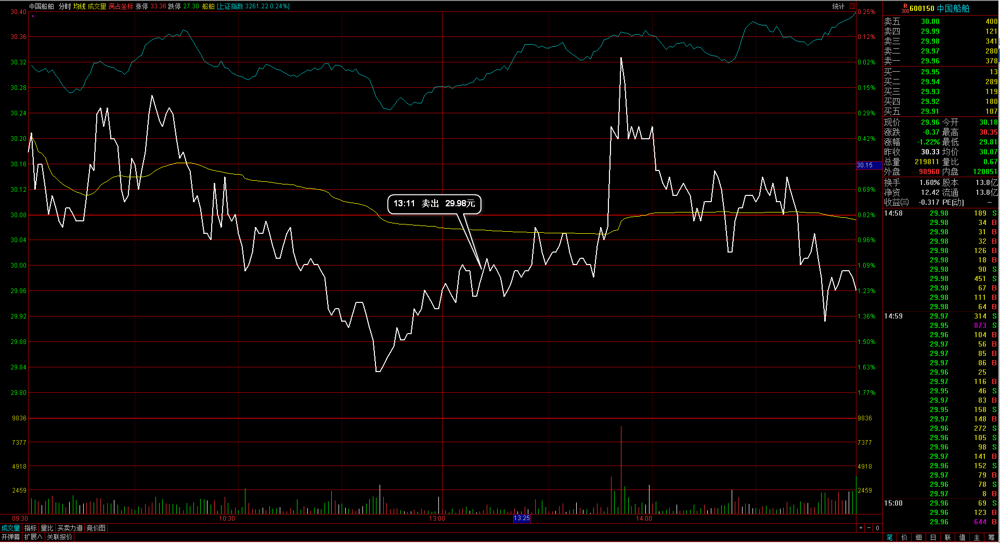

#20170222交易总结： 

##一、	当天走势概况
大盘仍然是高位震荡，开盘在3252.69点，盘中最低回落到3243.84点，下午建材板块带动向上，尾盘接近最高收盘，收盘在3261.22点，全天上涨7.89点，涨幅0.24%，总成交额变化略有减少2348.15亿元。大盘目前仍是高位震荡，并且尾盘强势收光头小阳，并且30分钟里的背驰一直没有向下，所以后市仍然较强；

##二、	交易明细
###1、	买卖点截图

大豪科技：盘中十分的弱势，打到昨天定义的止损位，清仓出局；

中国船舶：昨天尾盘跟随大盘强势入场，但个股显得更弱，盘中成交也少，平仓出局；
 
东华科技：盘中冲高位放量，提前止盈，尾盘回落觉得不够，于是没有再接回；
 
摩恩电气：大阳线之后连续收阴，在相对低点位置接单入场，预期再收阳线延续；
 
钢研高纳：再次拉上开盘价上，并且向上突破均价线，于是入场，止损在当日最低点；
 
中铁二局：拉上均线之后再次企稳，尾盘可能有翘尾行情，于是在均价线附近进场；

###2、	成交记录截图

##三、	具体每一轮交易及盈亏情况
###1、	各股交易、持仓明细
 

###2、	平仓分布

###3、	盈亏比和成功率
 

###4、	账户总计

##四、	其他及总结
1、	对于尾盘翘尾行情的特征，有一点是下午盘必须上涨为主，或者是横盘为主，并且整体的趋势不可以是向下下跌的。这个翘尾的动作原因我理解和大盘关系有关，是大盘当天小幅震荡，方向不明，让人在盘中无处下手买卖个股，或者是一段时间都是这种犹豫不决的情况，那在尾盘就会有人买入看好的个股，希望明天能直接向上冲击；
2、	大盘这两天都是在高位震荡，30分钟周期里是背驰后再背驰，所以对这个大盘是否仍然强势有些没底，但最终大盘还能在高位维持就是强势的一种，不过日内的波动幅度较小所以没有合适的低点参考可以入场，提防有风险多只能在偏尾盘才买入个股；
3、	有一个想法，去找离历史关键高点还有10%空间之内的个股，个股只要收放量幅度的阳线，并且是推进靠近历史高位的，那后面的交易日都可以关注这个可能的突破机会，如果有热点板块的支持那更加合适；

 

##五、	收盘后账户截图
