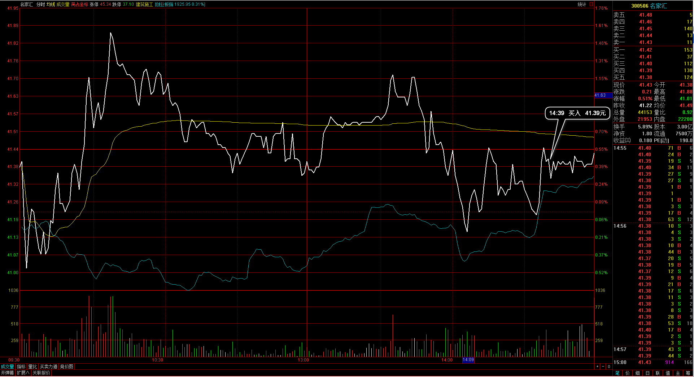

#20170223交易总结： 

##一、	当天走势概况
今天大盘跳空低开在3258.53点，开盘小段冲高后震荡下跌，最低在盘中打破3240到3236.36点，经两次回踩确认又拉到3240支撑之上，在尾盘向上收升在3251.38点，全天下跌-9.84点，下跌-0.30%，总成交额变化不大在2368.23亿元。大盘目前在高位收出一根带下影线的阴线，短期内受阻，后市就依托3240为分界确定小级别的多空；

##二、	交易明细
###1、	买卖点截图

摩恩电气：打破昨日低点，这笔交易在30分钟级别逆势入场，以为日内底点实际并没有在大级别确认；

中铁二局：昨天尾盘入场有拉升，今天开盘后明显较弱势，打破止损出局；
 
云南铜业：早盘看到那波拉升，结合大盘在破开盘回落后入场，实际入场有点激进；
 
中国船舶：大盘在3240日内见底，结合大盘时机入场建仓；
 
名家汇：尾盘接合大盘的日内见底，个股在较低位置，建仓入场；

###2、	成交记录截图

##三、	具体每一轮交易及盈亏情况
###1、	各股交易、持仓明细
 

###2、	平仓分布

###3、	盈亏比和成功率
 

###4、	账户总计

##四、	其他及总结
1、	在30分钟入场的时候需要有30分钟周期的横走，而不是去逆势30分钟的下跌趋势，也就是说入场时30分钟级别绝对不是下跌趋势，是横走或上涨趋势阶段；
2、	大盘在日线这个位置收阴线，盘中短暂的下跌了3240再拉回，尾盘把仓位加到6成左右，需要提防明天的低开低走，后面回补的几支个股在日内都类似大盘一样做了双底确认，要留意这只是短暂的5分钟W右肩，整体的30分钟趋势需要考虑；
3、	按整理好的涨幅排名和联动比例挑选盘中热点，这个在早盘竞价完和开盘15分钟后，两个时间段都要有记录统计；

 

##五、	收盘后账户截图
