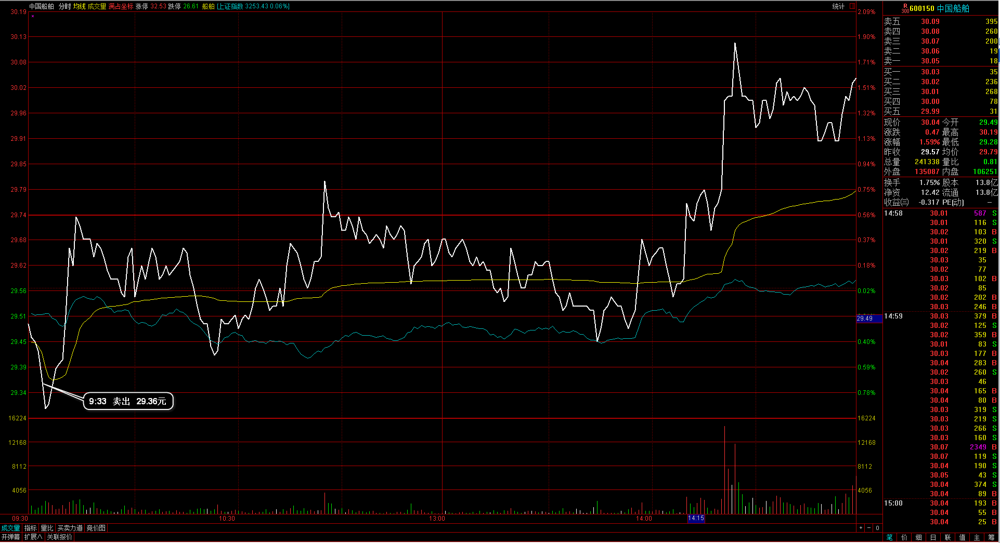

#20170224交易总结： 

##一、	当天走势概况
延续昨天大盘下跌，大盘开盘在3246.86点，一段下跌达到日内最低点3233.53点，在3230附近再次获得支撑，正好是日线10日均线位置，然后开始向上最高拉到3253.96点，收盘也收在3253.43点，全天上涨2.05点，涨幅0.06%，成交总额较前两天稍有回落2138.39亿元。目前上涨节奏仍然健康，保持在上升趋势线之上，3240~3230一线的支撑比较明显；

##二、	交易明细
###1、	买卖点截图

中国船舶：早上开始打破了设定的止损位出局，止损位的设定比较不科学，只是昨天的最低价；

云南铜业：昨天已经浮亏，早盘跳空低开，见没有下行等待反弹出场，发现整体特别弱，破日内低点清仓出局；
 
名家汇：打破了止损清仓出局，这个个股目前仍然在区间内运行，是选股上源的问题；
 
钢研高纳：前两日持仓突破到今天，冲高的过程想做T倒仓，但发现可能还有向下调整，后市没接回；
 
白云山：日线较强，在25.40一张有支撑，回落的时候接多单入场；

口子窖：酿酒板块个股，在35.5支撑附近接单；

瑞丰高材：日线向上突破，在分时图均价线附近接多单入场；

###2、	成交记录截图

##三、	具体每一轮交易及盈亏情况
###1、	各股交易、持仓明细
 

###2、	平仓分布

###3、	盈亏比和成功率
 

###4、	账户总计

##四、	其他及总结
1、	今天处理好一个选股方式，先由日线级别选择好近期强势的个股，然后再到盘中30分钟级别挑选；
2、	整体有一个需要解决的，就是在30分钟级别里，不可以追单方式，这样碰到回调风险也是比较高的；
3、	另外有一个问题，自己的止损多是以日内低点解决，但这样的点并不是正确的科学的止损点，不过按自己的操作级别，应该就是选择这样的点；
4、	我需要考虑30分钟级别的趋势方向，有时并没有走完，还在下降通道里，就直接入场接单了，今天的云南铜业就是这样的情况，并且在30分钟里有一个顶背驰出现，没有当一回事，直接跳空低开；

 

##五、	收盘后账户截图
