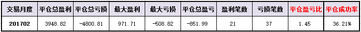

#20170227交易总结： 

##一、	当天走势概况
大盘跳空低开在3249.19点，早盘就形成了最高点在3251.65点，指数本来在5日、10日均线中间选择方向，早盘在这个区间里震荡一阵，然后下午选择向下突破，盘中低点达到3224.09点，最终收在3228.66点，全天下跌-24.77点，跌幅-0.76%，成交总额与之前比变化不大2113.96亿元。目前大盘向下已经跌破了10日均线的支撑，也打破了上升趋势线，后市短期内偏空看法；

##二、	交易明细
###1、	买卖点截图

口子窖：早盘低空低开特别偏弱，向下打到设定止损位，于是平仓出局；

瑞丰高材：早盘也是跳空低开的，向上冲收回后仍然向下，被均价线压制无法上行，选择平仓出局；
 
白云山：是一笔止盈单，当时发现并没有新进的量能向上推高行情，于是在回落时选择先平仓出局，后市再接回，但整体一直偏弱的震荡下行，就没有再进入；
 
中国国贸：在30分钟周期里是有向上的一段，然后回调整理，于是在整理里利用支撑的底分形入场；
 
佳士科技：同样的当时在30分钟里有异动，直接拉起来的一根，于是直接入场利用底分形；

百大集团：以为是向下调整的低点，当向上拉走达到均价线附近时，直接开多入场；

厦门空港：日线上有一根很大的信号K，但今天是跳空低开挺多再向下的，这个就比较弱势了，也是在向上突破均价线时入场，尾盘被收低；

###2、	成交记录截图

##三、	具体每一轮交易及盈亏情况
###1、	各股交易、持仓明细
 

###2、	平仓分布

###3、	盈亏比和成功率
 

###4、	账户总计

##四、	其他及总结
1、	在30分钟里需要留意20周期均线的支撑情况，这个一般是行情的支撑压力位置的存在，所以交易的个股最好是能在均线之上的；
2、	日线走出的形态是首先要参考的，特别是信号K线，有时自己没有完全考虑信号K线的量能和幅度情况，这个在选股提前一天日线股票池就应该筛选过滤好；
3、	发现一个问题，就是30分钟有时出现了买入信号但实际并没有收完这根K线，等入场后有可能最终再变化成反向的K线情况，所以在实际交易中仍然需要以价格为标准，或者就是不再抢那之前的一下再退后选择确定性较大的价位；（比如正向走出一段之后）

 

##五、	收盘后账户截图
