#20170228交易总结： 

##一、	当天走势概况
本来预期大盘今天是向上确立高位然后向下的节奏，但出现了一日震荡反弹的交易日。今天大盘开盘在3225.97点，属于稍低开然后开启整个一天的震荡向上，最高点达到3242.68点，盘中最低点在3225.97点，最终收盘在3241.73点，全天上涨13.07点，涨幅0.40%，总成交额比之前有回落达1860.19亿元。预期明天仍然是震荡回落的行情，今天的震荡上涨在3220附近有支撑，需要留意这个区域以及中小板的走势；
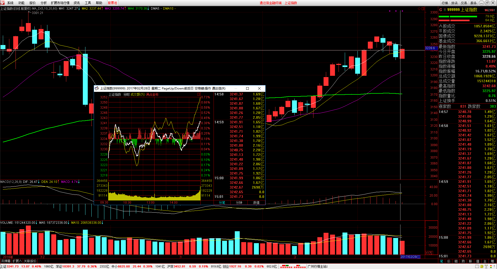

##二、	交易明细
###1、	买卖点截图
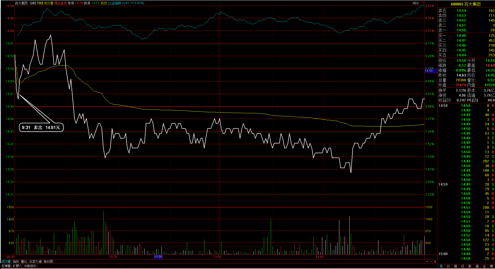
百大集团：昨天收盘前已经走坏，所以早盘觉得处理掉，开盘下落过程清仓出局；
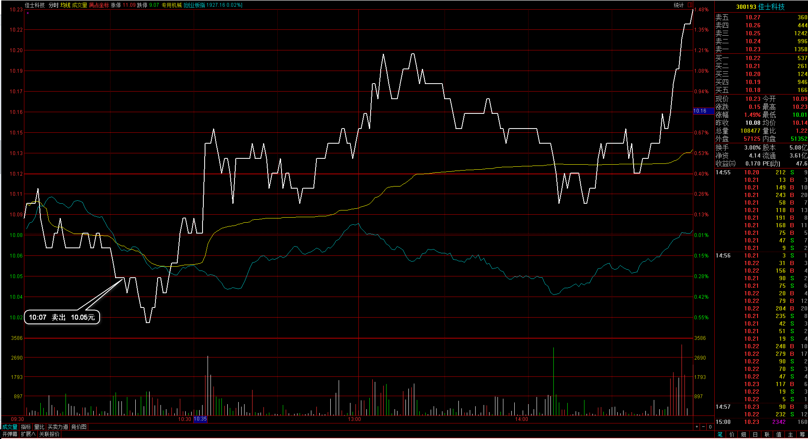
佳士科技：再一次出在一波行情的最低点，不过当时这支个股的选股在动作上并不合适，入场时是期望能向上突破日K线的阶段高位，但走势感觉很弱；
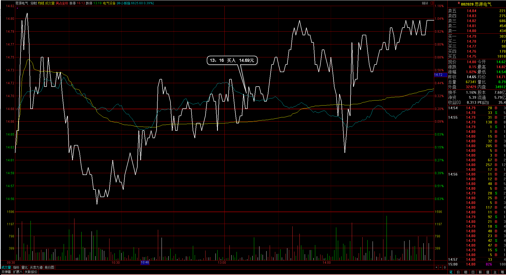 
思源电气：顺着日线的节奏向上，在回调低点介入的，止损应该在当天的日内最低点位置；
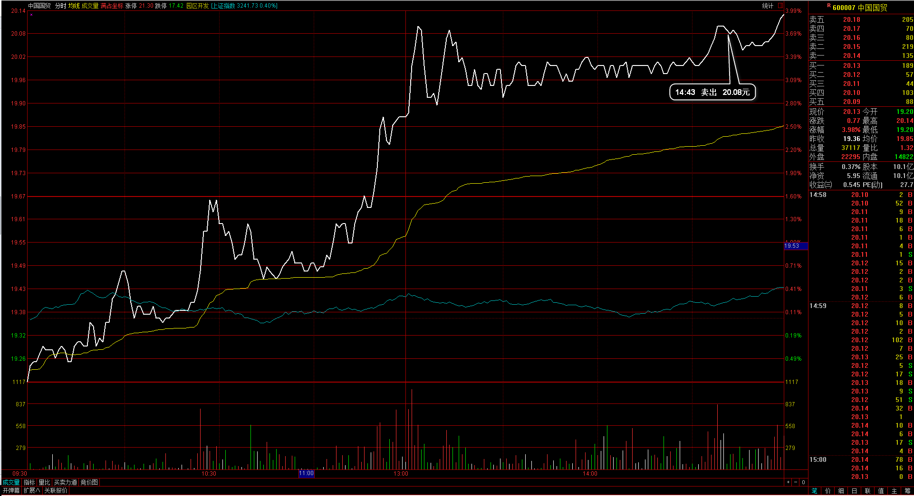 
中国国贸：30分钟周期有顶背驰的感觉，也正好在高位第三次，无法再向上冲回落时在这里先平仓，等之后的回落再接回；
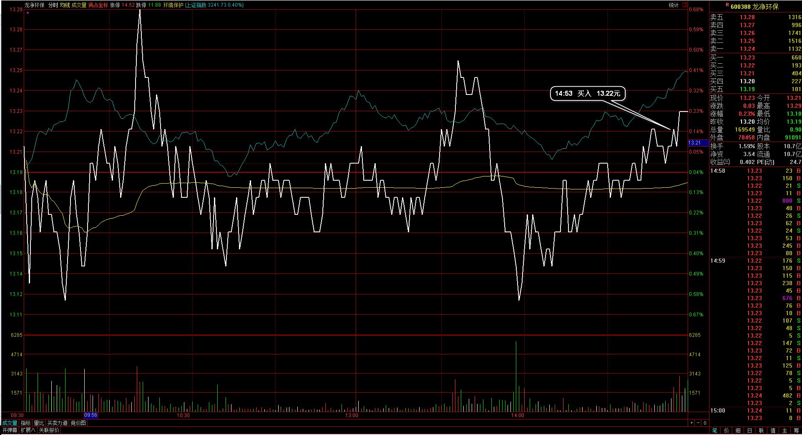 
龙净环保：尾盘找到的小盘整个股，期望完成了调整明天顺着环保版块能有一波上冲；

###2、	成交记录截图
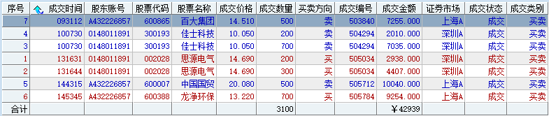

##三、	具体每一轮交易及盈亏情况
###1、	各股交易、持仓明细
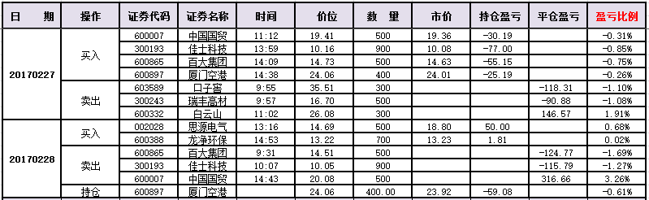 

###2、	平仓分布
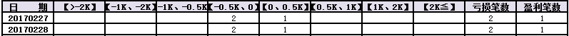

###3、	盈亏比和成功率
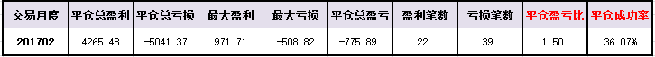 

###4、	账户总计
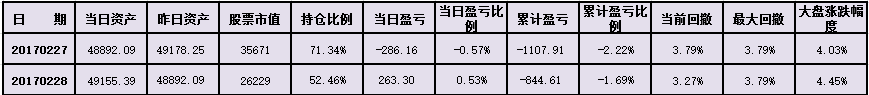

##四、	其他及总结
1、	发现个股节奏的变化情况经常踏错，首先觉得强势就会一直强势，于是去追随强势个股，结果碰到强势个股在休息调整，又尝试着去买那些调整的个股，但那调整的个股却一直在调整不容易有行情，所以这个部分时机的出入很大很大；
2、	然后今天无意看到板块指数行情，对板块行情的关注受“热点”的理解影响，觉得行情的动态热点应该只是盘中的那一个点，但后面实际发现自己经常踏不到热点行情的节奏，强的时候进去和弱的时候进去在效率上都没有多少效率区别，但板块的行情波动日K线却是有趋势表现的，所以觉得也许我把“热点”换成“热门”更好，把一些主力热闹板块放在一起，从这些板块处理自己的股票池，然后股票在这些“热门”板块里再根据当天的“热点”去轮换个股，对于这个想法准确在3月尝试；
3、	在3月里我需要更新自己的交易系统第二版，这部分是对“热点”的完善，前期是“时机”的版本，希望能得到推进整个交易模式的确立；

 

##五、	收盘后账户截图
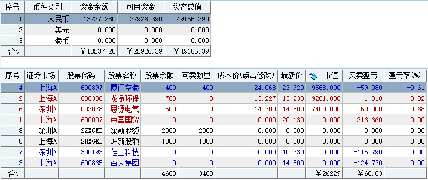