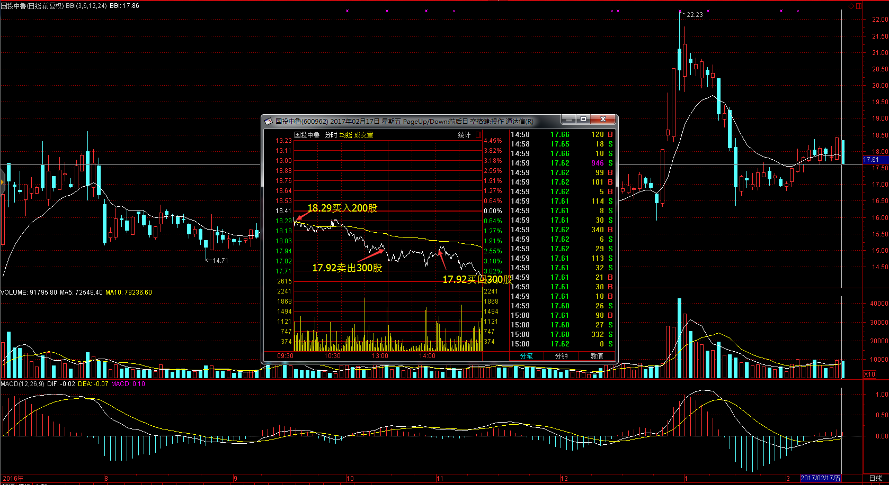
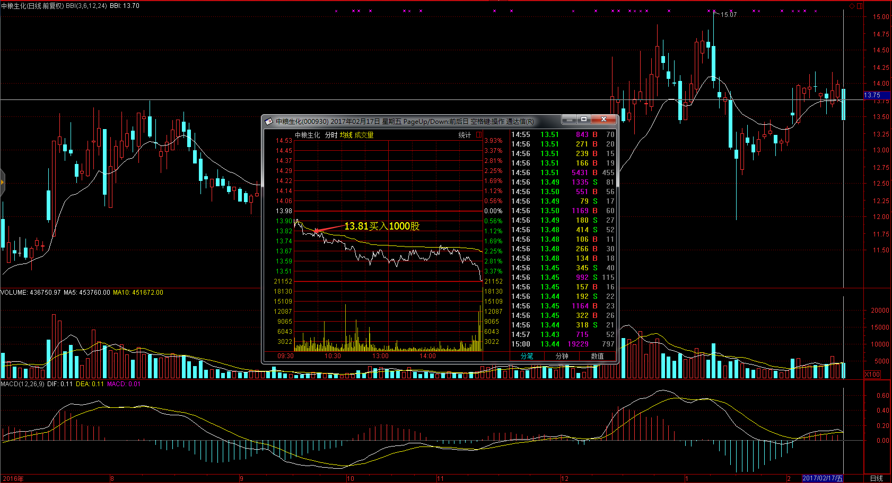
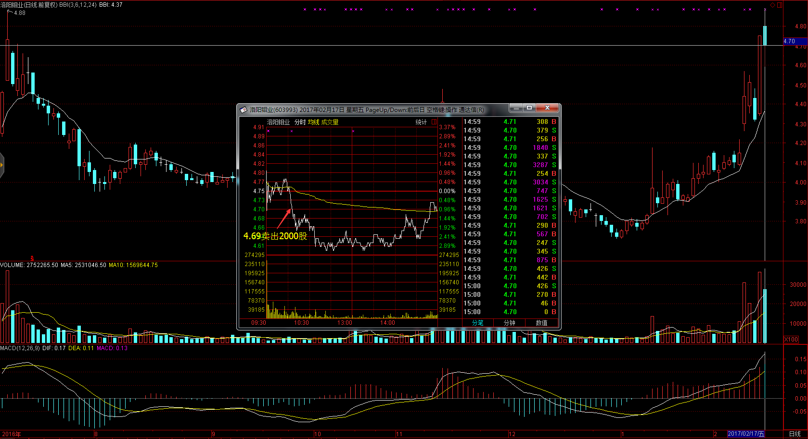
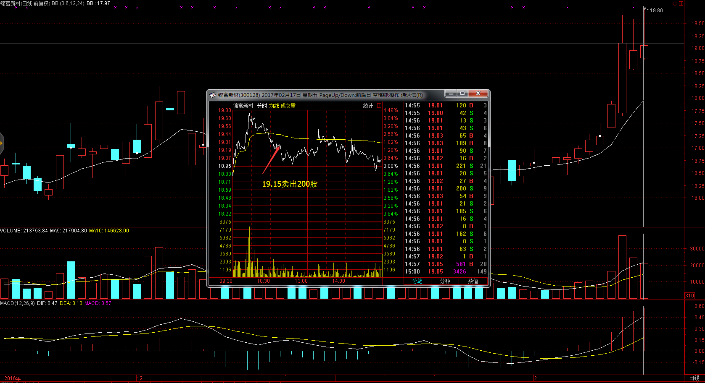
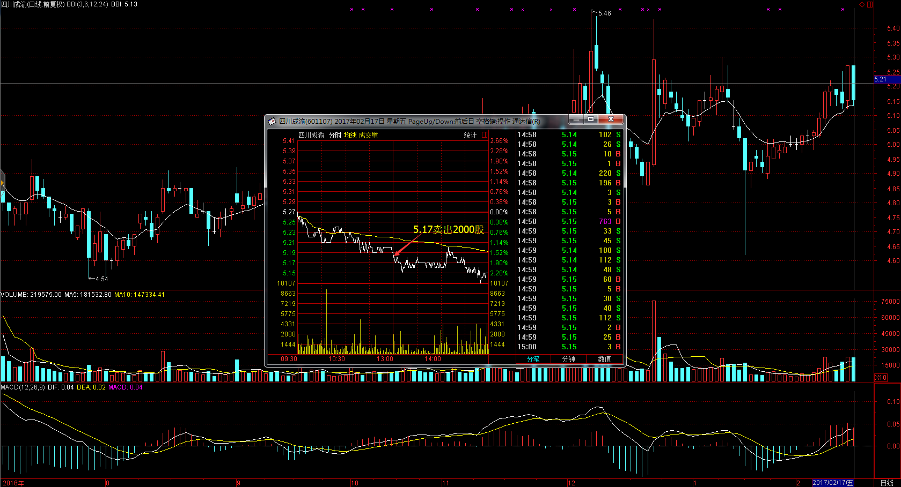
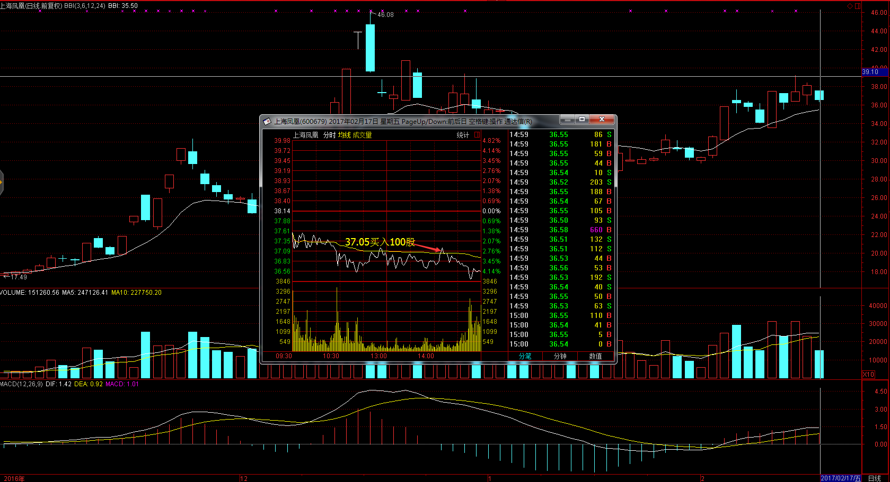
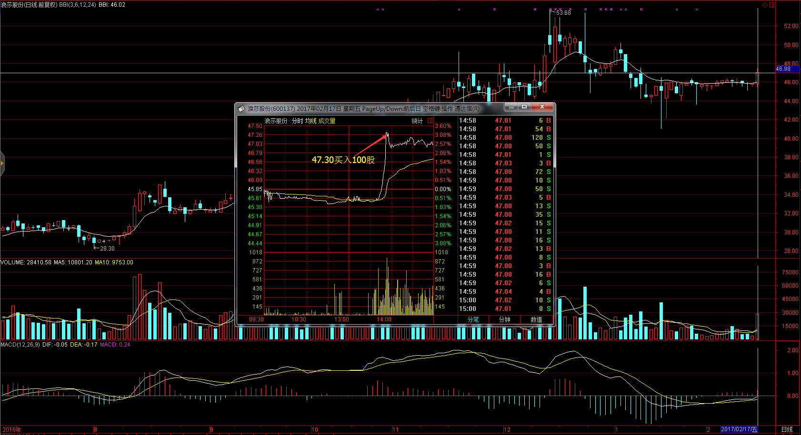
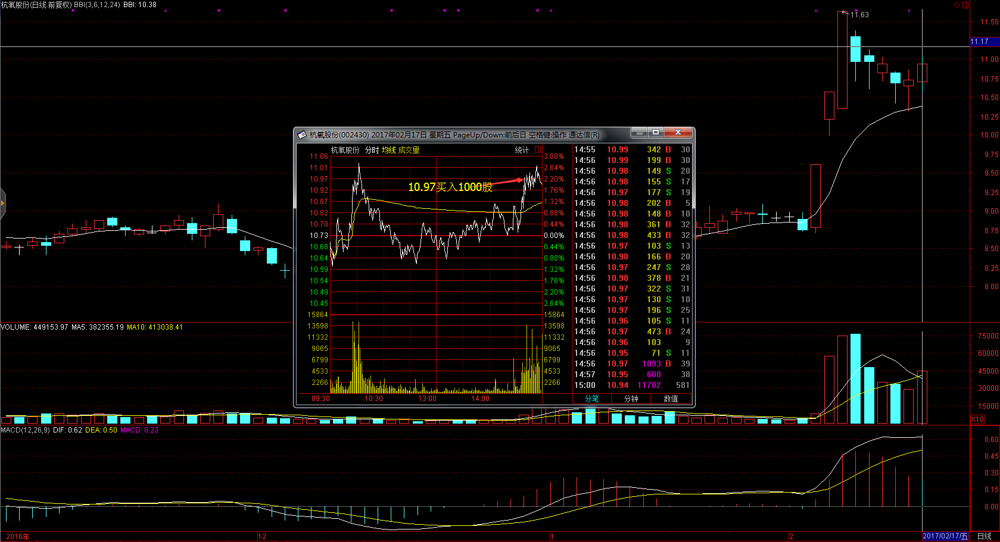
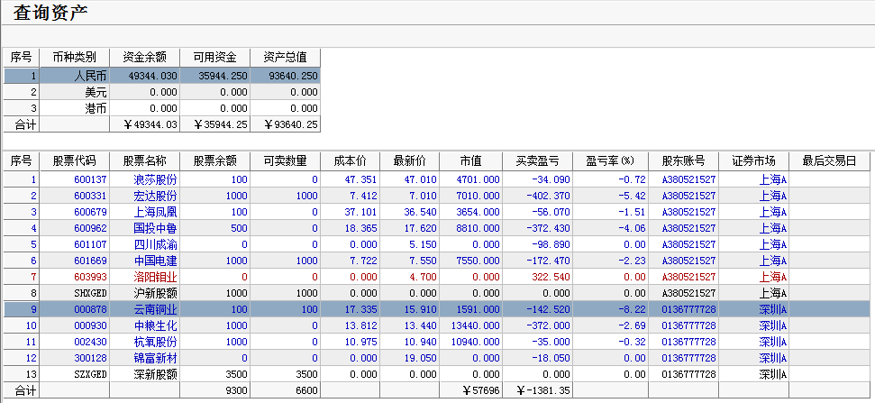

# 2017.02.14交易总结 #
一、	当天走势技术分析回顾
 

- 今天沪低开，开盘后冲高回落，形成15分钟macd顶背驰，随后震荡下跌，收一根几乎光脚的中阴线，把昨天阳线吃掉，KDJ死叉向下发散，且J线值下破75，短期继续调整概率加大，有可能在3200点附近震荡整固后再寻找突破时机，如果跌破3200点，可能要回调到3173点附近。创业板收一根中阴线，尾盘在20日线获得支撑，20日线趋势还是向下，如果不能在附近站稳，存在二次探底的可能。

- 盘面上，券商板块早盘大幅拉升后跌回来全军覆没，船舶、西藏、酿酒等板块涨幅居前，煤炭、土地流转、上海国资改革等板块跌幅居前。

二、	交易明细

1.	买卖点截图

国投中鲁早盘在18.29买入200股，走弱的时候在17.92卖出300股，午后预期大盘站稳，在17.92买回300股。

中粮生化在底部横盘，突然放量的时候，在13.81买入1000股。

洛阳钼业横盘震荡，跌破均价线的时候，在4.69卖出2000股。

锦富新材冲高回落，跌破均价线的时候，在19.15卖出200股。

四川成渝震荡回落，破位下跌回落的时候。在5.17卖出2000股。

上海凤凰底部横盘震荡，突破均价线的时候在37.05买入100股。

浪莎股份大放量快速拉升的时候的时候在47.30买入100股

杭氧股份有调整结束的迹象，在10.97买入100股

2.	交易明细

![]20170217150250.png)

三、	分析每笔交易心态、操作理由、可改进情况
交易总结：

- 今天卖出了洛阳钼业、锦富新材、四川成渝，买入中粮生化、上海凤凰、浪莎股份、杭氧股份。

>早盘预期会上涨，计划买入一些股票，早盘买入了中粮生化，但实际上大盘走势并不强，只有券商板块大幅拉升，个股都不怎么涨。

> 大盘回落的时候，分别卖出洛阳钼业、锦富新材、四川成渝。锦富新材和四川成渝的出场点不是太好，锦富新材冲高回落跌破均价线的时候应该考虑出场，前两天都是冲高回落，这位置压力比较大，而锦富新材没有跟随涨大盘上涨，而是震荡回落，比较弱，这时候应该考虑出掉。

>午后认为大盘见底的，分别小仓位买入了上海凤凰和浪莎股份，尾盘杭氧股份有调整结束的迹象，买入了杭氧股份。

四、	收盘后账户截图

