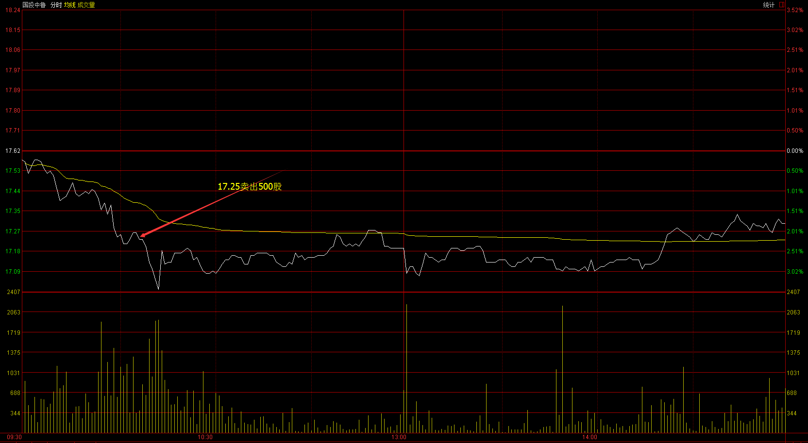
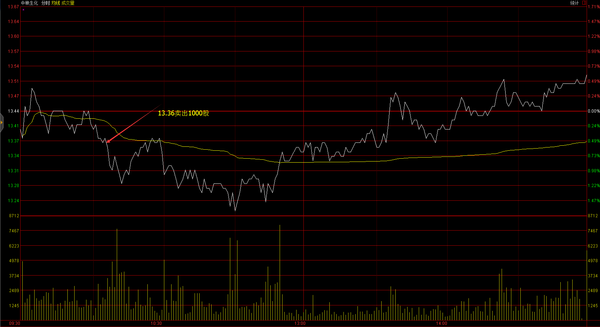
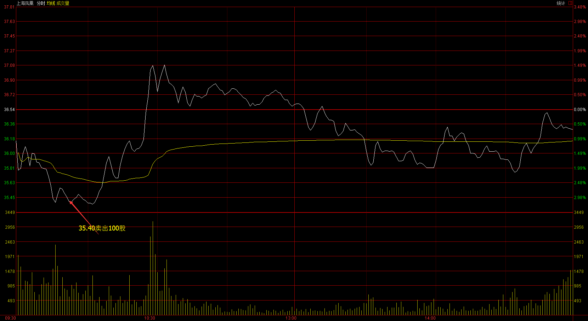
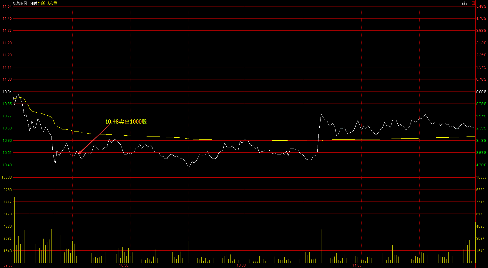
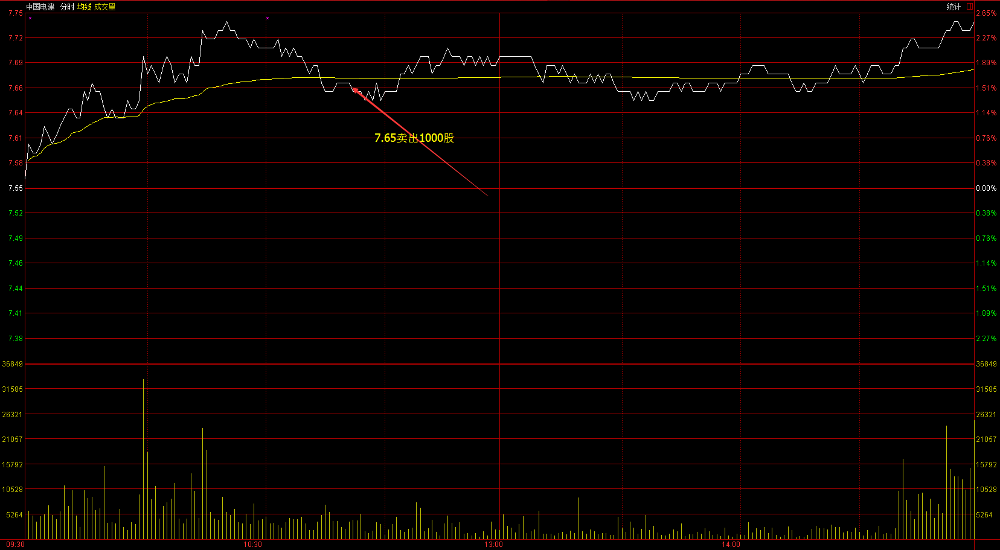
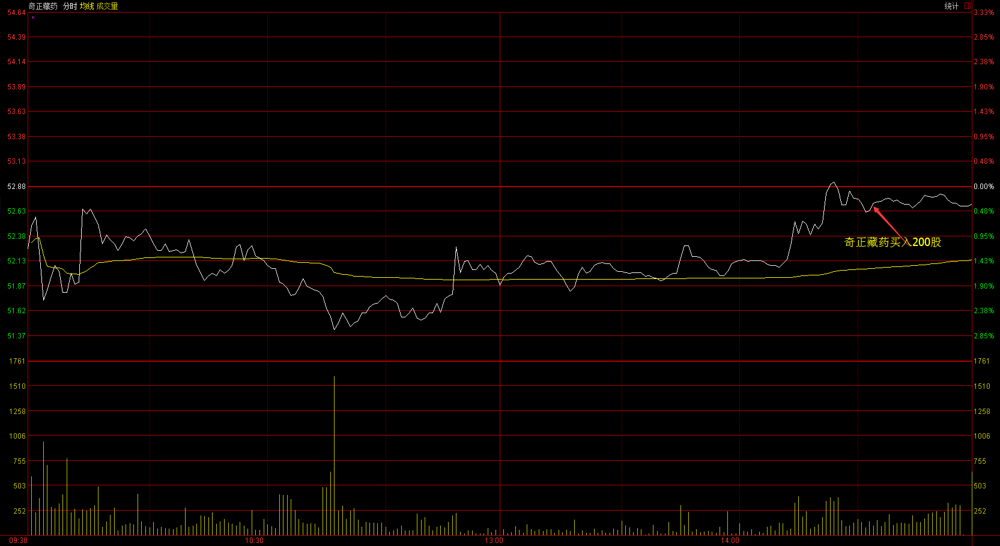
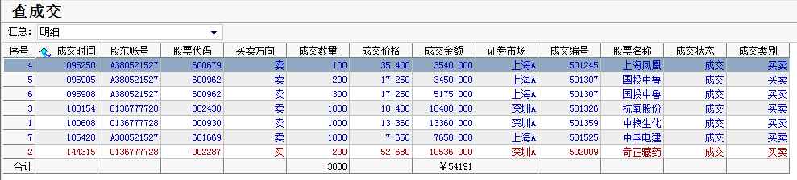
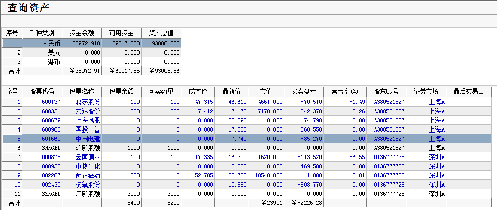

# 2017.02.20交易总结 #
一、	当天走势技术分析回顾

- 今天沪指低开，开盘后全天维持震荡上涨，收一根光头光脚的大阳线，创了两个月来反弹的新高，从30分钟来看，沪指走一个扩张性三角形，一般情况扩张性三角形通常出现在行情的末端，沪指的中小级别整理中，也经常出现扩张性三角形的中继整理的走势。从量能来看，今天的量能不足以支撑沪指继续大涨，这个时候不宜追高，反而要高位减仓以待时机。

- 创业板高开，全天整体围绕开盘价震荡，收一根中阳线，夹于5日线和20日线中间，短期来看，调整的风险还没结束，有待观察。

- 从盘面来看，今日表现最为突出的就是次新银行股，保持了整天的强势运行。酿酒、造纸、家用电器等周期性板块涨幅居前，次新股、日用化工等板块跌幅居前。

二、	交易明细

1.	买卖点截图

国投中鲁早盘下跌，破位后在17.25卖出500股。

中粮生化早盘震荡，破位后在13.36卖出1000股。

上海凤凰早盘下跌，破位后在35.4卖出100股。

杭氧股份早盘下跌，破位后在10.48卖出100股

大盘二次确认顶部的时候，中国电建也是冲高回落，跌破均价线，反弹乏力的时候卖出

奇正藏药30分钟图有站稳的迹象，在52.68买入200股

2.	交易明细

三、	分析每笔交易心态、操作理由、可改进情况
交易总结：

- 今天早上卖出了上海凤凰、国投中鲁、杭氧股份、中粮生化、中国电建，买入了奇正藏药。

>上海凤凰、国投中鲁、杭氧股份、中粮生化都是早上破位下跌，止损出场。

>早盘判断大盘会冲高回来，大盘二次确认顶部的时候，中国电建也是冲高回落，跌破均价线，反弹乏力的时候卖出。

>大盘没有回调，一直没有买进股票，自选股里的股票也不够强势，临近尾盘奇正藏药30分钟图有站稳，买进了奇正藏药。

>最近都是赚了指数，亏了钱，主要是选的股票不够强势，大部分买进的股票都是在区间里震荡，而区间震荡随机性相对比较强，第二天很容易止损出场。要选板块指数处于上涨趋势的强势个股，板块指数走好，相关个股走强的概率会比较大，如果板块指数是下跌趋势的，这个板块的强势个股相对也不会太强势。

四、	收盘后账户截图

