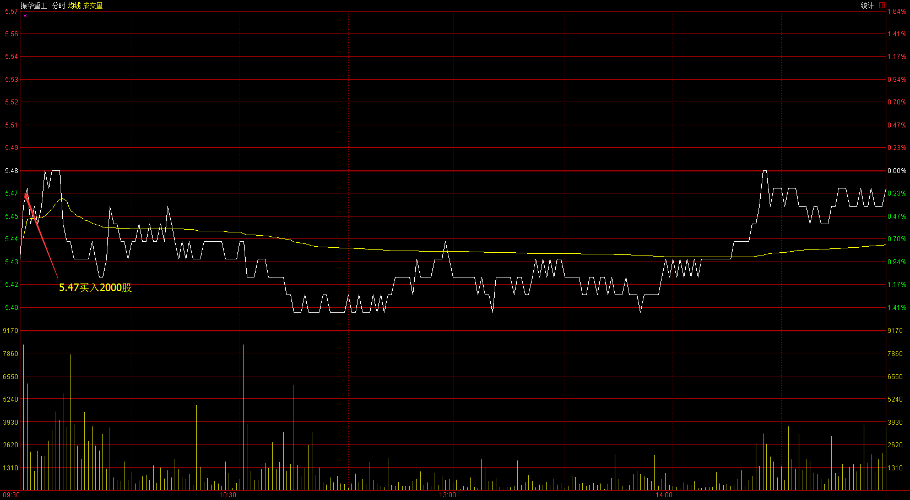
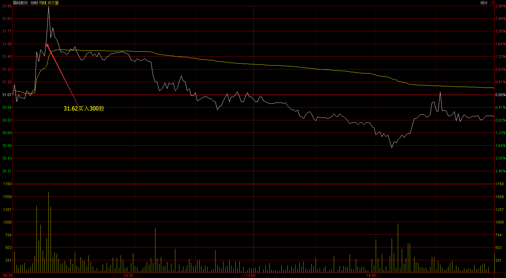

# 2017.02.20交易总结 #
一、	当天走势技术分析回顾

- 今天沪深两市指数高开，开盘震荡冲高，维持强势横盘震荡，沪指收一根缩量小阳线，从30分钟来看，沪指扩张性三角形突破后，在高位横盘震荡，可能明天还有冲高的动能，但成交量较昨天明显的萎缩，如果量能没能放大，短期要预防冲高回落形成30分钟顶部背驰。

- 创业板比较强势，放量上涨，收了一根大阳线，创1月16号反弹以来的新高，创业板有望持续反弹。。

- 盘面上，个股呈现普涨格局，盘中共享汽车，次新股，高送转，有色金属，煤炭，新零售等板块等轮番发力，盘面交投活跃，小盘股炒作复苏，高送转板块历经多日调整后再度大幅反弹。

二、	交易明细

1.	买卖点截图

奇正藏药在52.65卖出100股。

云南铜业在16.00卖出100股。

浪莎股份在35.4卖出100股。

振华重工在5.47卖出2000股

酒钢宏兴在3.54买入2000股

国统股份在31.62买入300股

洛阳钼业在4.82买入2000股

格林美在7.00买入2000股，尾盘在7.12买入2000股

钢构工程在22.59买入900股

2.	交易明细

三、	分析每笔交易心态、操作理由、可改进情况
交易总结：

- 今天早上卖出了奇正藏药、云南铜业和浪莎股份，买入了振华重工、酒钢宏兴、国统股份、洛阳钼业、格林美和钢构工程。

>奇正藏药、云南铜业和浪莎股份今天走势都比较弱，在午后卖出，主要是买入的股票太多了，看不过来。当初是想轻仓去尝试一下买入各种形态的股票，总结交易方法和积累经验，但实际上效果并不好，自以为知道这些形态，实际上是做在错误的事情，在某一段时间，股票的波段是比较随机，最后导致追涨杀跌。

>早盘分别买入了振华重工、酒钢宏兴和国统股份，买入后这些板块都开始下跌，没有把握把握好板块的轮动。

>洛阳钼业和格林美都是突破早盘高点，回调在高点上方站稳的时候买进。

>钢构工程尾盘买入，预期短期调整结束，明天会上涨。

> 做相对确定的事情，确保每笔交易是站在概率胜算的那方。先尝试找出几只基本面和形态都比较好的股票，深入了解研究这些个股最近的波动，因为每只股票的做盘手法不一样，然后开始来回交易，累计交易经验。

四、	收盘后账户截图

