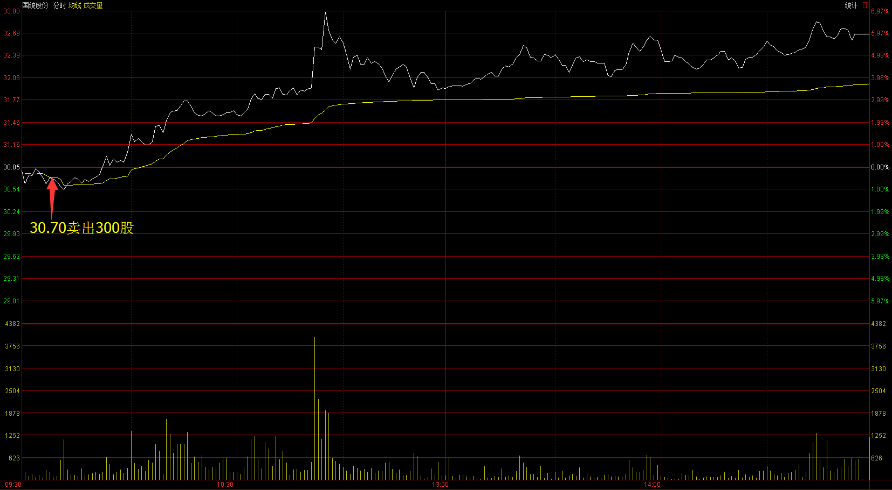

# 2017.02.20交易总结 #
一、	当天走势技术分析回顾

- 沪指早盘低开,盘中震荡激烈，收一根缩量的小阳线，从历史上看，沪指2016年10月12日-2016年10月18日也是走一个扩张性三角形，突破后在平台后在上方震荡整理，然后继续反弹，后市反弹幅度和三角形最长边等长。从60分钟图来看，沪指今天的走势在扩张性三角形上方站稳，如果三角形突破后上涨的幅度和三角形最长一边等同，那么沪指下一步的目标位是3280点，用波浪理论来算，3280点也刚好是1月16日反弹以来的5浪头部的目标点位，突破3280点后能在上方站稳，可能会走延伸浪，如果突破3280点又回来，那么3280很可能是顶部，然后开始调整。 
-

- 创业板刷新反弹高点后，震荡回落，收一根缩量的星阴线，十字星可能是上涨的中继，也可能上涨的结束，如果沪指能继续反弹，创业板今天的星阴线很可能是上涨的中继。

- 盘面上，板块轮动明显，水泥、工程机械、酿酒板块涨幅居前，军工、煤炭等板块跌幅居前。

二、	交易明细

1.	买卖点截图

酒钢宏兴在3.45卖出2000股

国统股份在30.70卖出300股

格林美在7.29卖出2000股，尾盘在7.15买入2000股

宏达股份在7.13卖出2000股

钢构工程在22.37卖出900股

全志科技在72.55买入200股

2.	交易明细

三、	分析每笔交易心态、操作理由、可改进情况
交易总结：

- 今天早上卖出酒钢宏兴、国统股份、宏达股份和钢构工程，买入了全志科技。

>酒钢宏兴和国统股份昨天买入后，走势不符合预期，早盘比较弱，由于满仓，打算腾出仓买入创业板股票，开盘后不久卖出，后市这两只股票都上涨，后市创业板反而走得比较弱，这是比较错误的操作。

> 宏达股份和钢构工程在早盘大盘见顶的时候卖出，卖出后开始下跌。

> 午后大盘见底的时候，买入了全志科技。
四、	收盘后账户截图

