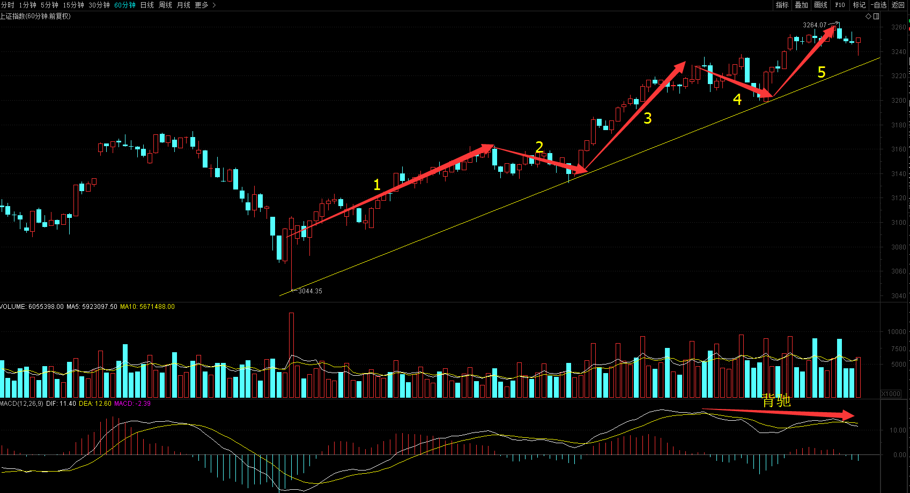
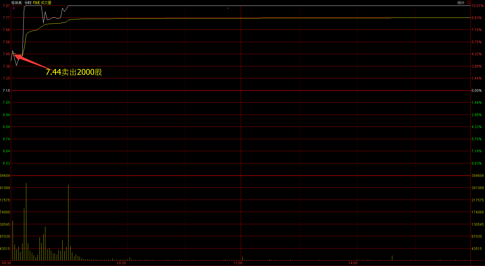
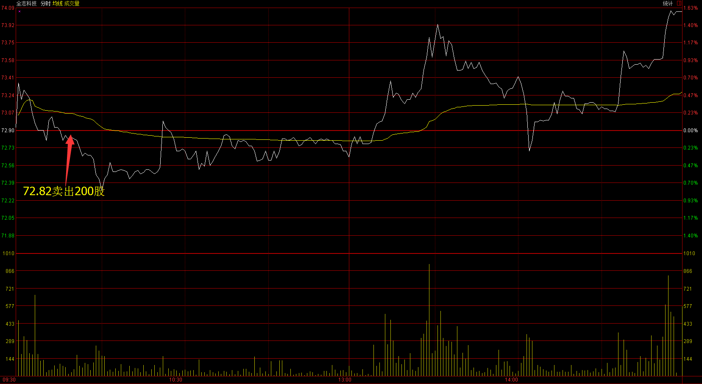
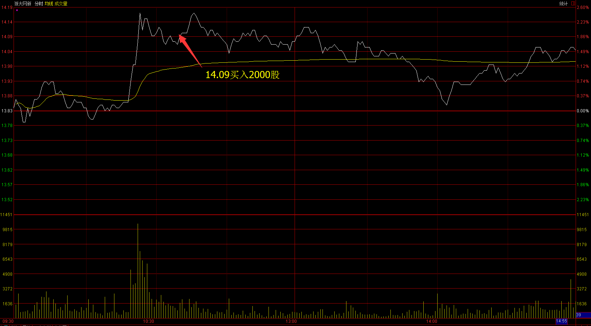
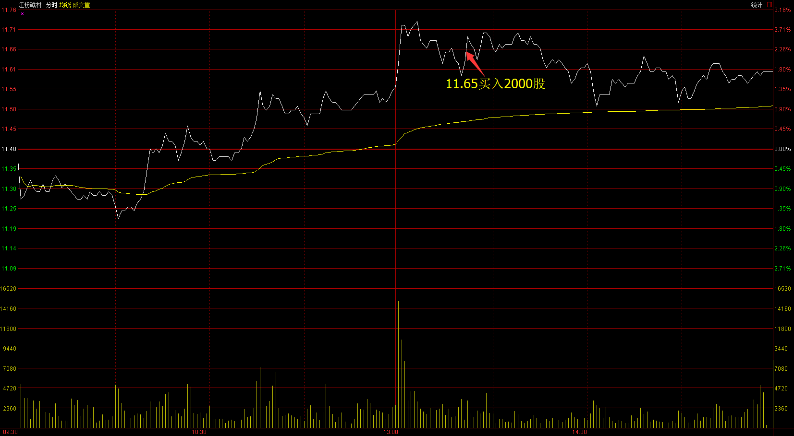
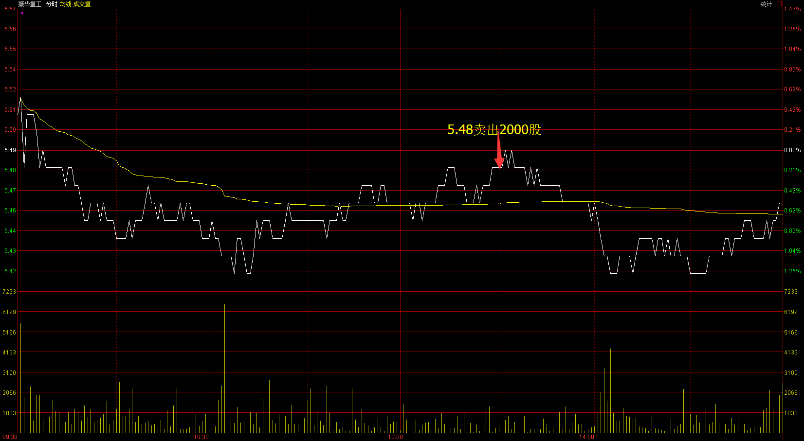
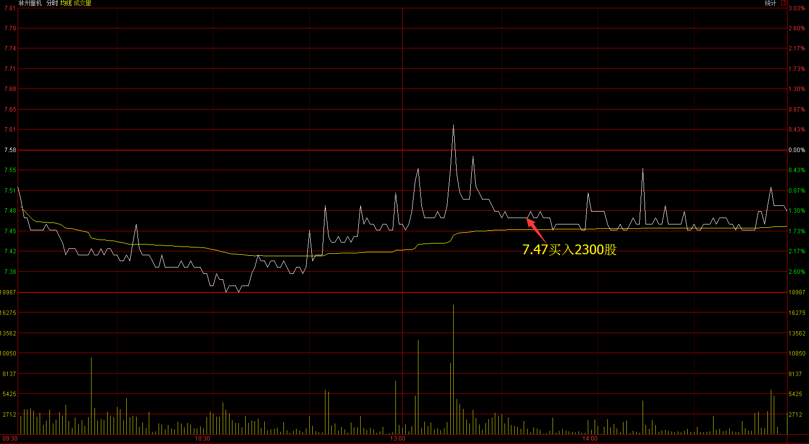
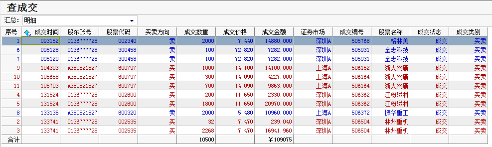
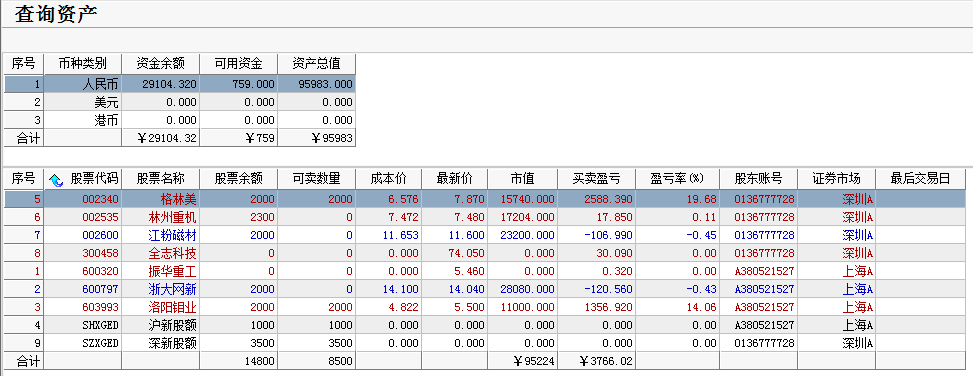

# 2017.02.23交易总结 #
一、	当天走势技术分析回顾

- 今天沪指低开，随后盘中持续震荡下跌，午后受水泥板块暴跌的影响，沪指跳水，在五日线获得支撑，跌幅收窄，收一根长下影线的小阴线，从60分钟图来看，沪指从1月16日开始反弹，推动浪上涨，今天走出MACD顶部背驰，5浪反弹可能结束，后市将展开3浪回调，回调浪有两种可能走势，一种是平台形调整浪，另一种是展开锯齿形ABC浪下跌调整，调整浪走完将再开始5浪推动浪上涨。 
- 

- 创业板受医药、次新股板块拉升人气影响，表现较强势，收一根光头小阳线，从60图来看，上涨趋势完好，如果大盘没有出现大幅调整，创业板继续上涨的概率较大。

- 盘面上，板块轮动明显，昨天大涨的水泥、钢铁板块今天集体下跌，医药板块受消息的影响集体大涨，次新股、有色、医药板块涨幅居前，建材、钢铁、航空板块跌幅居前。

二、	交易明细

1.	买卖点截图

格林美在7.44卖出2000股

全志科技在72.82卖出300股

浙大网新在14.09买入2000股

江粉磁材在11.65买入2000股

振华重工在5.48卖出2000股

林州重机在7.47卖出2300股

2.	交易明细

三、	分析每笔交易心态、操作理由、可改进情况
交易总结：

- 今天卖出了全志科技和振华重工，买入了浙大网新，江粉磁材和林州重机。

>早盘大盘比较弱，全志科技冲高回路的时候卖出。

> 午后卖出了振华重工，买入了林州重工，振华重工的盘子太大了，上涨的幅度不会太大，换成林州重工。

> 浙大网新早盘逆势上涨，大盘站稳的时候，浙大网新回调的时候买进，这样操作面临比较大的风险，早上大盘下跌把昨天阳线的实体吃掉，午后可能继续下跌，如果这只股票没有足够强势，很可能被大盘带下来。

> 午后，当时判断大盘已经站稳，买入了江粉磁材。
四、	收盘后账户截图

