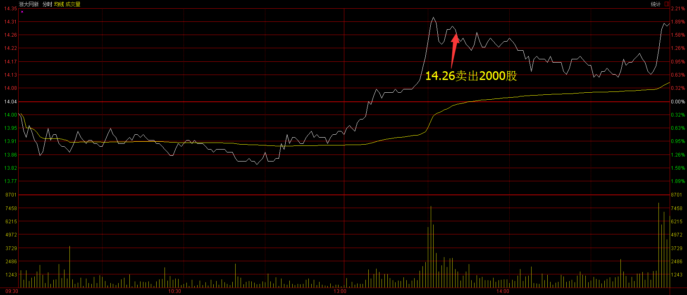

# 2017.02.24交易总结 #
一、	当天走势技术分析回顾

- 今天沪指低开，开盘后震荡下跌，在10日均线获得支撑，随后反弹，收一根缩量带下影线的光头小阳线。从60分钟图来看，KDJ指标在50附近金叉，沪指的调整比较强势，没有触及到趋势线就反弹，后市沪指调整走平台形调整的概率比较大，沪指在3239点之上为强势。

- 创业板低开高走，收一根稍微放量的光头中阳线，从60分钟图来看，上涨趋势完美，反弹继续。

- 盘面上，中国联通异动，带领指数翻红，机场航运板块尾盘出现大爆发，板块股票全部翻红，互联网、次新股、运输服务等板块涨幅居前，有色、建材、煤炭跌幅居前。

二、	交易明细

1.	买卖点截图

林州重机在7.37卖出2000股

浙大网新在14.26卖出2000股

山河智能在14.09买入2000股

2.	交易明细

三、	分析每笔交易心态、操作理由、可改进情况
交易总结：

- 今天卖出了林州重工和浙大网新，买入山河智能。

> 林州重机早盘低开震荡，跌破震荡区间的时候卖出。

> 浙大网新午后冲高，当时大盘还没有站稳，在二次确认顶部的时候卖出。

> 大盘二次确认底部站稳的时候，山河智能快速拉升突破早盘的震荡区间，冲破后上冲的时候买进。

- 今天持有的股票都不够强势，有色、工程机械板块都回调，没有把握板块轮动好节奏。
四、	收盘后账户截图

