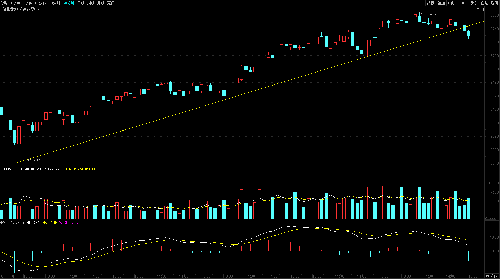
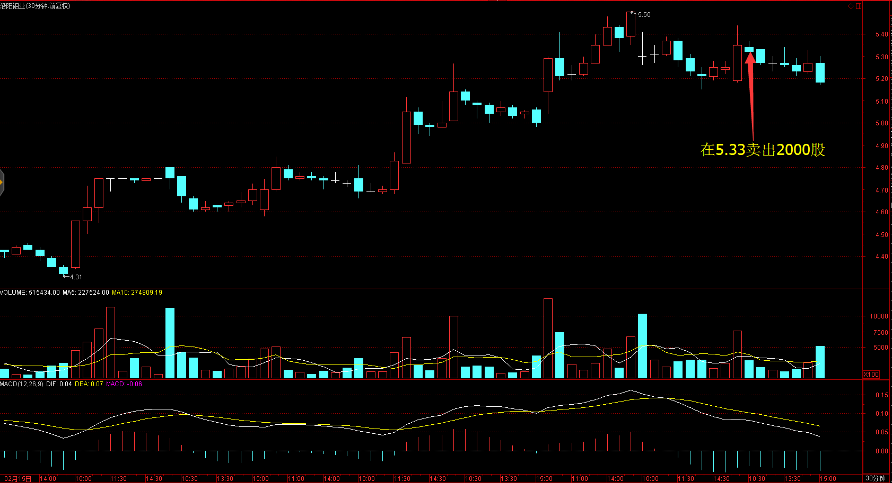
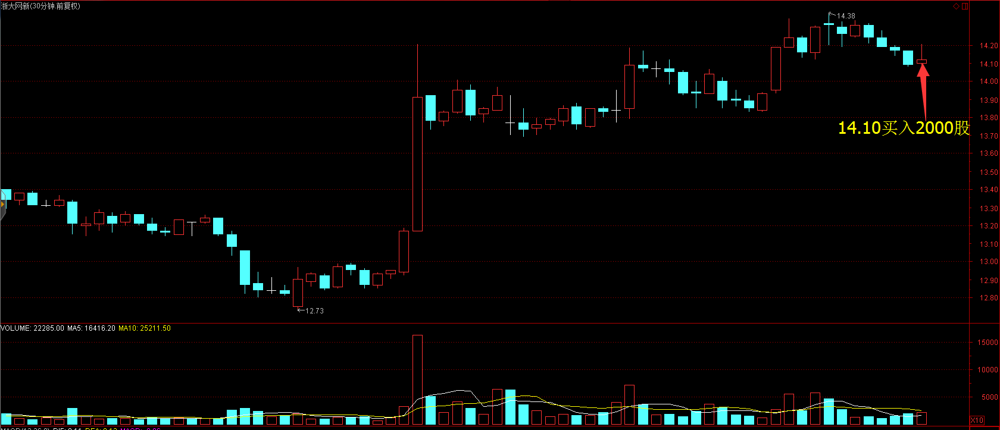
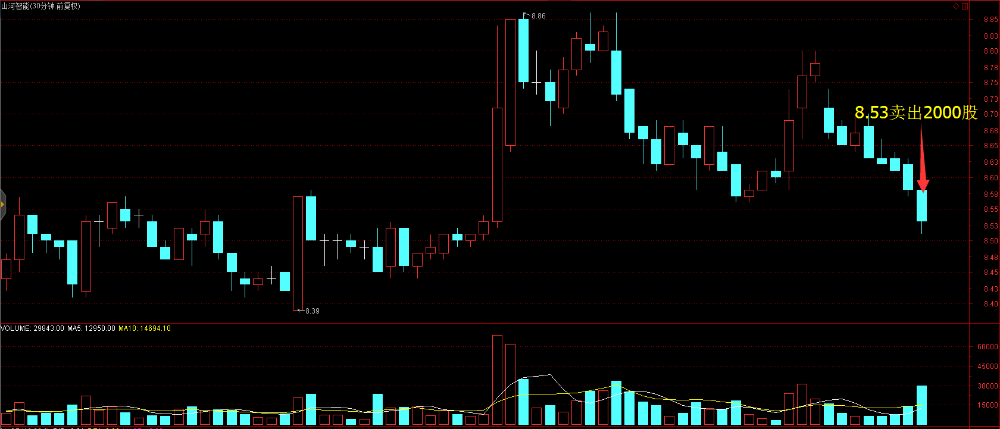
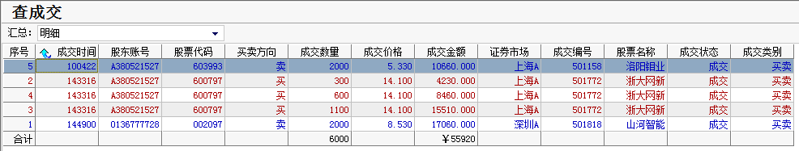
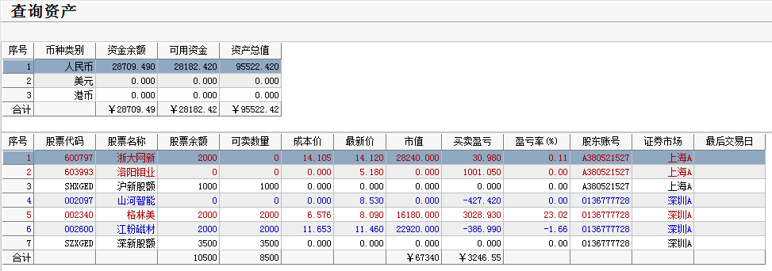

# 2017.02.25交易总结 #
一、	当天走势技术分析回顾

- 今天沪指低开，随后维持窄幅震荡，午后热点匮乏，沪指开始下跌，收一根中阴线，跌破了10日线，日线顶分形成立，从60分钟图看，沪指今天跌破了上涨趋势线，短期将会继续调整，根据波浪理论，5浪走完后，3浪回调大部分会落在上一波推动浪的4浪位置，那么沪指后市有可能会考验3200点的支撑，短期沪指在3239点之上为强势，3222点以下为弱势。

- 创业板低开，开盘后震荡上涨，午后转跌，收一根中阴线，几乎把上一个交易日的阳线吃掉，如果沪指下跌，创业板短期调整的概率加大。

- 盘面上，热点匮乏，旅游、环境保护、钢铁等板块涨幅居前，运输服务、酿酒、建筑节能等板块跌幅居前。

二、	交易明细

1.	买卖点截图

洛阳钼业在5.33卖出2000股

浙大网新在14.10买入2000股

山河智能在8.53卖出2000股

2.	交易明细

三、	分析每笔交易心态、操作理由、可改进情况
交易总结：

- 今天卖出了洛阳钼业，山河智能，买入了浙大网新。

> 早盘洛阳钼业30分钟图二次确认顶部的时候卖出。

> 山河智能震荡下午，临近尾盘加速下跌，30分钟破位的时候止损出场。

> 临近尾盘，大盘见底的时候，在低位买入了浙大网新。这笔操作不是太好，大盘明天比较大概率下跌，那么个股可能会有更低的价位进场，应该等明天再找低位买入。
四、	收盘后账户截图

