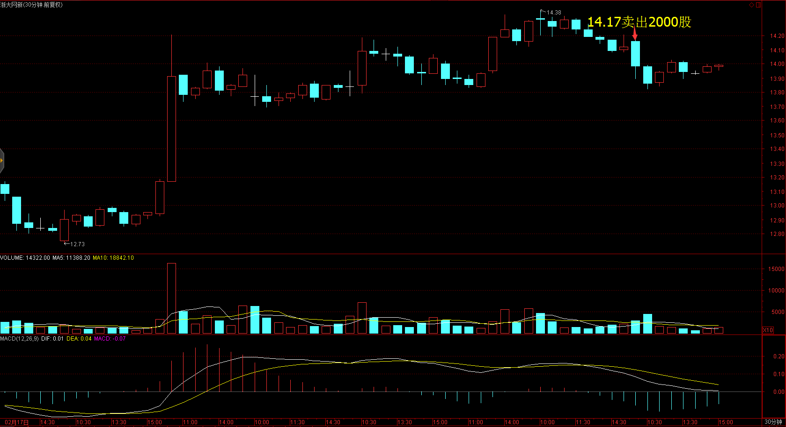
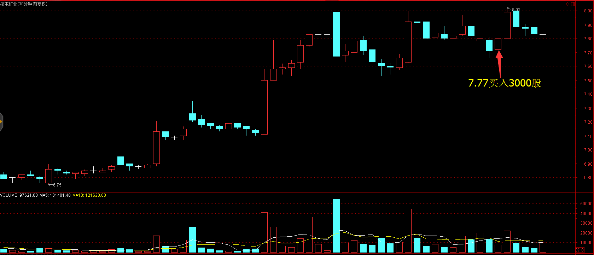
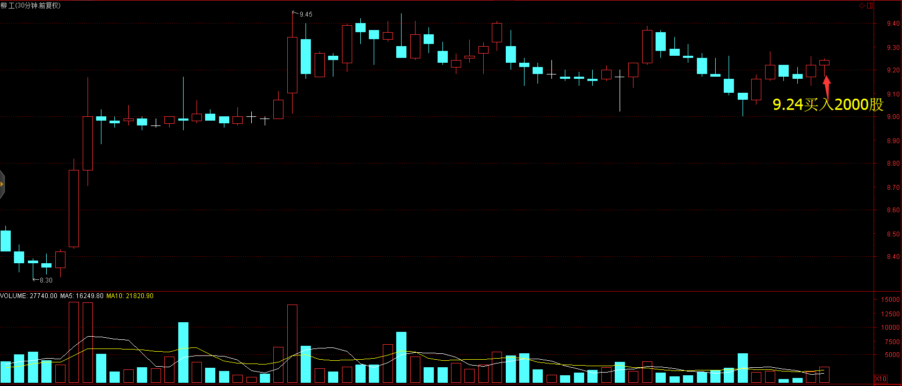
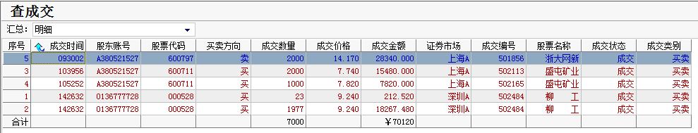
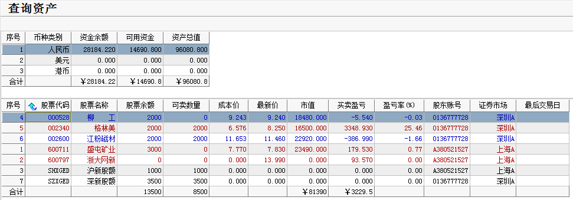

# 2017.02.28交易总结 #
一、	当天走势技术分析回顾

- 今天沪指全天震荡，收一根缩量的实体小阳线，成交量萎缩，暗示着场外资金进场意愿不强，从60分钟图，KDJ指标在50以下金叉，预示着明天还有继续冲高的动能，如果明天收盘站在3252点之上，沪指可能调整结束，但在3252点之下沪指将会继续震荡整理。

- 创业板走势较弱，收一根缩量的星阳线，日线收出了顶分形，要破坏顶分形，明天收盘要收在1932之上，但从60分钟来看创业板上涨趋势完好，今天在前期高点附近有站稳的迹象，预计短期震荡概率比较大。

- 盘面上，快递板块表现强势，申通快递、韵达快递、圆通速递、顺丰控股全部涨停，物流、油改、银行等板块涨幅居前，P2P概念、钢铁、医药等板块跌幅居前。

二、	交易明细

1.	买卖点截图

浙大网新在14.17卖出2000股

盛屯矿业在7.77买入3000股

柳工在9.24买入2000股

2.	交易明细

三、	分析每笔交易心态、操作理由、可改进情况
交易总结：

- 今天卖出了浙大网新，买入了盛屯矿业和柳工。

> 早盘预计大盘会调整，昨天买入浙大网新没能涨上去，认为进场太早了，今天居然高开，一开盘就卖出。

> 盛屯矿业60分钟图维持强势的震荡整理，预期还有一波上涨，今天早盘回调，站稳的时候买进，当时大盘也站稳反弹。

> 临近尾盘海外工程板块快速上涨，有调整结束的迹象，这个板块里一直关注柳工这只个股，柳工在30分钟图的60天线获得支撑，上涨一波维持震荡，预计调整结束，且上涨趋势完好，在收盘前买入。

四、	收盘后账户截图

