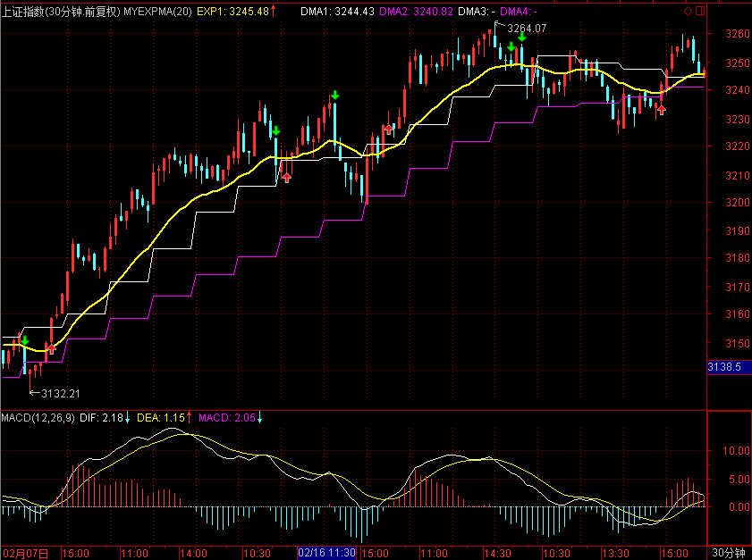
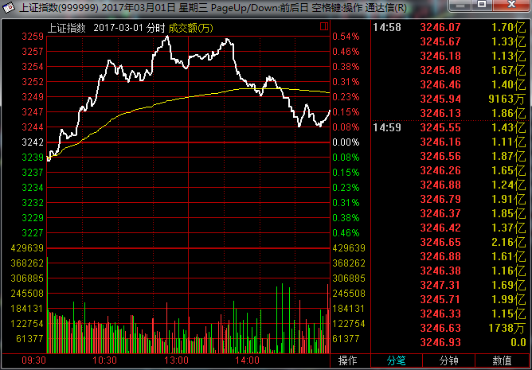
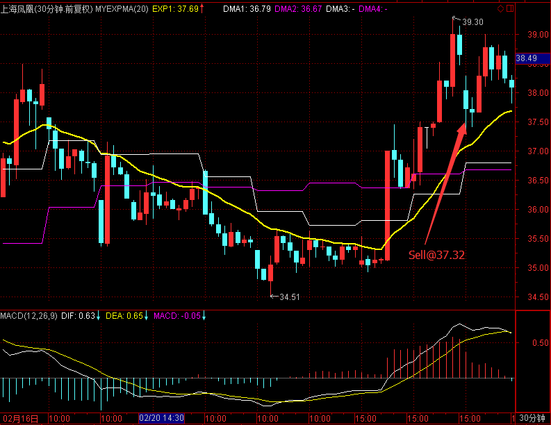
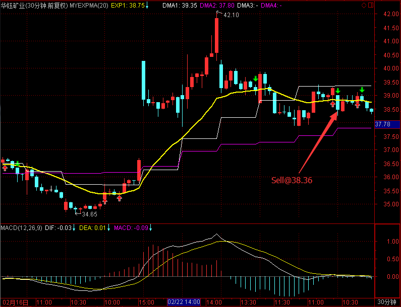
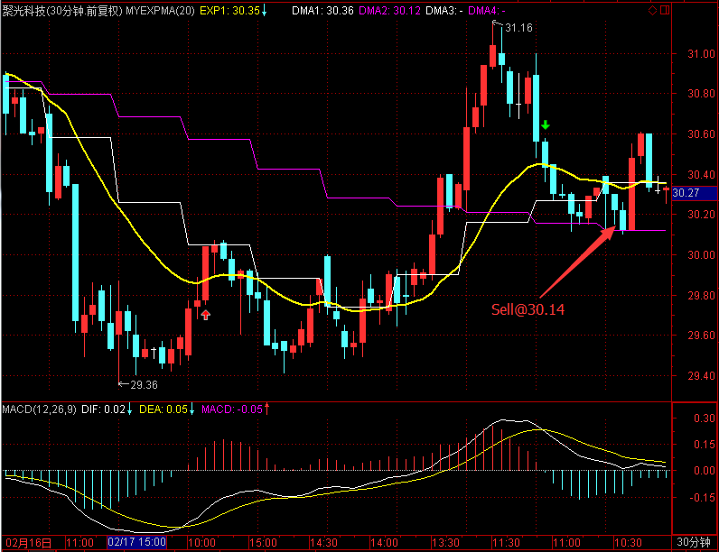
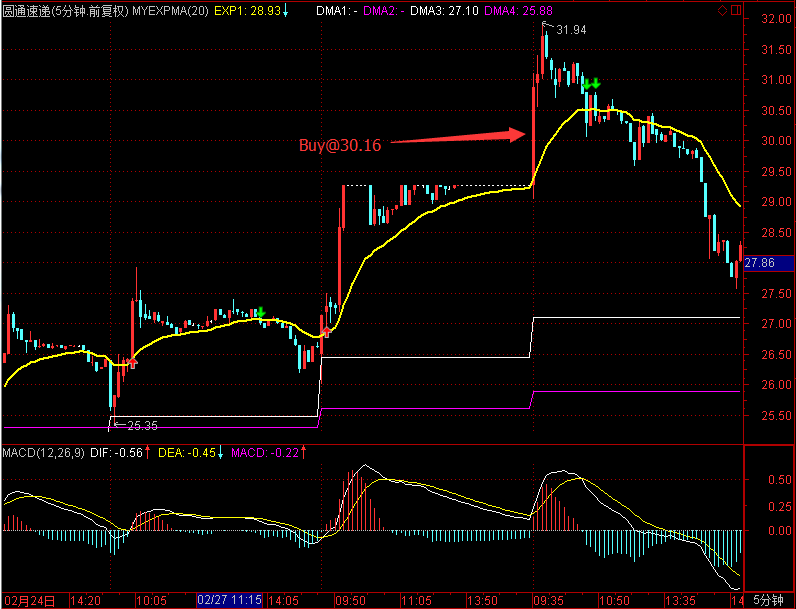
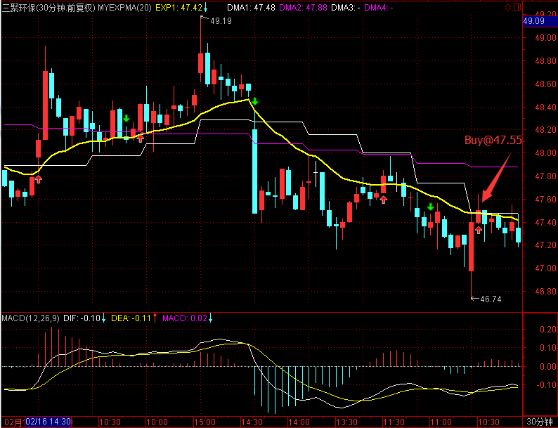
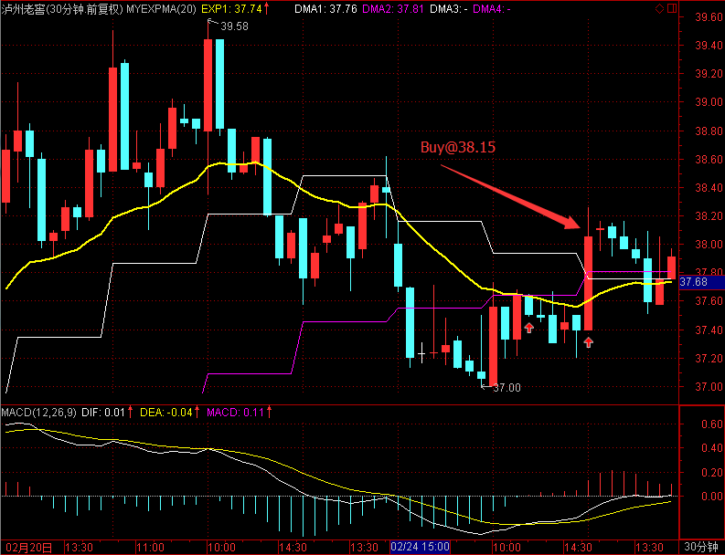

# 2017.3.1 交易总结

------

## 大盘走势

大盘再次强劲上涨，最终收盘站上了5日均线，今天开盘在3240.07点，然后强劲上涨，开盘价附近就是日内最低3237.87点，盘中两次上冲3260未果，创下盘中高点3259.98点，然后大幅回落，最终收在3246.93点，全天上涨5.20点，涨幅0.16%，成交总额较前两日有放大达到2259.41亿元。后市大盘可能仍会在3260~3240区间震荡做调整。

## 交易情况

### 卖出操作

600679 上海凤凰，开盘走弱，不能站上均线，在37.35卖出。

601020 华钰矿业开盘低走，在38.36卖出。

300203 聚光科技上涨后又回调至原点，在开盘30.14价格卖出。

------

### 买入操作

600233 圆通速递在物流运输板块，在顺丰的带领下走强了几天，开盘继续往上时买入，买入价30.16。

------

300072 三聚环保日线走势良好，在开盘往上站上5日线时买入，买入价47.55。

------

000568 泸州老窖前两天调整完，在开盘往上时于38.15买入。

------

## 今天异动股票

000877 天山股份涨停

## 交易总结

- 开盘卖出三个股票，都在开盘价附近

## 交易计划

- 

