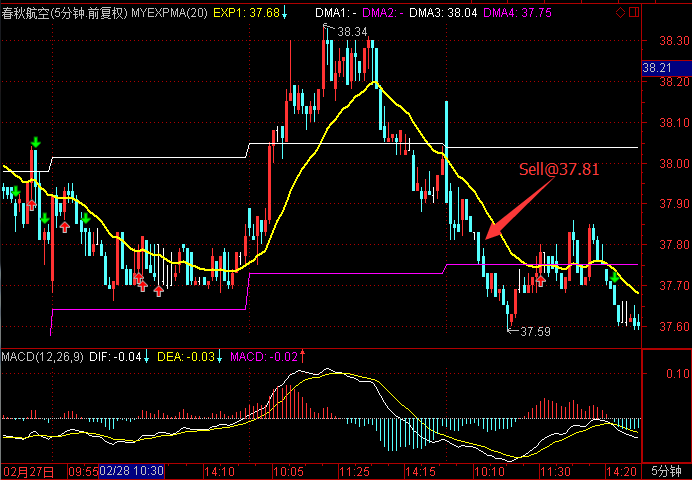
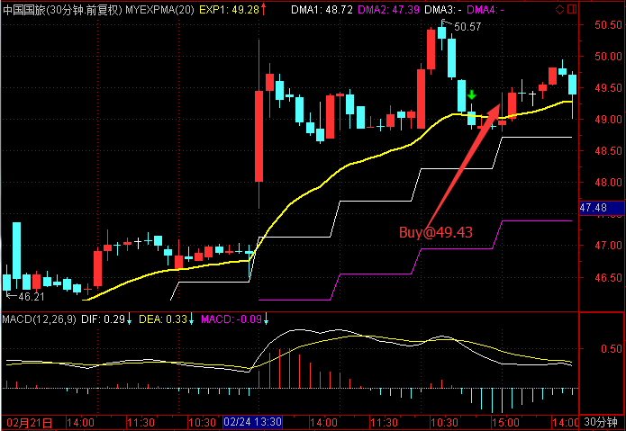

# 2017.3.2 交易总结

------

## 大盘走势

大盘向上再次冲击3260失败，然后开启了向下寻找支撑的下跌行情，今天开盘在3250.52点，然后直接向上最高达3256.81点，无力再向下以两段式下跌最低达到3228.66点，最终收盘在3230.03点。全天总成交额为2230.44亿元，与上个交易日相近。明天要密切关注3225点位附近的支撑情况。

## 交易情况

账户情况：

成交情况：

------

### 卖出操作

600233 圆通速递昨天买入后大幅下跌，开盘继续下跌，在26.55卖出，亏损较大。

600079 人福医药下跌后无法继续上升，在20.27卖出。

601021 春秋航空未能如期拉升，在37.81卖出。

002287 奇正藏药继续下跌，在50.78卖出。

300072 三聚环保下跌幅度较大，在46.51卖出。

------

### 买入操作

601628 中国人寿疑似形成底部结构，在往上走时于25.78买入，买入后当天继续下跌，跌破前面构筑的底部位置，但当天无法卖出。

601888 中国国旅日线形态良好，在早盘30分钟往上时，于49.43买入。

300176 鸿特精密在日线形态良好，上升迅猛，开盘往上时就买入，买入价48.69/49.30。

300028 金亚科技前面有涨停，回调至10日线上有支撑，在开盘附近14.85买入。

000877 天山股份前一天涨停，开盘往上就立即抢入，在15.10买入。

------

## 交易总结

- 高波动股票的波幅大，而且早盘买入后容易被大幅下跌深套，在获得高收益的同时也需要承受高的风险，还需要多摸索。

- 当天没有走强的股票，做好计划，第二天低开或者平开往下时，就需要先平仓，不能持侥幸心理等待。

## 交易计划

- 中国人寿和金亚科技，开盘需要平仓
- 天山股份，鸿特精密需要关注，开盘10分钟走得弱也需要考虑平仓
- 其余股票视盘中走势进行平仓

