# 2017.3.6 交易总结

------

## 大盘走势

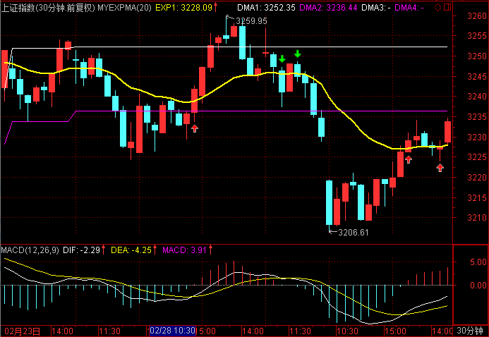

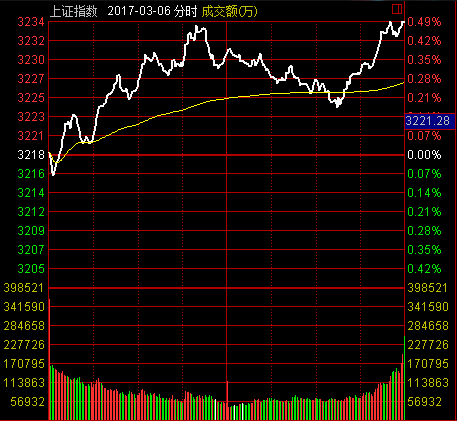

大盘稍向下低开在3217.33点，只向下回探了一点，然后往上波动，盘中最高达到3234.66点，最终收盘在3233.87点，上涨15.56点，涨幅0.48%，全天成交总额达到1937.69亿元，与之前变化不大，后市将在3240~3220区间突破后选择方向。

## 交易情况

账户情况：
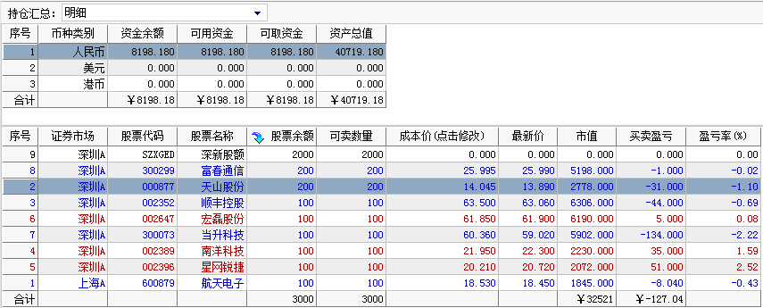

成交情况：
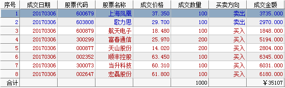

------

### 卖出操作

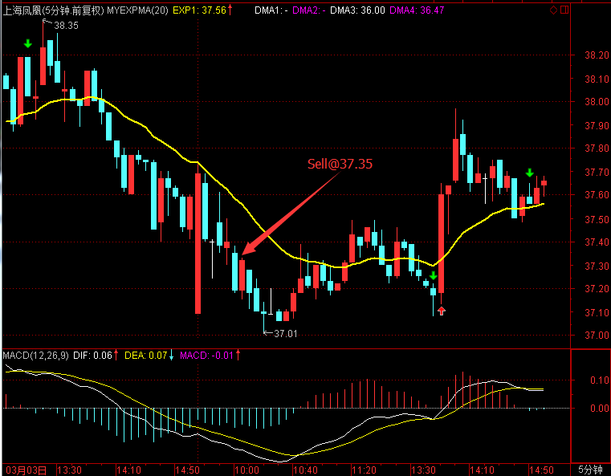

600679 上海凤凰，开盘走弱，不能站上均线，在37.35卖出。

------

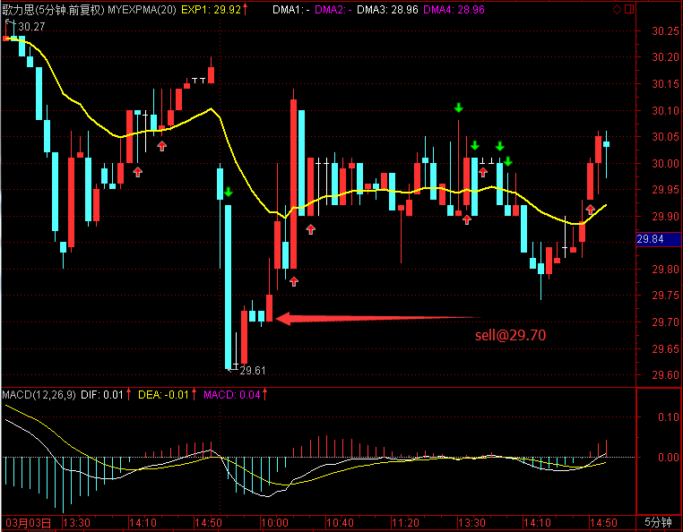

603808 歌力思开盘低开低走，略微反弹时卖出，卖出价29.70。

------

### 买入操作

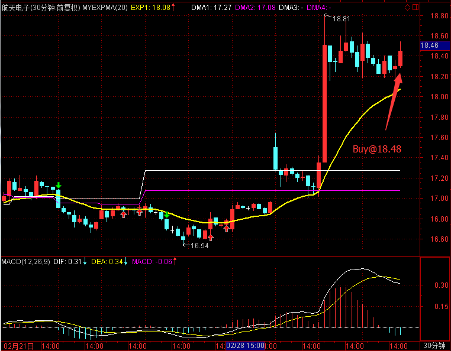

600879 航天电子日线出现动量信号，在尾盘18.48买入。

------

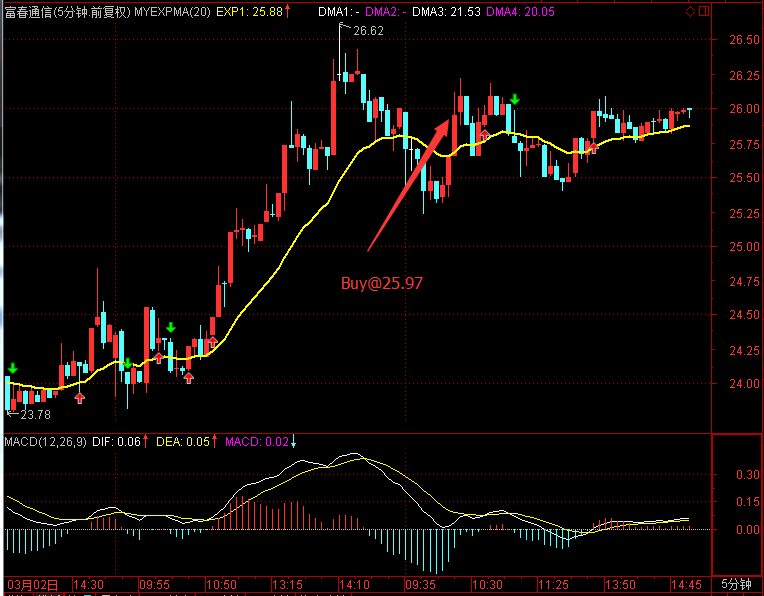

300299 富春通信连续多日上涨，今天出现在波动大股票列表中，在开盘突破均线拉升时买入。买入价25.97。

------

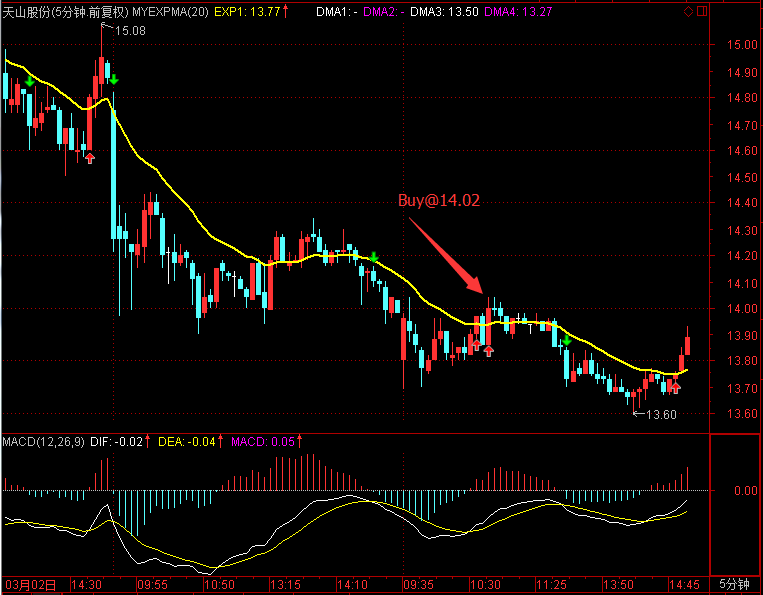

000877 天山股份是今天波动大股票列表股票，在价格走平突破均线时买入，买入价14.02。

------

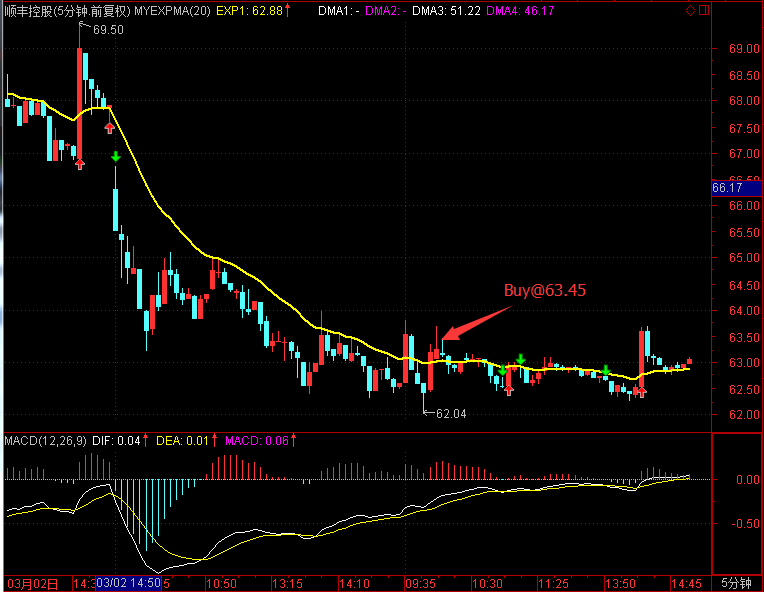

002352 顺丰控股是今天波动大股票列表股票，在价格走平突破均线时买入，买入价63.45，买入后下跌了一波，尾盘拉回。

------

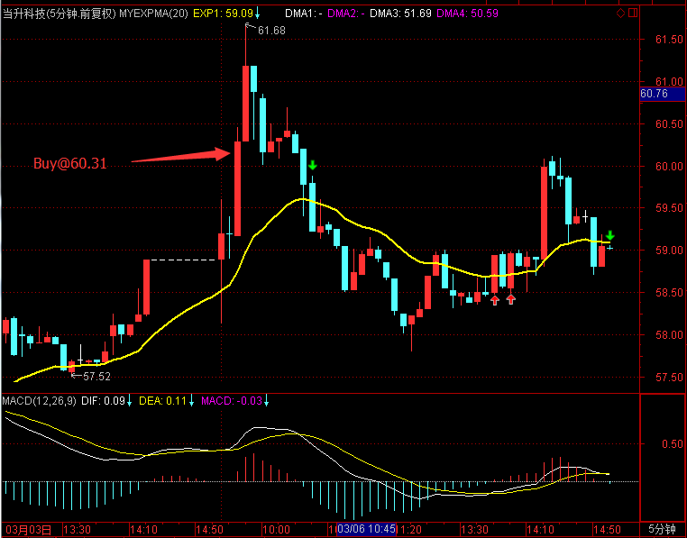

300073 当升科技是今天波动大股票列表股票，早盘开盘往上走时买入，买入价60.31，买入后冲高后一直下跌，尾盘略微拉回。

------

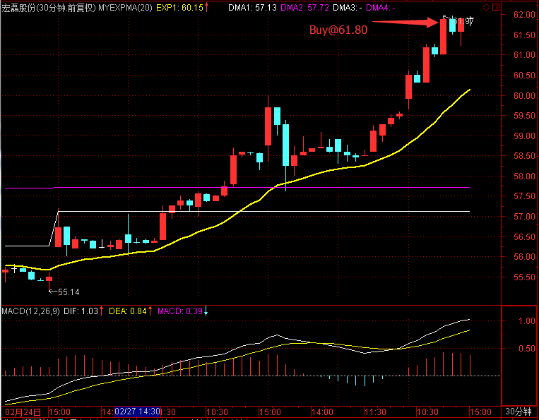

002647 宏磊股份日线出现动量信号，在尾盘61.80买入。

------

### 持仓股票

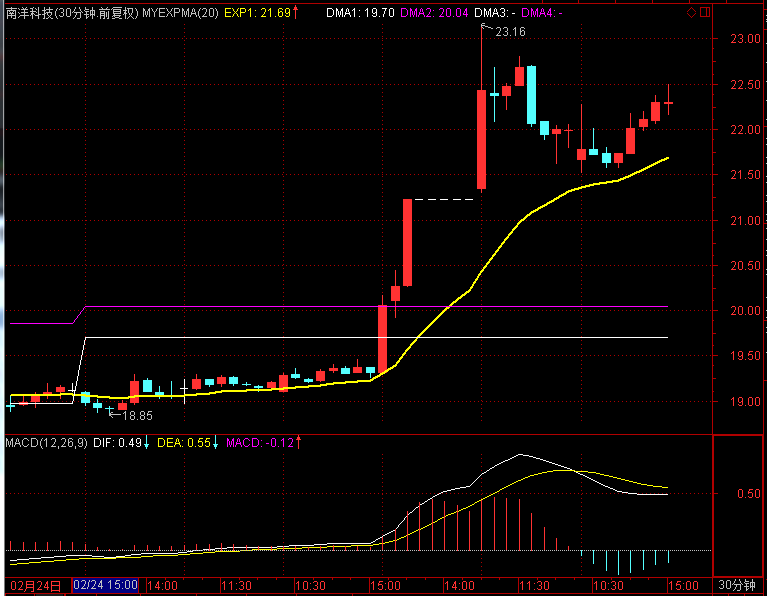

------

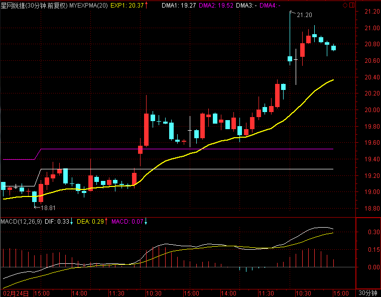

------

## 今天异动股票

## 板块情况

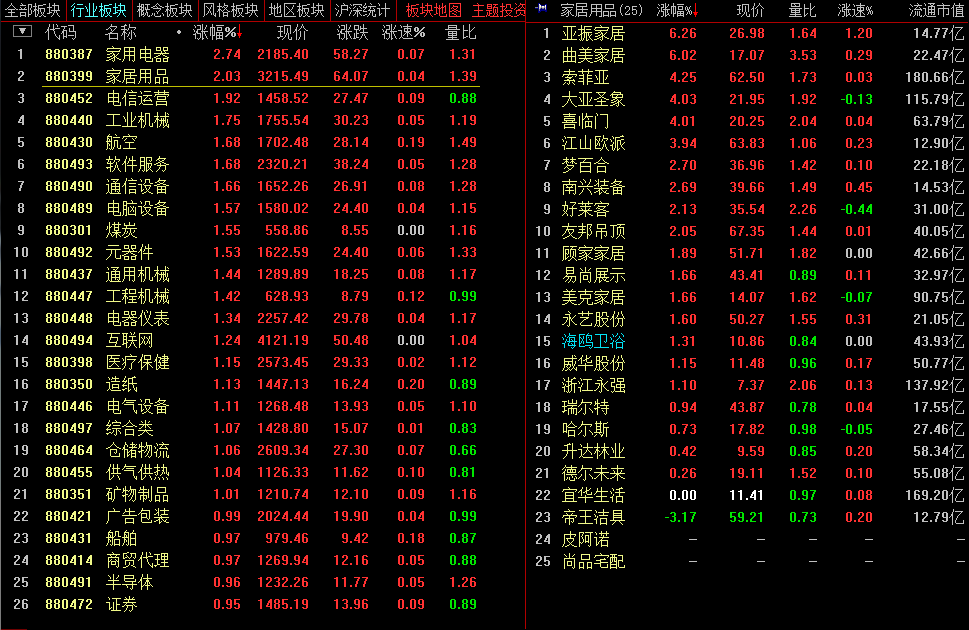

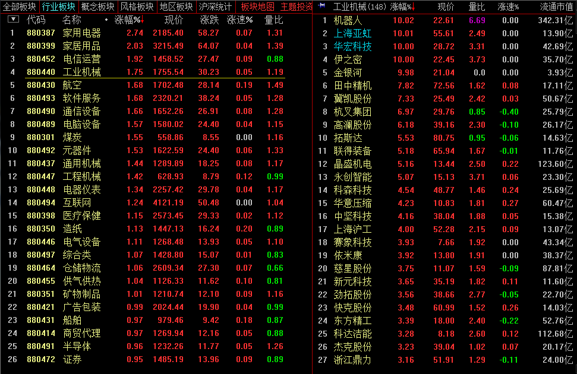

今天家用电器领涨，海信科龙、格力、华帝在盘中强势，值得关注。

## 交易总结

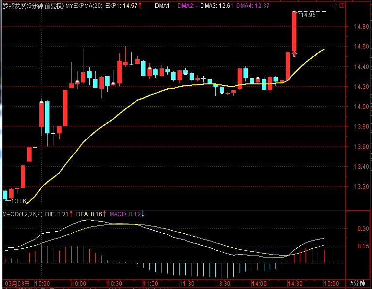

- 高波动的股票还需要摸索交易，开盘强势的股票仍然需要介入。开盘回调再上涨的，非常值得买入，今天的罗顿发展就是很好的例子。

- 当天没有走强的股票，做好计划，第二天低开或者平开往下时，就需要先平仓，不能持侥幸心理等待。

## 交易计划

- 当升科技，尾盘有往下的迹象，开盘没有走强需要平仓
- 南洋股份、顺丰控股、富春通信需要关注，开盘10分钟走得弱也需要考虑平仓
- 宏磊股份、航天电子持有1-2天观察。
- 其余股票视盘中走势进行平仓

