# 2017.3.8 交易总结

------

## 大盘走势

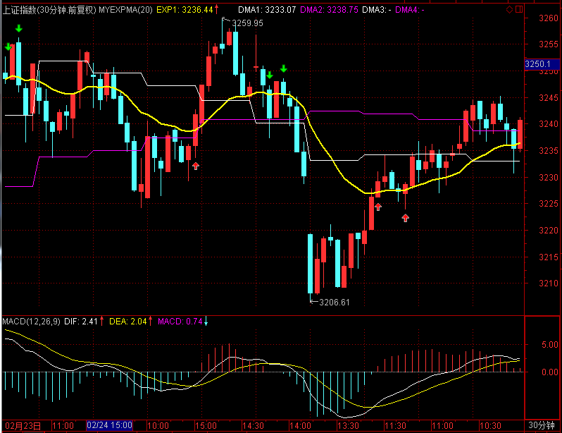

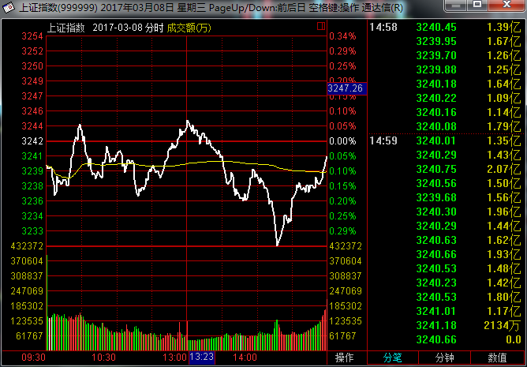

大盘跳空低开在3249.19点，早盘就形成了最高点在3251.65点，指数本来在5日、10日均线中间选择方向，早盘在这个区间里震荡后，下午选择向下突破，盘中低点达到3224.09点，最终收在3228.66点，全天下跌-24.77点，跌幅-0.76%，成交总额与之前比变化不大2113.96亿元。目前大盘向下已经跌破了10日均线的支撑，也打破了上升趋势线，明天走势偏空。

## 交易情况

账户情况：
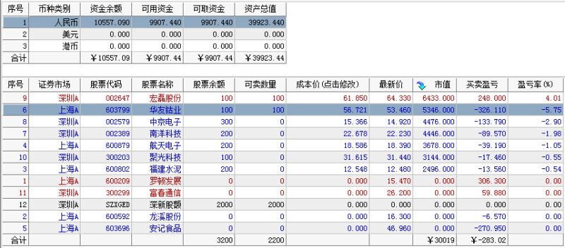

成交情况：
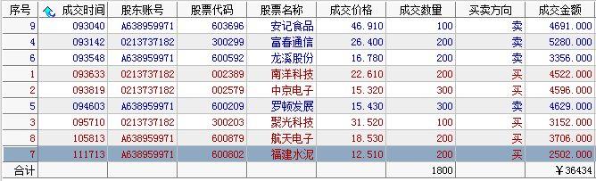

------

### 卖出操作

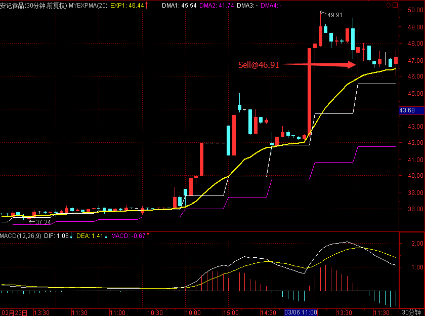

603696 安记食品在开盘下跌时，在46.91卖出。

------

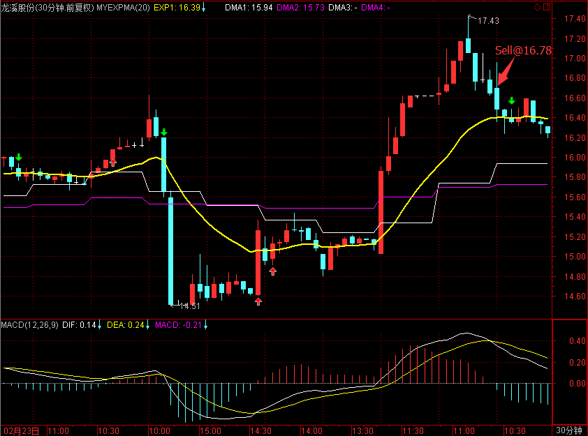

600592 龙溪股份在开盘下跌时，于16.78卖出。

------

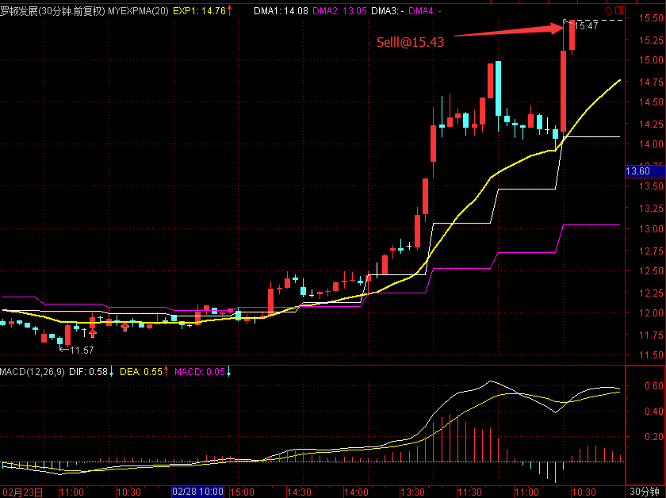

600209 罗顿发展在摸到涨停价时卖出，卖出价15.43。卖出后封住涨停。

------

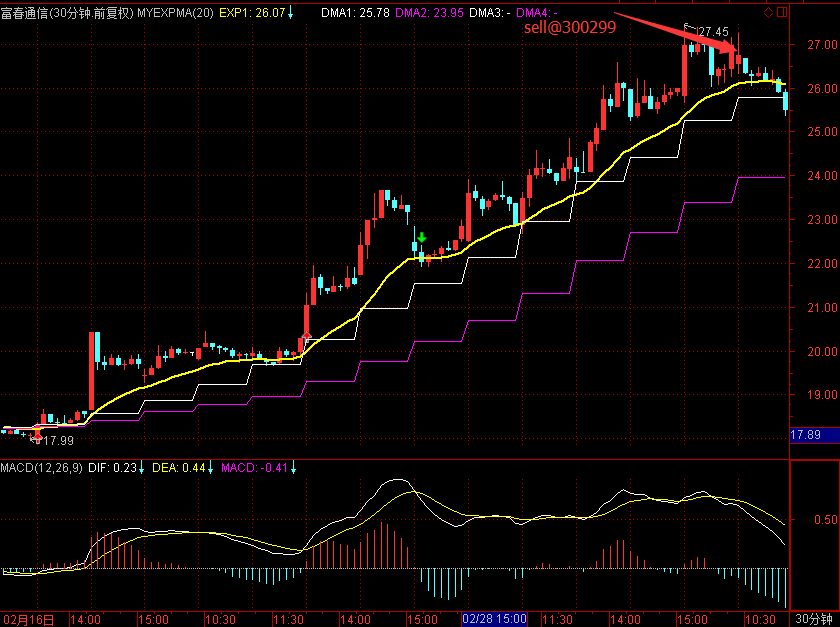

300299 富春通信在开盘下跌时，在26.40卖出。

### 买入操作

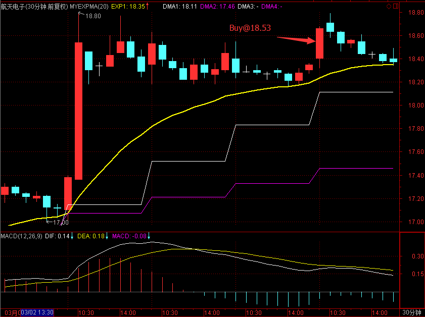

600879 航天电子开盘拉起时，在18.53买入。

------

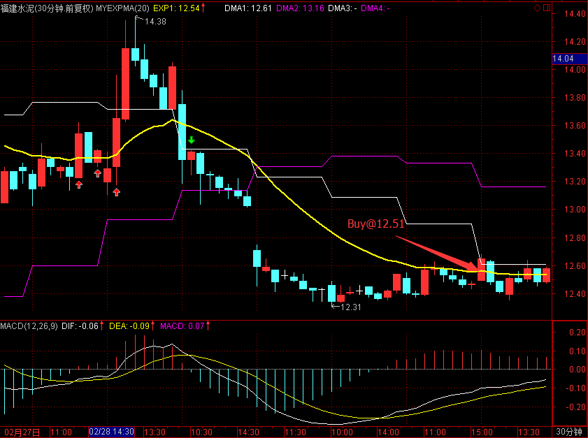

600802 福建水泥在开盘上涨时，在12.51尝试抄底。

------

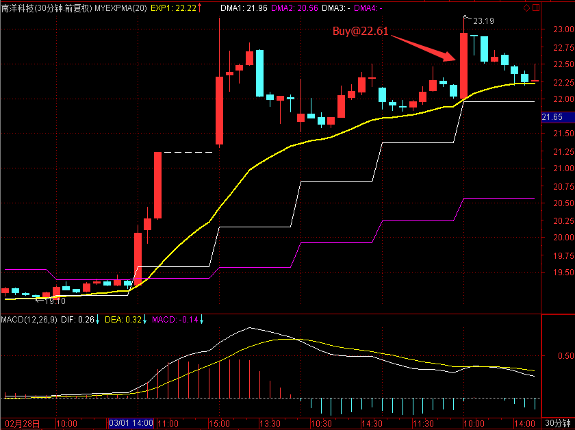

002389 南洋科技开盘拉升，在22.61买入。

------

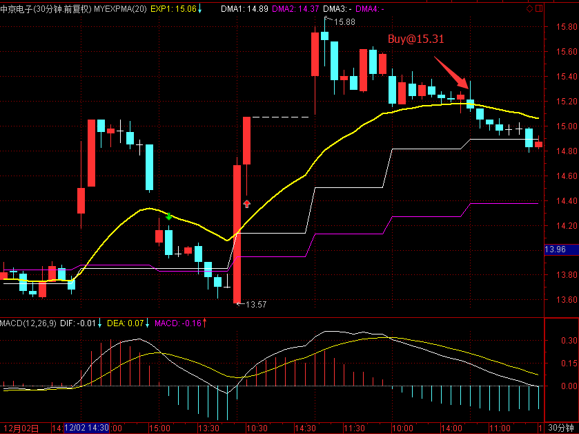

002579 中京电子在开盘拉升时，于15.32买入。
------

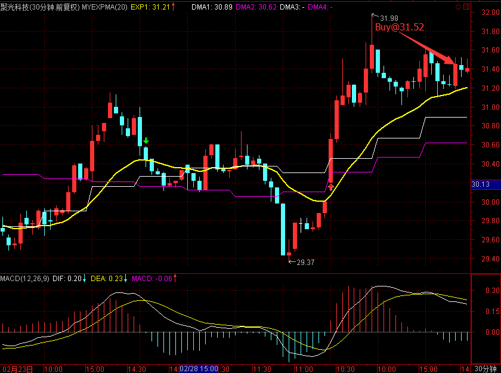

300203 聚光科技二次确认低位后，拉升时在31.52买入。

### 持仓股票

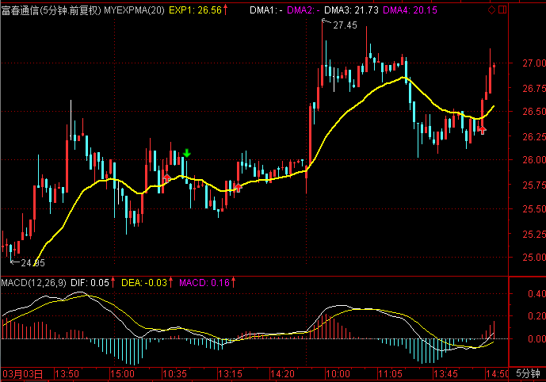

300299 富春通信今天冲高5%没有卖出，继续持有，尾盘下调。

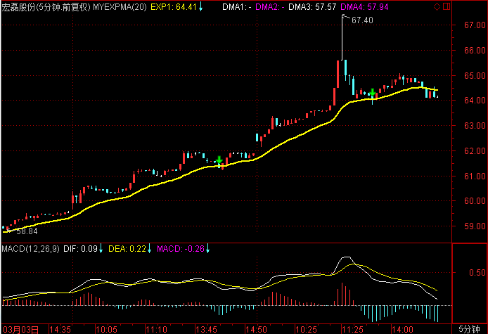

002647 宏磊股份今天涨势良好，在高点8%没有卖出，尾盘回落至3%附近

------

## 今天异动股票

002770 科迪乳业，通过日线动量选中，盘中开盘后涨停，之后打开，尾盘收8.25%。

300017 网宿科技，通过日线动量选中，今天涨7%。

## 交易总结

- 高波动股票需要放大止损，顺丰控股就是止损刚好打到前面的低位就平了，可以适当放大止损位置，更多时间持仓。
- 今天的航天电子和星网锐捷平仓了，但看30分钟周期，其实还在支撑线上，走势没有破坏，继续关注。
- 日线动量选取的股票走势较好，后续可以持续选股，结合30分钟周期进行操作。
- 选取在5日线、10日线上，并且离均线不远的股票进行交易是较好的选择。
- 短线抢入的股票需要做好平仓计划，第二天开盘达到预期条件就需要先平仓，不能持侥幸心理等待。

## 交易计划

- 罗顿发展、华友钴业需要平仓
- 航天电子、星网锐捷视、顺丰控股可以等回踩确认后重新开仓
- 富春通信、宏磊股份、安记食品波动较大，可以适当做T+0
- 继续关注酒类股票，走势良好

