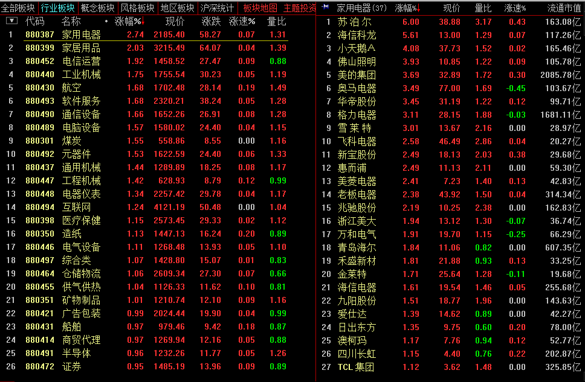

# 2017.3.9 交易总结

------

## 大盘走势

大盘跳空低开在3249.19点，早盘就形成了最高点在3251.65点，指数本来在5日、10日均线中间选择方向，早盘在这个区间里震荡后，下午选择向下突破，盘中低点达到3224.09点，最终收在3228.66点，全天下跌-24.77点，跌幅-0.76%，成交总额与之前比变化不大2113.96亿元。目前大盘向下已经跌破了10日均线的支撑，也打破了上升趋势线，明天走势偏空。

## 交易情况

账户情况：

成交情况：

------

### 卖出操作

600879 航天电子日线开盘走弱，先平仓卖出。继续关注。

------

002352 顺丰控股今天的卖点很差，卖在了最低点，之后开始反弹。

------

002396 星网锐捷冲高后回落，在低位卖出。卖点也是不理想。

------

300073 当升科技也是卖在最低点，开盘冲高时没有卖出。

------

000877 天山股份下跌较多，在13.51卖出。

------

002389 南洋股份开盘走弱，在21.91卖出。

------

### 买入操作

603799 华友钴业在开盘往上走时买入，结果一路走弱，盘中跌超过7%，当天资金受损较重。（波动大股票）

600592 龙溪股份在开盘往上冲时买入，盘中冲高后回落。（波动大股票）

600209 罗顿发展开盘回调，站上均线后买入，之后开始缓慢下跌。（波动大股票）

603696 安记食品在开盘冲高时买入，全天基本平盘。（波动大股票）

------

### 持仓股票

300299 富春通信今天冲高5%没有卖出，继续持有，尾盘下调。

002647 宏磊股份今天涨势良好，在高点8%没有卖出，尾盘回落至3%附近

------

## 今天异动股票

002770 科迪乳业，通过日线动量选中，盘中开盘后涨停，之后打开，尾盘收8.25%。

300017 网宿科技，通过日线动量选中，今天涨7%。

## 板块情况

今天酿酒板块领涨，之前关注的沱牌舍得、泸州老窖、伊力特、山西汾酒走势良好。

## 交易总结

- 高波动股票需要放大止损，顺丰控股就是止损刚好打到前面的低位就平了，可以适当放大止损位置，更多时间持仓。
- 今天的航天电子和星网锐捷平仓了，但看30分钟周期，其实还在支撑线上，走势没有破坏，继续关注。
- 日线动量选取的股票走势较好，后续可以持续选股，结合30分钟周期进行操作。
- 选取在5日线、10日线上，并且离均线不远的股票进行交易是较好的选择。
- 短线抢入的股票需要做好平仓计划，第二天开盘达到预期条件就需要先平仓，不能持侥幸心理等待。

## 交易计划

- 罗顿发展、华友钴业需要平仓
- 航天电子、星网锐捷视、顺丰控股可以等回踩确认后重新开仓
- 富春通信、宏磊股份、安记食品波动较大，可以适当做T+0
- 继续关注酒类股票，走势良好

