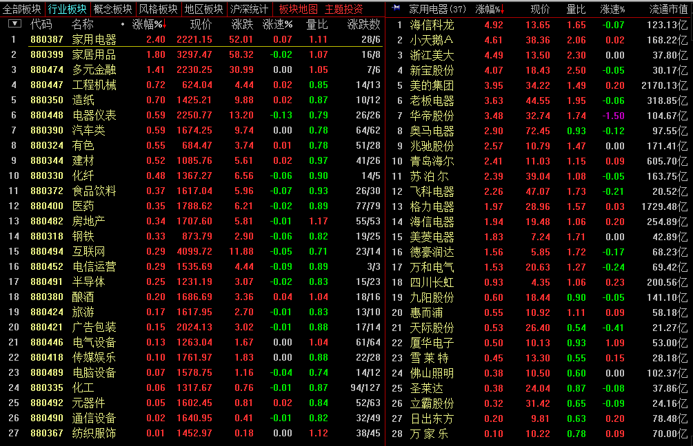

# 2017.3.10 交易总结

------

## 大盘走势

大盘跳空低开在3249.19点，早盘就形成了最高点在3251.65点，指数本来在5日、10日均线中间选择方向，早盘在这个区间里震荡后，下午选择向下突破，盘中低点达到3224.09点，最终收在3228.66点，全天下跌-24.77点，跌幅-0.76%，成交总额与之前比变化不大2113.96亿元。目前大盘向下已经跌破了10日均线的支撑，也打破了上升趋势线，明天走势偏空。

## 交易情况

账户情况：

成交情况：

------

### 卖出操作

002579 中京电子跌破前面平台，达到止损，在14.66平仓卖出。卖出点在全天最低位附近。

002389 南洋科技未能如期往上突破高点，在22.21平仓卖出。

------

### 买入操作

600209 罗顿发展，昨天最高点达到前面高点，非常有可能再次突破该高点，形成新的一波上涨。开盘低开后往上，补完缺口后买入。买入价16.18，之后开始下跌。买入位置在全天最高点附近。

600978 宜华生活，一直上涨，但幅度不大，在回到开盘价附近，11.67买入。

------

### 持仓股票

300299 富春通信继续回调，在10日线上，继续持有。

300176 盘中一度上涨，尾盘回落，可以继续持有。

------

## 今天异动股票

002460 赣锋锂业，全天上涨，收盘涨9.69%。

300175 朗源股份，昨天涨停，今天跌停。

## 板块情况

今天家用电器领涨，华帝股份创出新高，走势非常强劲。

## 交易总结

- 在上涨的回调中买入是较好的选择，设定好止损后，未达止盈止损不出场。
- 用公式选取在日线上多头排列、收盘价重新站上5日线的股票，多数都是在上涨过程的股票，继续观察。

## 交易计划

- 罗顿发展继续观察，止损价格14.70
- 继续关注酒类股票，走势良好
- 华帝股份、白云山、洋河股份、多氟多、赣锋锂业、天齐锂业重点关注。

