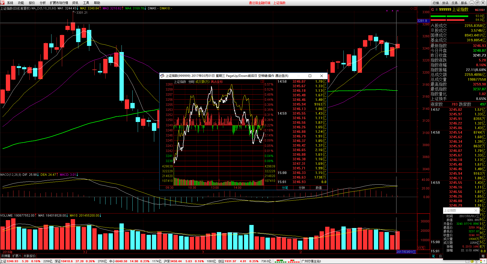
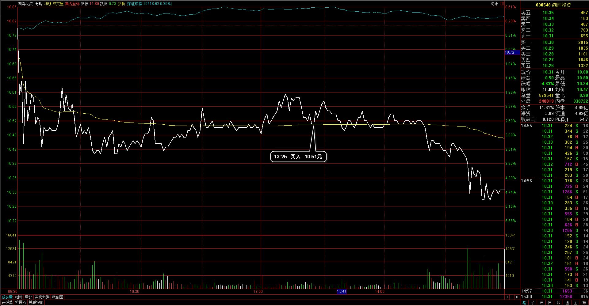
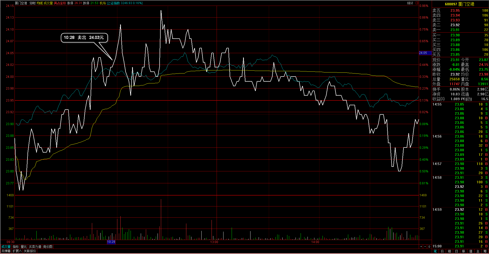
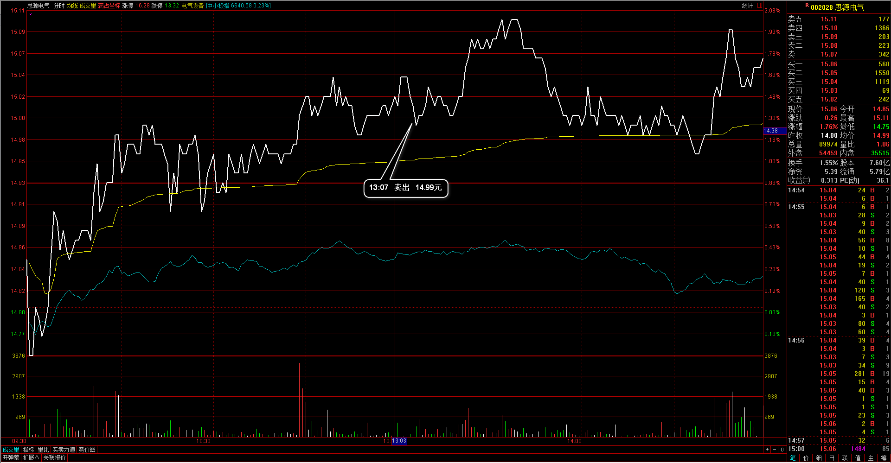
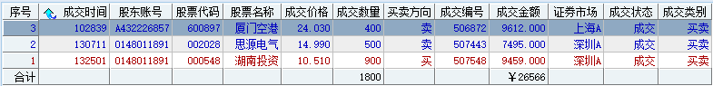
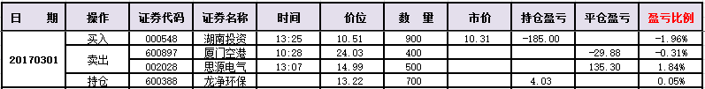
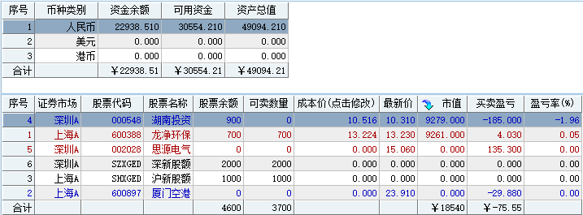

#20170301交易总结： 

##一、	当天走势概况
大盘再次强劲上涨，最终收盘站上了5日均线，今天开盘在3240.07点，然后强劲上涨，开盘价附近就是日内最低3237.87点，盘中两次上冲3260未果，创下盘中高点3259.98点，然后大幅回落，最终收在3246.93点，全天上涨5.20点，涨幅0.16%，成交总额较前两日有放大达到2259.41亿元。后市大盘可能仍会在3260~3240区间震荡做调整；

##二、	交易明细
###1、	买卖点截图

湖南投资：昨天上涨比较强，今天以为是回落调整，在日内企稳的时候，并且大盘向好位置入场，尾盘跟随大盘再向下行；

厦门空港：当时日线上涨达到5日均线位置，因为整体形态比较弱，于是在先清仓出局；
 
思源电气：上涨的位置感觉竭力，第二次向上推量能没有跟上，于是平仓出局；

###2、	成交记录截图

##三、	具体每一轮交易及盈亏情况
###1、	各股交易、持仓明细
 

###2、	平仓分布

###3、	盈亏比和成功率
 

###4、	账户总计

##四、	其他及总结
1、	大盘整体向上的情况，个股上涨有板块的支撑，一般变化情况并不会太大，所以寻找个股，一定要找日线上有量能幅度都动起来的，那种情况表明有资金在介入和关注，市场形成的合力会不同点；
2、	大盘今天第二次在3260位置见顶，当时有感觉到但仍想等着回落后再介入前期强势的仓储物流板块，不过从当时的板块分时图中发现整体的下落比较明显，当时个股也已经准备好，就差板块指数能企稳，后来的情况是大盘整体向下落，顺丰也因此打开了涨停板，最终涨停幅度全抹，幸运的是有一直关注着板块分时变化，对整体的市场氛围有了解所以并没有着急重个股而建仓；
3、	把部分短期连续上涨的板块都集中找了出来，之后的着重关注在这些板块内，热点就在这些热门里轮动。交易个股之前已经开始养了习惯，先去看一下当前所属板块的运行情况，这个方向再继续研究下去；

 

##五、	收盘后账户截图
