#20170302交易总结： 

##一、	当天走势概况
大盘向上再次冲击3260失败，然后开启了向下寻找支撑的下跌行情，今天开盘在3250.52点，然后直接向上最高达3256.81点，无力再向下以两段式下跌最低达到3228.66点，最终收盘在3230.03点。全天总成交额为2230.44亿元，与上个交易日变化不大。整体上行情的回落有向前期3225测试的可能，所以明天要密切关注这个点位的支撑情况；
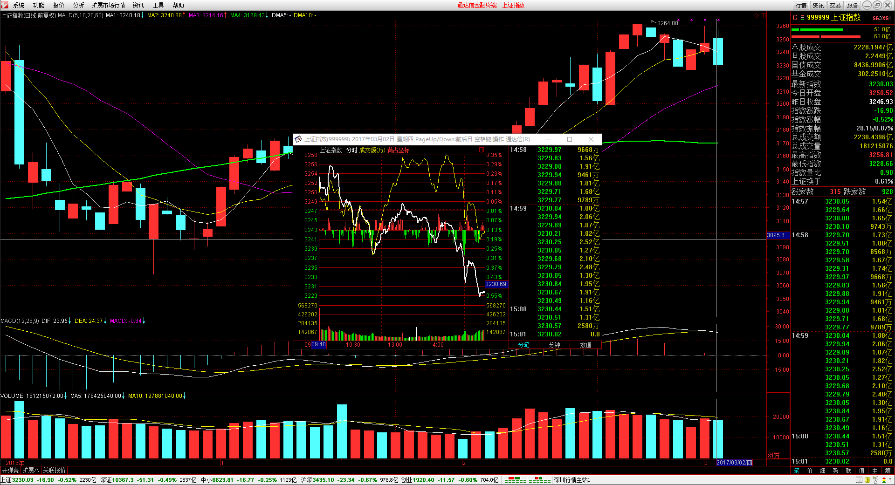

##二、	交易明细
###1、	买卖点截图
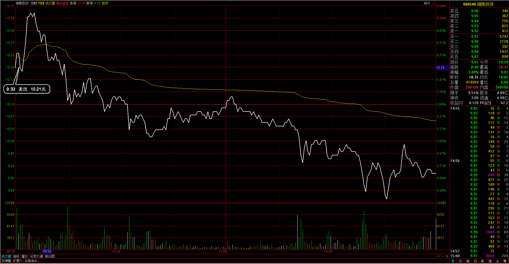
湖南投资：昨天尾盘已经走坏，决定今天开盘处理掉，直接在开盘后平仓处理；
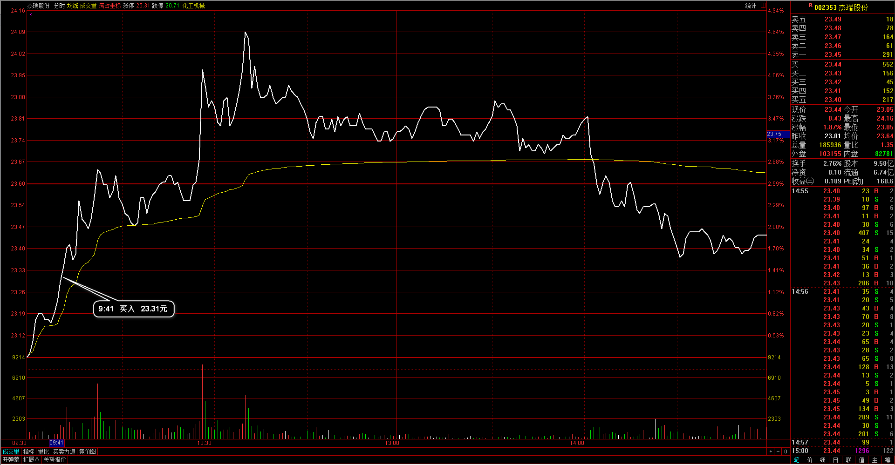
厦门空港：当时日线上涨达到5日均线位置，因为整体形态比较弱，于是在先清仓出局；
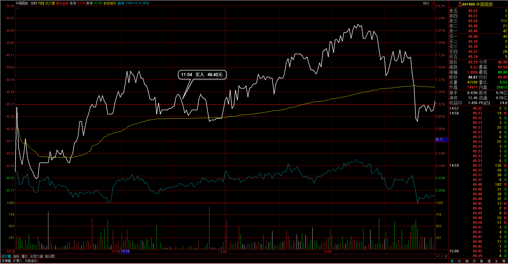 
中国国旅：整个旅游板块是我选择的热门板块，一直都有关注着个股的调整，中国国旅早盘破开盘价后回到均价线得到支撑，30#里也被回调确认于是买入；
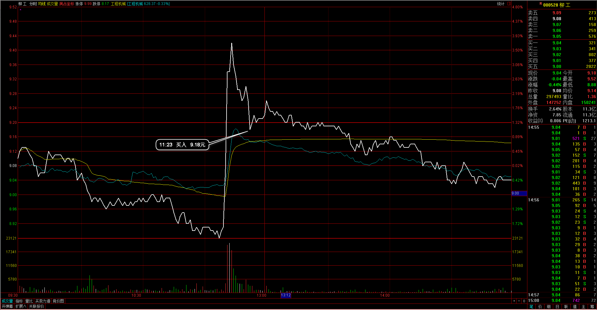
柳工：盘中异动，只买入了1手资金，尝试这种波动节奏，日线如果形成则构成了我的信号K情况，不在目前系统范围内；
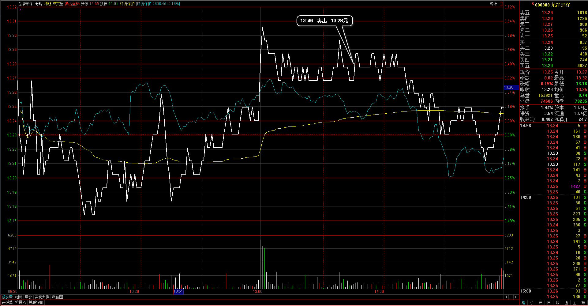
龙净环保：整体波动幅度不大，并且进入后也已经达到两日，仍没有走出预期所以调仓换股；
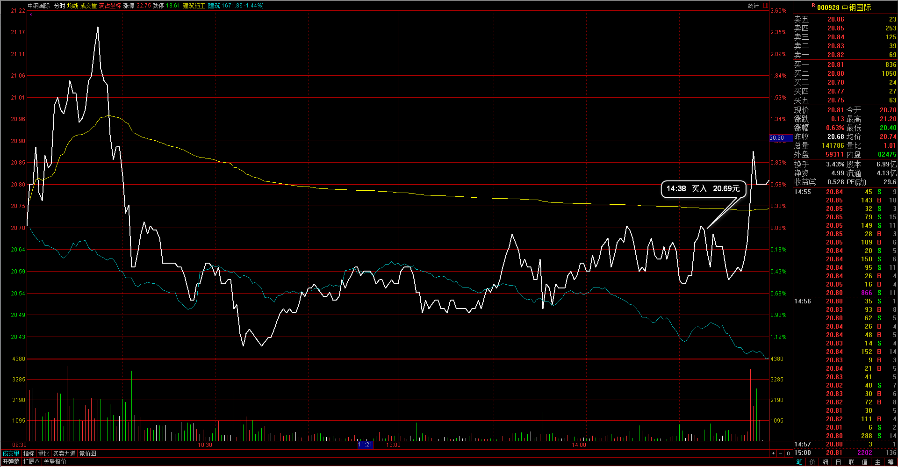
中钢国际：整体的幅度开始不同，向下调整觉得已经调整完，在尾盘进入建仓；

###2、	成交记录截图
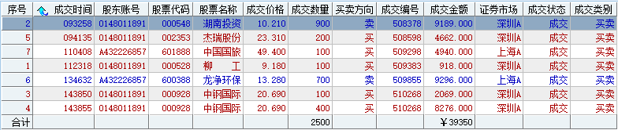

##三、	具体每一轮交易及盈亏情况
###1、	各股交易、持仓明细
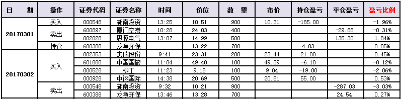 

###2、	平仓分布
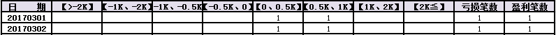

###3、	盈亏比和成功率
 

###4、	账户总计
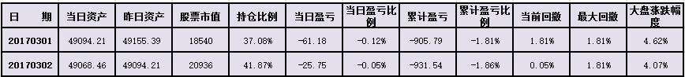

##四、	其他及总结
1、	今天的交易除了昨天的湖南投资有点超过想象以外，其他都在可按的里面，昨天复盘有再把湖南投资的情况再做复盘，当时盘中已经走得较坏的回调段，并不是很明显的强势调整，所以把这一分部稍做区分，应该能过滤掉一些类似的入场情况，同样的过滤也会去掉一些可能潜在盈利的机会；
2、	昨天还有一支600180的个股也是盘后给出信号，当时以行业板块走势过滤掉了回调的机会，今天回头来看当时的过滤的确有意义，所以在盘中要一直留意到板块的整体波动情况，把这部分做成习惯；
3、	盘中追了一支异动的个股，只帮了一手资金，因为如果能有效收成日K线则会构成信号K的样子，但最终异动只是向上拉升后面不能有持续，类似这样的波动还是需要有整体板块和氛围的支持；

 

##五、	收盘后账户截图
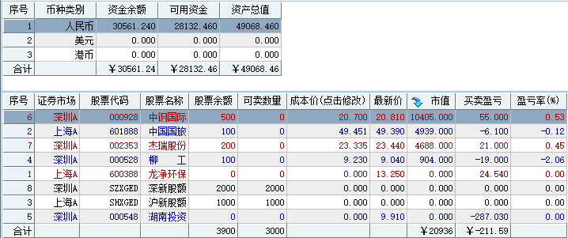