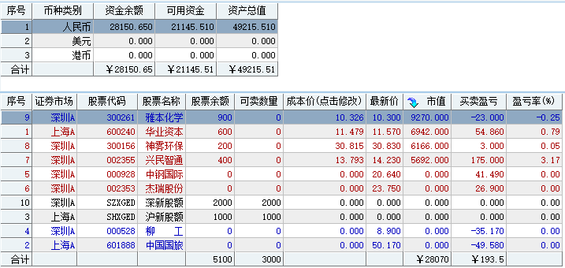

#20170303交易总结： 

##一、	当天走势概况
今天上证受外盘回落等因素影响，跳空低开在3219.20点，然后全天在3221.16~3206.61点内震荡，最终收盘在3218.31点，收一根带有下影的十字星线，正好在大盘的日线60均线上，全天下跌-11.72点，跌幅-0.36%，成交总额比之前略微减少1927.08亿元。因为大盘整体已经下破了之前的3225支撑点位，目前在60日均线位受到暂时支撑，所以后市预期以震荡偏空的思路对待；

##二、	交易明细
###1、	买卖点截图

柳工：这本不是自己交易系统内的个股，昨天盘中异动买了一手感受波动节奏，早盘低开直接平仓出局；

兴民智通：有在30分钟里关注，早盘开盘大盘弱势个股强还能向上突破开盘价，觉得回调到位追入建仓；
 
中国国旅：其实并没有浮亏，只是当时大盘情况比较向坏，想减仓手上个股持仓，并且这个早盘形成了下降三角形整理，向下跌破时出场；

中钢国际：日内波动到成本之上，这时预期大盘的波动可能也是日内高位，准备调仓换股，于是出局；

杰瑞股份：当时量是见大盘向上有压力开始回落，于是在这个时间点火清仓个股，并且在成本价之上一点，不想亏损着出场，实际问题是自己对待出场的动作之前经历得少并没有形成一个机制

雅本化学：尾盘把仓位建立回来，前期信号个股回调的过程靠近本来的入场位进入；

神雾环保：环保板块一直有关注着，可能入场得有点晚，但的确是在自己30分钟信号之后接入，不是第一时间入场位，留意一下第二入场位使用1%换回的是否是确定性加一点；

华业资本：在尾盘30分钟发出信号，回落的时候接入，最终信号是成立的

###2、	成交记录截图

##三、	具体每一轮交易及盈亏情况
###1、	各股交易、持仓明细
 

###2、	平仓分布

###3、	盈亏比和成功率
 

###4、	账户总计

##四、	其他及总结
1、	早盘再次杀入兴民智通，这样的信号是我之前特别留意到的，开盘向下打到30分钟里的20均线向上收，然后破开盘日的震荡小横盘，并且在日线里是有一根信号K在前面的，中间有夹着一根十字星做调整，不过有一点不同的是在日线级别这并不是一次向上创新高的过程，而是在日线里向上反弹的一段行情，向上的日线是有2倍量能和振幅的结构，在30分钟里也有经历过调整。总结今天和昨天的杰瑞股份这种，都是开盘追入比较漂亮的结果，晚上需要把这两个案例整合复盘；
2、	昨天的中国国旅，实际是比较强势的个股，但由于自己不科学的设定了止损价格，导致几乎在最低止损出局，然后后面的机会全部错过，这个一来是因为当时大盘特别弱需要自己减仓持有，二来是已经浮亏了一个点手上其他的自己看好所以觉得是偏弱处理，整个过程的处理并不是十分的科学，最终选定了49元的止损位出场导致（其实我盘后的交易清单有认真的确定48.80元的止损区域），在盘中的时候由于下降三角形的样子我主观以为49元下破会直接打掉48.80元，于是提前出场……收获的一份坚定！
3、	上面提到的是止损的位置，实际还有一个问题让自己的交易没有形成闭环，就是移动出场，止盈的问题，有时总是过多的去纠结平仓在高位，实际是害怕回吐太大，对待止盈的部分需要自己多提炼些数据优化出场；

 

##五、	收盘后账户截图
