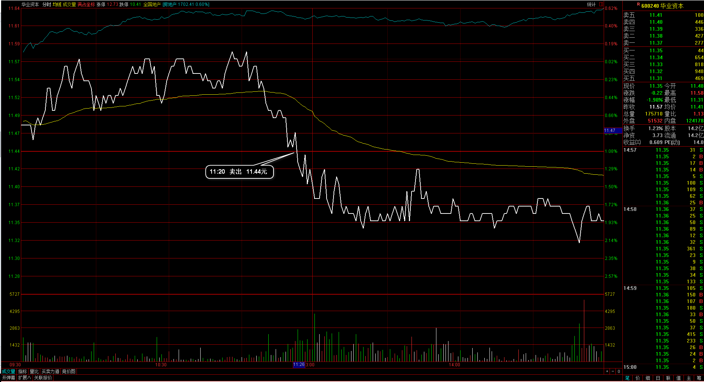

#20170306交易总结： 

##一、	当天走势概况
大盘稍向下低开在3217.33点，只向下回探了一点，然后整体以一个完整的波动上涨，盘中最高达到3234.66点，低开在3215.07点，最终收盘在3233.87点，上涨15.56点，涨幅0.48%，全天成交总额达到1937.69亿元，与之前变化不大，目前上涨在5日均线处受到压制，但也属于回调在60日均线处得到支撑，以3240~3220为区间突破判断后市；

##二、	交易明细
###1、	买卖点截图

兴民智通：设定的止损价格被打破于是出场，虽然平仓在最低点附近；

雅本化学：止损被打破，清仓出局，也需要思考下是不是自己的止损摆放得太近了；
 
华业资本：上涨中突破掉转向下，打破开盘价格于是先出场；

神雾环保：是开盘直接向上冲高3%，然后再回落整个跌破，觉得走坏于是平仓止盈；

南洋科技：个股在反弹阶段向上，盘中回调再次站上均价线，并且30分钟周期达到指标支撑位，拉起来的时候追入；

博云新材：同样是在盘中发现个股比较强势，上涨后回落不再向下并且30分钟周期回调达到支撑位置，而且大盘也正在向下之后转上的过程；

金力泰：尾盘大盘继续收高，觉得仓位还是比较轻的，于是把当前比较健康的环保板块个股再补入一个，正好是回调到支撑位置然后向上拉起的走势；

###2、	成交记录截图

##三、	具体每一轮交易及盈亏情况
###1、	各股交易、持仓明细
 

###2、	平仓分布

###3、	盈亏比和成功率
 

###4、	账户总计

##四、	其他及总结
1、	大盘今天开盘向上，个股多是直接向上冲的，中午盘过后个股开始回落，向下时多是收的上影线阴线，这种时节点的行情，感觉就像是去形成一根长上影的倒锤线，以后碰到这种节奏的走法，开盘冲高的都应该先处理平仓，因为大盘在3230这个位置有压力，可能的回落，所以上冲的第一下都是减仓动作；
2、	有一个比较关键的问题，就是我经常会碰到大盘一开盘就向上上涨的行情，这样的行情我经常会错过很多上涨的过程，但像今天这种在下跌的过程反弹到关键的压力位置，可以在盘中感受到个股的上涨部分也是犹豫的，有的向上上涨过程然后再次被压回，所以在处理这样的行情里，我只管去选择那些有买入机会的个股好了，不用在意个别的没有买入的股票被拉升了；
3、	另一个就是今天个股的止盈，早上开盘就向上冲了2~3%，然后直接被压回来把今天整个盈利全吐完了，然后再出局，这种情况需要自己多经历，暂时没有一个确定的对策，可以先不用纠结在这一块，需要做得多了有经验的累积再出对策；目前我需要的是一条简单的机械方式，然后在这样的方式经历之后再慢慢的做调整

 

##五、	收盘后账户截图
