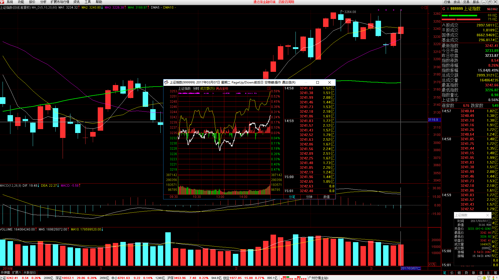
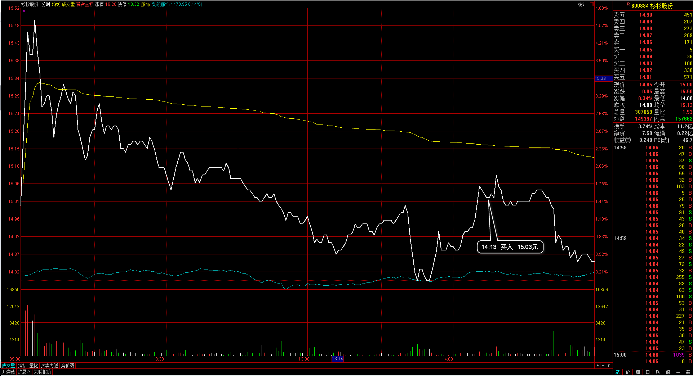

#20170307交易总结： 

##一、	当天走势概况
大盘稍稍低开在3233.09点，然后下午2点前整个都是区间震荡行情，盘中最低点达到了3226.82点，尾盘发力向上突破站上10日均线，最高点3242.66点，最终收盘于3242.41点，全天上涨8.54点，涨幅0.26%，成交总额为2099.31亿元，整体变化不大。目前大盘向上再次回到均线上方，预示这一波行情的最终博弈胜者是20日均线，所以应该以20日均线为整个行情的生命线，如果后市仍然站上20日均线之上，则一直是以多头思路对待；

##二、	交易明细
###1、	买卖点截图

杉杉股份：尾盘整个都是回落的，其实今天是跳空高开的回落，认定这个位置是有支撑的情况，所以在拉起时再入场；

金力泰：从昨天收盘就有点感觉似乎特别弱，因为这个是入场后就一直浮亏的情况并向下再走出新的低点，在行情向上反弹后再次下破日内均价线位置止损出局；
 
超声电子：尾盘大盘站上10日均线，于是把仓位加上一层，超声电子一直上涨经历了日内的调整预期后市向上延续；

###2、	成交记录截图

##三、	具体每一轮交易及盈亏情况
###1、	各股交易、持仓明细
 

###2、	平仓分布

###3、	盈亏比和成功率
 

###4、	账户总计

##四、	其他及总结
1、	今天有一个感受，就是止损一定要严格按照自己清单的定制的那样执行，以往自己也是风险耐受度小，还没有达到自己的止损点，但由于曾经浮盈过等波动情况，就会觉得这个时候再浮亏是错误的信息，于是过早的把持仓清理出局，今天手上三个持仓的个股盘中是轮换着波动亏损，最终却又收了回去，整体感受还是要等待大盘的方向，在这样的位置如果还像以前一样处理平仓，多是止损在较低的位置，然后看着行情再拉起比较尴尬；
2、	大盘这一波上涨是以20日均线支撑向上，然后回调时误以为10均线也是一个重要的参考，不过按理也的确是一个重要的线形，因为之前也是它最贴合着，但这一波上涨后需要回调，回调第一肯定是考验20日均线，所以20均线成为一个特别重要的位置，在20均线附近都应该是可以尝试建仓的，这一点没有做到通透，我在30分钟周期画了123线已经是下破位的了；
3、	以后在大的分析上，需要认可大线的支持力，大线没有被破坏前一切都以大线的方向为主；

 

##五、	收盘后账户截图
