#20170308交易总结： 

##一、	当天走势概况
今天大盘开盘在3240.53点，然后上午一直在一个区间调整，创出日内高点3245.30点，在下午2点半时间完成一波向下跳水，达到日内最低点3230.61，尾盘再次拉回，收盘在3240.66点，最终形成一根十字星线，全天下跌-1.75点，跌幅-0.05%，总成交额变化不大1982.26亿元。这根十字星线十分关键，这波反弹可能达到位置，留意明天是否向下确认这根高位的十字星线；
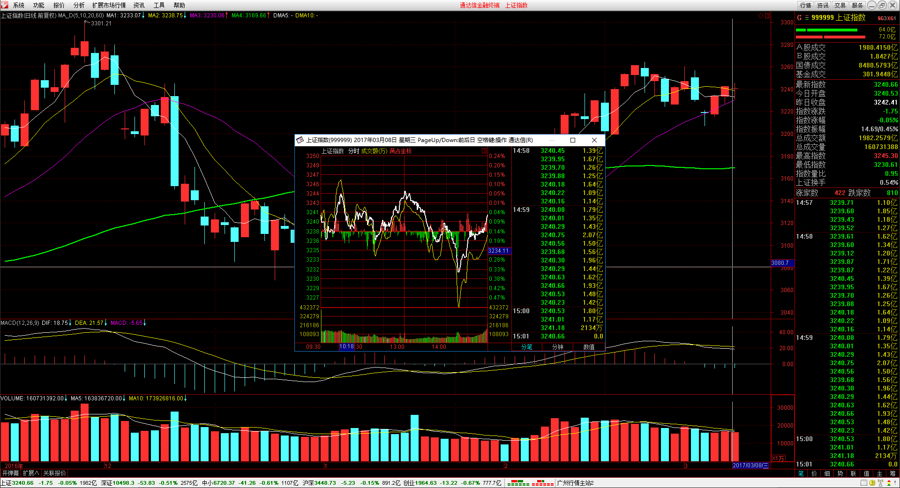

##二、	交易明细
###1、	买卖点截图
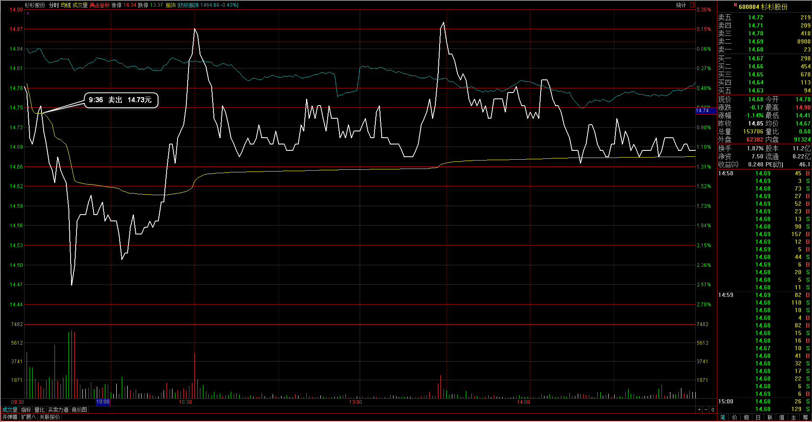
杉杉股份：昨天收盘时已经是比较难看的倒锤线了，早上开盘冲高时就退出了；
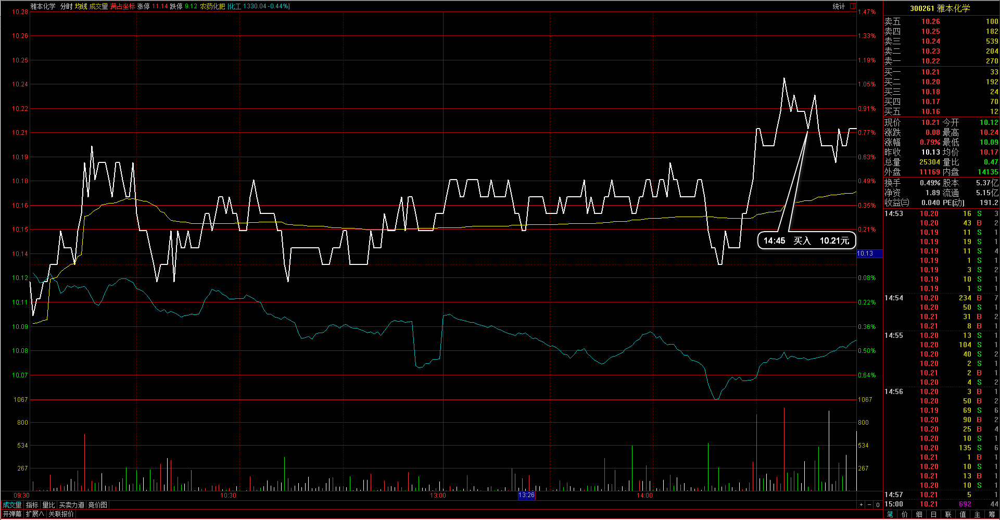
雅本化学：日线的上涨过程，回调末端预期完成，再进入个股；
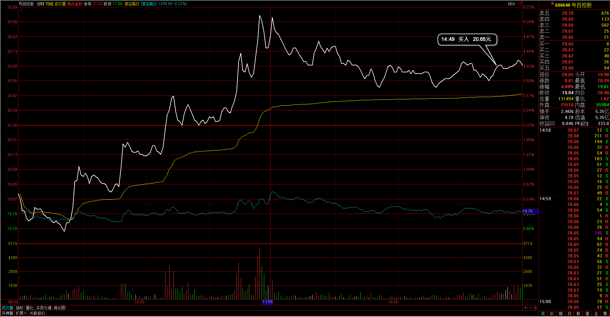 
号百控股：同样是日线调整完再向上拉起，提前先入场，明天好直接处理；
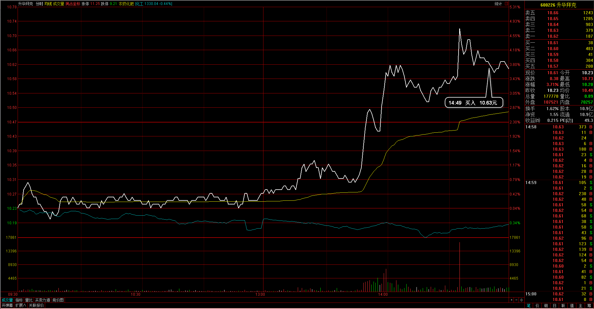 
升华拜克：30分钟周期的尾盘拉起，在信号K位置入场，预期需要承受稍稍的回调
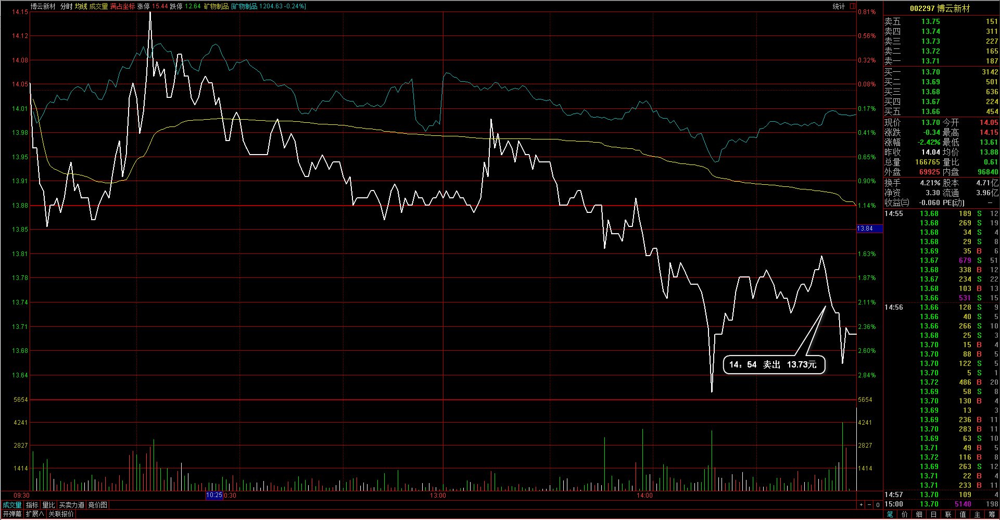 
博云新材：个股偏弱，手上持仓需要减少部分，在止损上把它清仓处理了

###2、	成交记录截图
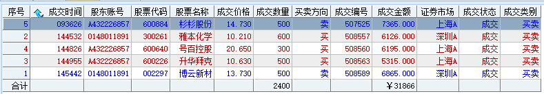

##三、	具体每一轮交易及盈亏情况
###1、	各股交易、持仓明细
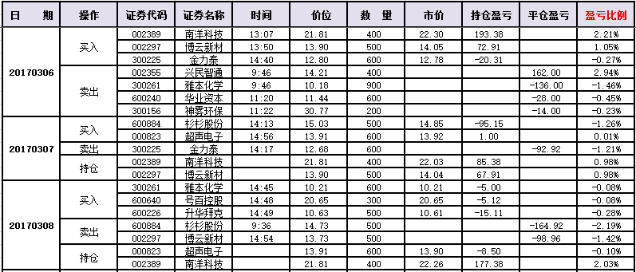 

###2、	平仓分布
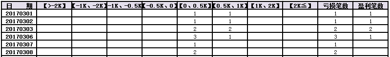

###3、	盈亏比和成功率
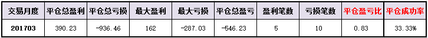 

###4、	账户总计
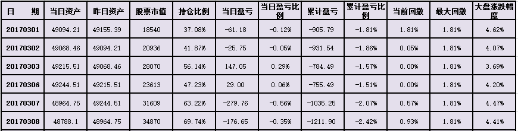

##四、	其他及总结
1、	仔细分析了自己最近的交易情况，我主要做的是回调中继的形态，有时个股并不会有中继形成而进入到调整里，所以我止损较小有时处理起来就比较容易在半路下车；
2、	把想法调整了一下，我可以直接去处理个股的回调段，之前也有这么想过，但在回调段里我是去接单的交易，导致我很多时候都是进入到了逆势的一个过程里；
3、	如果我只是右侧进入，也是以目前一样的情况来处理进入信号，只不过我把自己进入的行情段升级到回调结束之后，但有一点需要留意的，一定是要确认这个回调段是结束了的，这种情况下我也有可能会进入回调逆势的一波反弹里，这样的亏损也比较大，在这之前我需要先多复盘研究一下；

 

##五、	收盘后账户截图
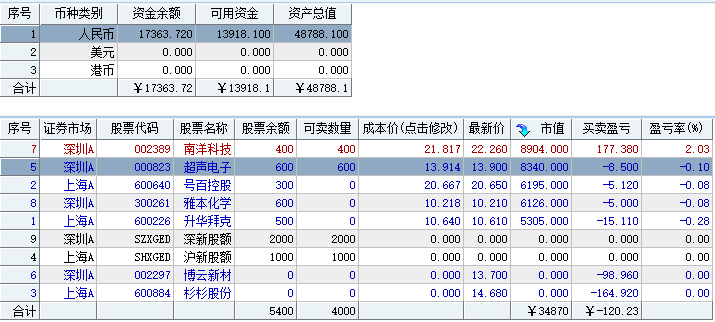