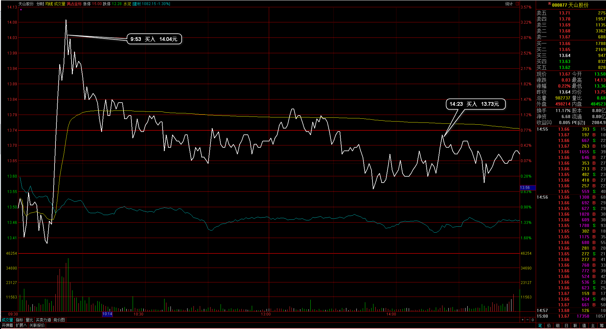

#20170309交易总结： 

##一、	当天走势概况
大盘跳空几个点低开在3233.70点，开盘后直接向下，盘中最低点达到前期低点位置3205.28点，尾盘有稍向上回收，最终收在3216.75点，全天下跌-23.91点，跌幅-0.74%，总成交额变化不大为1992.18亿元。今天日线已经下破60日均线，并且是被10日均线压制着向下，前期是支撑位3200，后市偏空；

##二、	交易明细
###1、	买卖点截图

先导智能：早盘已经高开向上，预期日线的调整段走完于是在破前日高点位置入场；

天山股份：同样也是觉得回调段末端，于是在这个位置入场，止损放在前期低点，早盘是追入仓位不大，尾盘补回仓位；
 
雅本化学：早盘的下跌已经破位，在反弹段里清仓出局；
 
超声电子：早盘下跌破位，没有处理等反弹，结果超出了预期，在反弹段的时候高位抛压较大，靠近出场；
 
南洋科技：持仓时间有三天了，但一直在横盘，今天也比较偏弱，几次开盘高位都压下来，于是在这附近平仓；
 
升华拜克：昨天尾盘追入，早盘回调过然后继续向上，在冲高位置大盘向下过程清仓出局；

###2、	成交记录截图

##三、	具体每一轮交易及盈亏情况
###1、	各股交易、持仓明细
 

###2、	平仓分布

###3、	盈亏比和成功率
 

###4、	账户总计

##四、	其他及总结
1、	也体验到了一点回调调整后追入，然后后面有延续性，让自己坐到盈利的上升段，但有一个问题由于入场的情况都不是很好，或者大盘向上的概率不大的话，那这样也会有过多的浮亏出现；
2、	所以从一开始我觉得还是选股的问题，选股才是最重要的一点？那应该从板块里解出来吧：每天把上涨的行业板块和上涨的概念板块做一个交集，其实的个股就是强中强的个股？应该只能算是上涨概率大的个股；
3、	有两个概念，一种是强势上涨的个股，近期一直都是上涨的并且涨幅比较大，还有一种是上涨不大但也是上涨可以说是不够强的，但后者明天上涨的概率高过前者，那实际应该以后者的这种概率为主？
4、	前期我对大盘的分析在30分钟周期，三线方式是大概率正确的，这一波连续几天的反弹向上让我迷失了一下，所以在整个过程中需要坚定自己的技术看法分析；

 

##五、	收盘后账户截图
