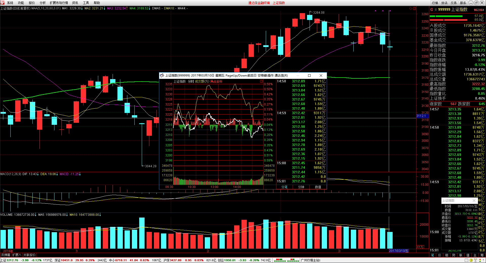
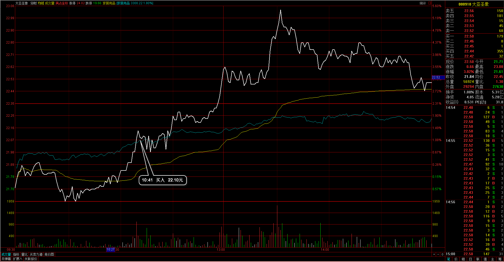
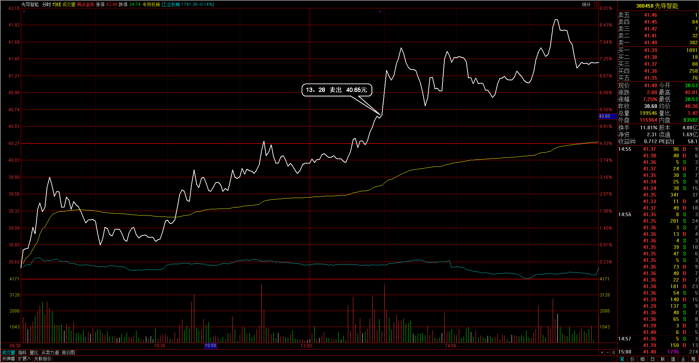
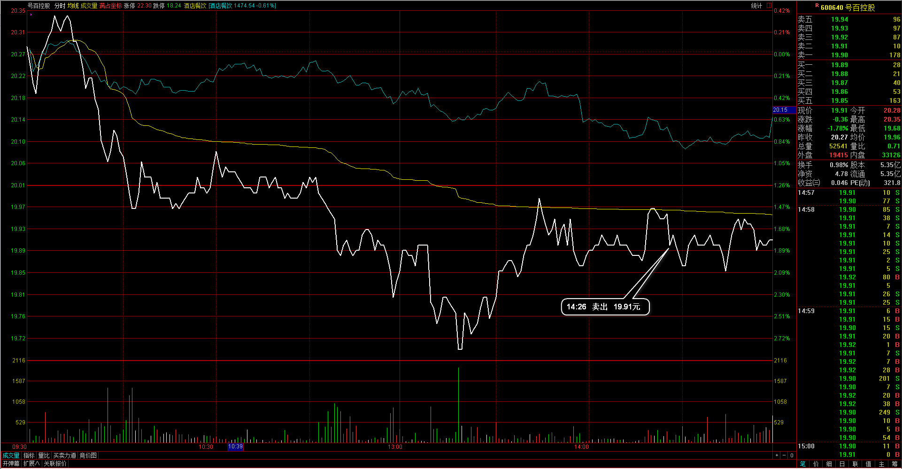
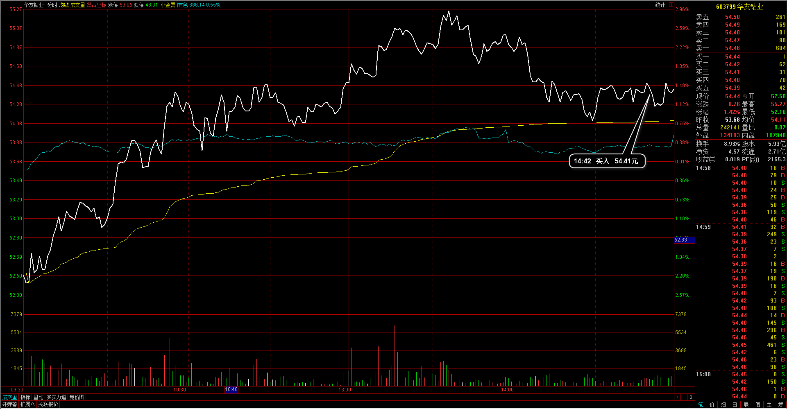
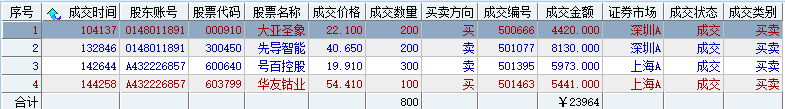
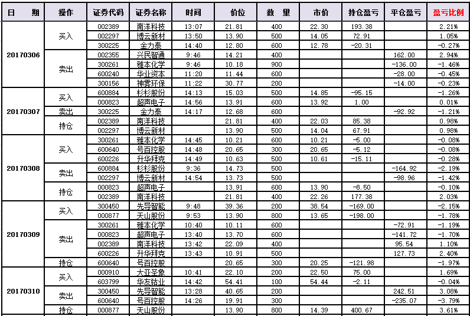
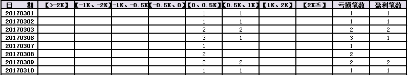
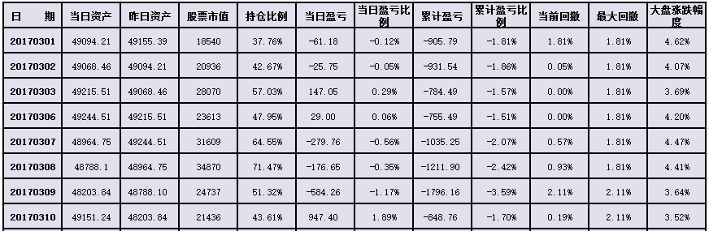
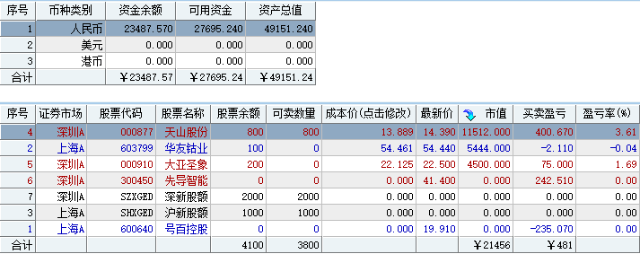

#20170310交易总结： 

##一、	当天走势概况
今天大盘稍跳空低开，开盘在3213.73点，然后整体在十来点里震荡，盘中最高点3222.32点，最低点3208.45点，最终收盘在3212.76点，全天下跌-3.99点，跌幅-0.12%，收成一根十字星线，目前仍然是偏空的看法，后市如果再向下跌破这两点低点，短期内下破3200的可能加大；

##二、	交易明细
###1、	买卖点截图

大亚圣象：从日线上来看，觉得是回调已经走完，然后向上走主趋势段，于是在30分钟图里的一个顶分形后面入场，入场的价位稍往后了一点，实际应该在开盘高点附近入场；

先导智能：这个个股在盘中已经达到目标位置，突破前期高点，但这个时候的出场就处理得较一般，甚至在5分钟周期里都没有收阴线的情况就出局了，而且突破前高正是启动位置，却直接平仓出局了，需要好好反思这笔平仓；
 
号百控股：其实后面来看在开盘后再向上显示了全天比较弱势的走法，后面应该在下破前日低点早点出局，而不是等待看一下后面的反弹情况；
 
华友钴业：有色板块本来不是很看好，但华友钴业在日线的回调位置可能短期内是企稳的情况，所以买入一手在这个查看支撑向上的情况；

###2、	成交记录截图

##三、	具体每一轮交易及盈亏情况
###1、	各股交易、持仓明细
 

###2、	平仓分布

###3、	盈亏比和成功率
 

###4、	账户总计

##四、	其他及总结
1、	昨天手上有两支个股都有浮亏，但是今天却产生了巨大的收益，所以有时正常的盈亏波动是特别普遍的情况，手上也有浮盈的个股最后直接亏损出局，个股每天有个4%左右的振幅这也是正常的，不要以浮亏来定义自己的持仓对错，经常见到浮亏了就处理，这是个错误的方式，需要自己明确一个的是入场的区域是否是对的，在T+1的节奏下坚守自己的止损位就好；
2、	今天有个个股的止损情况有拖拉，当时一是由于自己的浮亏不大，二是离下面的止损有点远，三是试验的情况下并没有多少持仓，经历了一个个股的3%左右的亏损，这种现象也是普遍的，但是对于止损还是有必要放在正确区间的有意义的位置上，如果碰到太远的情况，应该以某一条均线来处理，当打破均线如果短期内无法再回收可以直接出局，或者是先出局当再回到均线之上需要能再开回来；
3、	平仓出局了一次丢失更大盈利，盘中目标位置已经达到，前一段时间的高点，突破了高点再向上的过程，见到盘口大盘分时图里成交量不如之前一两波的大，于是就直接出局了，当出局后后面再拉升了5%之多。其实有时突破向上这个过程，我需要看成是一个行情启动的位置，不要心里老着着目标位达到了，有可能要顶背驰了之类的，这样会导致自己没有一致性的对待，两种风格自己应该以习惯的突破为主，也突出了我手上并没有一套完整的出场策略；

 

##五、	收盘后账户截图
