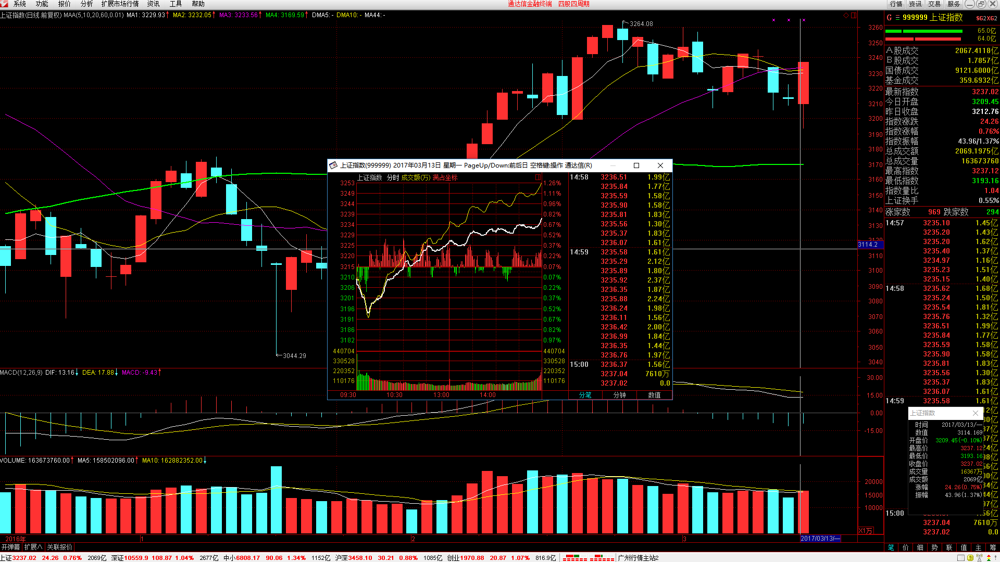
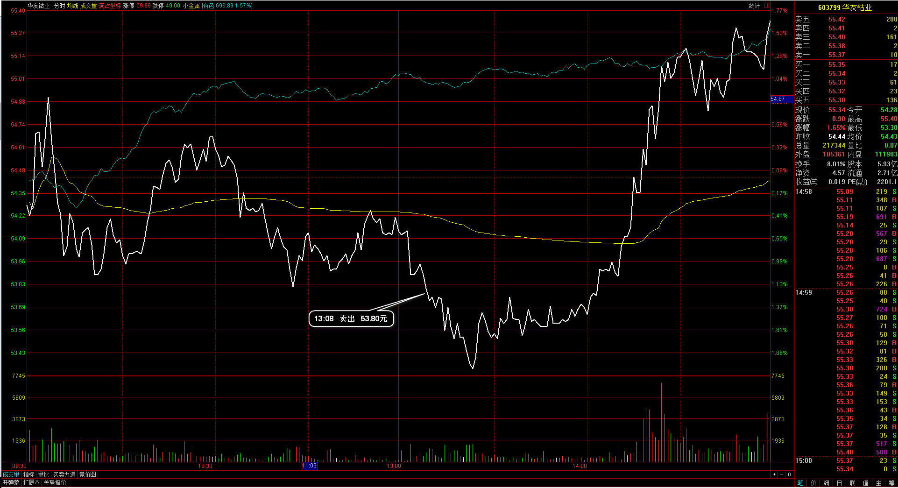
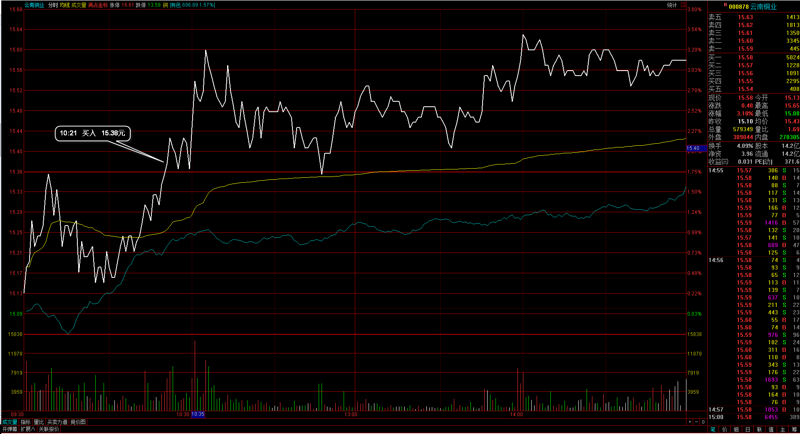
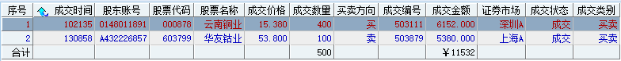
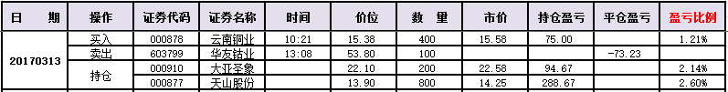
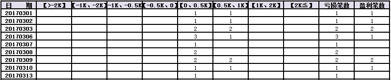
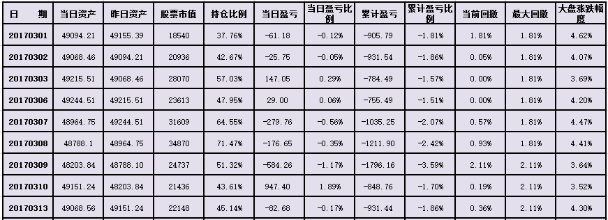
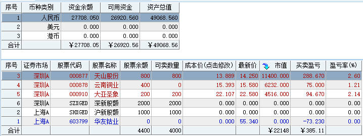

#20170313交易总结： 

##一、	当天走势概况
今天大盘十分强势，稍低开在周五十字星下3209.45点，然后在最低点3193.16点V型反转向上，收在最高附近，收盘3237.02点。全天上涨24.26点，涨幅0.76%，收成一根带下影的反转大阳线，量能较上个交易日有放大，成交总额2069.20亿元。在3200走出这样的一根大阳线，代表下部支撑位十分健康，对明天的预期是震荡向上的看法；

##二、	交易明细
###1、	买卖点截图

华友钴业：周五提前进入的个股，但在止损上并没有放到合适的级别，实际这个连入场当天的低点都没有达到，但在小级别里有走出连续的向下低点，总体上与当天的大盘强度不吻合，在下午下破低点时砍仓出局；

云南铜业：日线是连续向下的调整段，在这里有企稳的迹象，当天开盘稍高开，然后向上再突破时入场；

###2、	成交记录截图

##三、	具体每一轮交易及盈亏情况
###1、	各股交易、持仓明细
 

###2、	平仓分布

###3、	盈亏比和成功率
 

###4、	账户总计

##四、	其他及总结
1、	今天把选股的流程以股票池的方式确定下来了，并且把股票池按不同颜色来划分，这样能留意到个股在什么颜色就是什么状态，每天需要做的就是把个股的状态重新划分，但对于定义回调段的个股我仍需要再明细一点；
2、	华友钴业周五的入场是觉得信号K走出来了，于是提前进入，如果今天开盘有向上突破走出入场信号就再加仓，这个的止损就应该放在入场那天的低点，但今天整体都是偏强的上涨，华友钴业并没有连续向上下午开盘不久就处理了向下破日内低点的华友钴业，可是从日线上来看却仍然是健康着的，只不过今天并没有发出买入信号，需要把个股移动到盘中信号池里继续关注；
3、	总结这部分就是提前去赌信号属于没必要的交易，应该合理等待信号出现再入场，就像今天的云南铜业一样，高开再向上突破，于是入场，是强势+强势；
4、	在日线回调低点接单仍然没有完全的信号可以过滤掉，有个别股票是直接从下由上的拉起来，没有回调也没有对均线的确认那种，直接可以把30分钟里的20均线直接由下降拉成上涨，这样的信号把握不到，但就会去想自己能做到的那种信号是否会是弱势的个股？整体还是先按目前的信号来交易看看反馈；

 

##五、	收盘后账户截图
