#20170314交易总结： 

##一、	当天走势概况
大盘全天在十来个点里震荡，开盘在3235.25点，早盘最高达到3246.33点，下午最低点是3231.52点，最终收盘在3239.33点，全天上涨2.31点，涨幅0.07%，在5日无线之上收小阳线，总成交额较之前有减少为1915.35亿元。在这个位置多有犹豫，但如果是触底的反转，需要一直有长势的氛围才能向上，所以应以今天这根K线低点为空头的信号，只要不下破今天的今天仍然保持向上的看法；
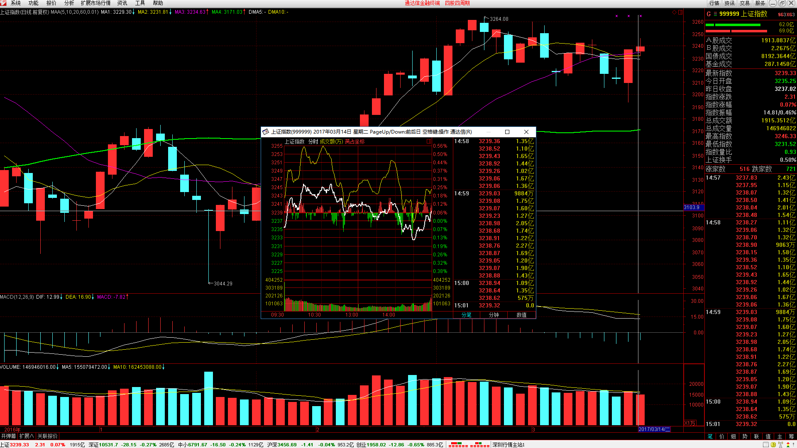

##二、	交易明细
###1、	买卖点截图
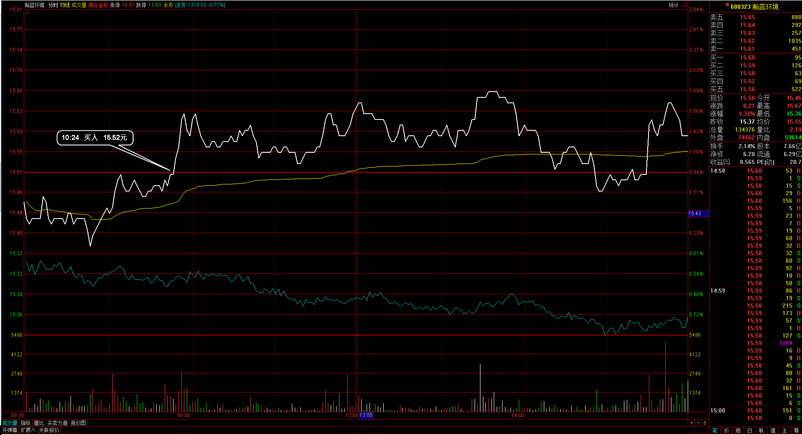
瀚蓝环境：连续向上的突破，并且日线前面有阶段高点，虽然比较近但仍然预期会突破；
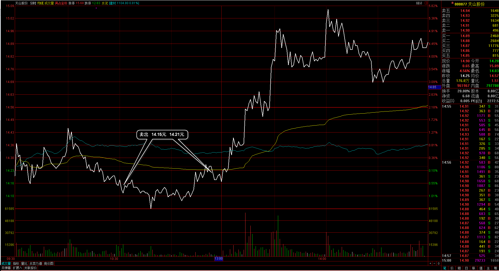
天山股份：这是自己执行中的问题，看到盘中下破了昨天的最低点，于是在这个位置就开始减仓出局，后面的强势都在自己扛过了日内最低而走出，本来预期是拿到16元，中间的波动让自己全部出局；
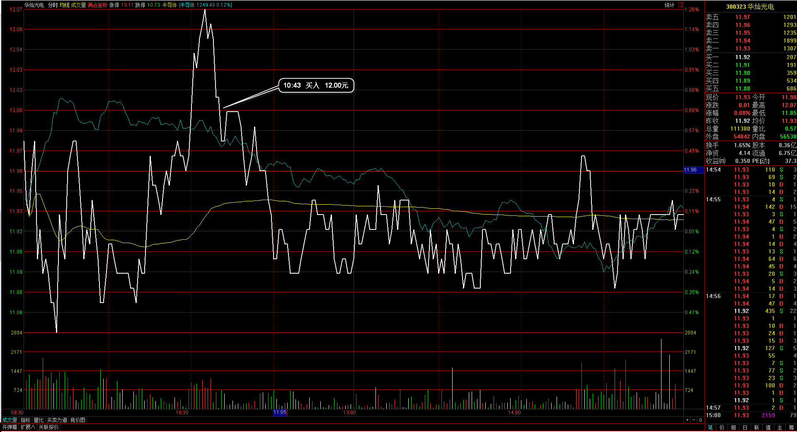
华灿光电：看到日线有已经回调完的样子，然后前面有日阳线信号K，于是在向上突破时入场，后面回调接入的突破位，但后面并没有走出来
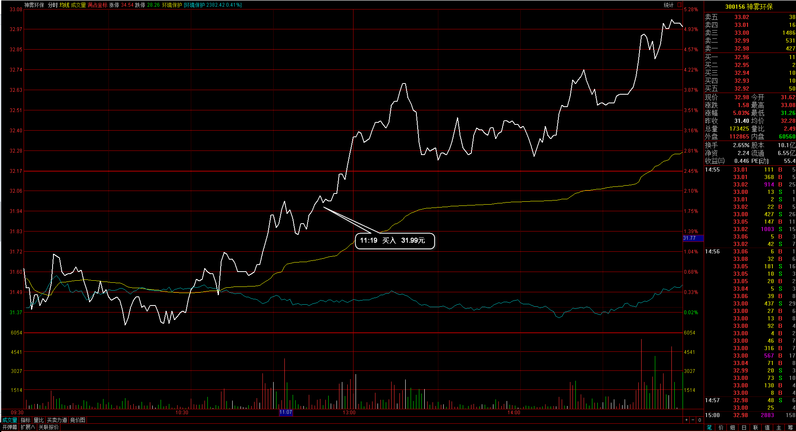
神雾环保：早盘的连续向上突破二次，并且在日线上也有一段平台的高点可以突破参考
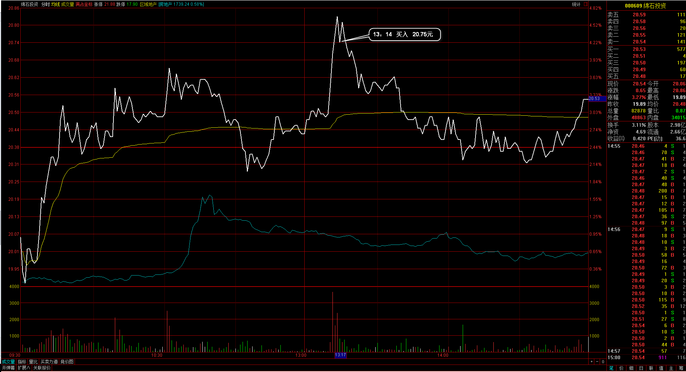
绵石投资：这个个股并不完成是系统的信号，盘后看是想做到20.88元的日线向上突破，可是前面并没有信号K的参考，直接让我在日内高点突破追入了，当时的理解也是前面连续几波的向上突破，于是想着可以再向上突破，但入场前日线的情况觉得下影锤子线就是确认支撑而没等信号K
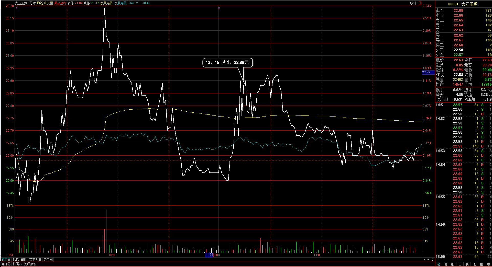
大亚圣象：就是这个个股间接的影响到今天的天山股份的平仓，因为连续两天都是收长上影的情况，直接再回落，我不想再回吐过多需要保守住盈利，于是把这部分的个股都平仓处理了，实际就应该是冲高然后平仓处理，日内再去寻找强势个股
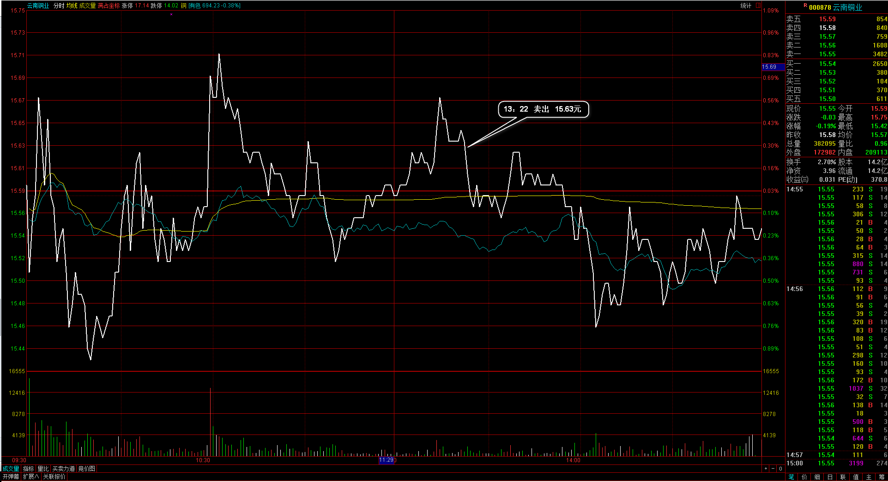
云南铜业：其实也是个股相对走得犹豫，其实仍然是在回调之后的向上段里，但短期内并没有再向上，于是在下午选择平仓处理

###2、	成交记录截图
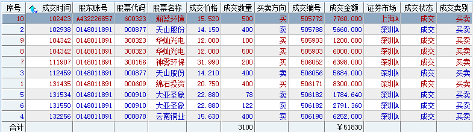

##三、	具体每一轮交易及盈亏情况
###1、	各股交易、持仓明细
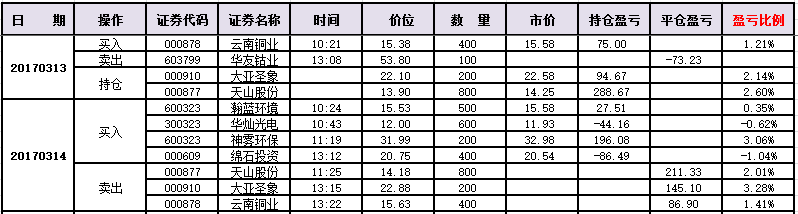 

###2、	平仓分布
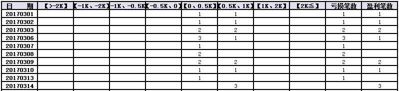

###3、	盈亏比和成功率
 

###4、	账户总计
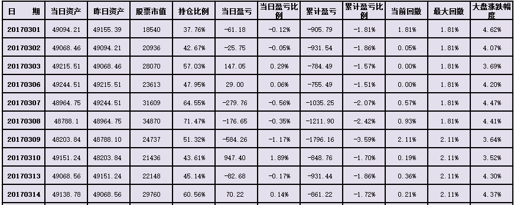

##四、	其他及总结
1、	天山股份，自己的操作需要仔细评价一下，首先我入场的初衷是向是16元的价格去尝试的，但在这个过程中碰到了我设定的出局信号，于是我在反弹过程下车了，但后面却又再次拉回去，我没有能再坐上这趟车，这中间的问题我需要理清，是的确有了我的出场信号我再出场的，后面的上涨需要割裂开来看，当成后面的第二段，只是目前我没有再坐回个股的操作方式，后面还是要严格按自己的信号操作，不要过于拿单；
2、	盘中有一个绵石投资，这个个股入场的位置是因为在分时里有连续的向上突破，并且今天整体都是上涨，个股前面有一个高点可以参考做突破尝试，于是在下午突破时进入，但最终却没有继续向上，基本站在最高点位，回头来看日线上并没有完全的信号K，这个操作有失误部分，选股的部分不够严谨；
3、	整体上需要我去感受一个二次突破和一次突破的区别，就像今天的华灿光电这种一次突破，后面经常会回到突破点之下，让自己浮亏，这个也类似今天的一汽富维，在向上突破后形态有纠结并不是极性转换，所以后面如果再向上突破位追入会直接导致站在日内高位上，需要留意这部分；
4、	也需要自己留意一下30分钟的配合情况，我的持仓情况应该走30分的流程；
5、	入场一定需要也最好需要有一个调整平滑的过程，这个信号的可信度会比较高一些；

 

##五、	收盘后账户截图
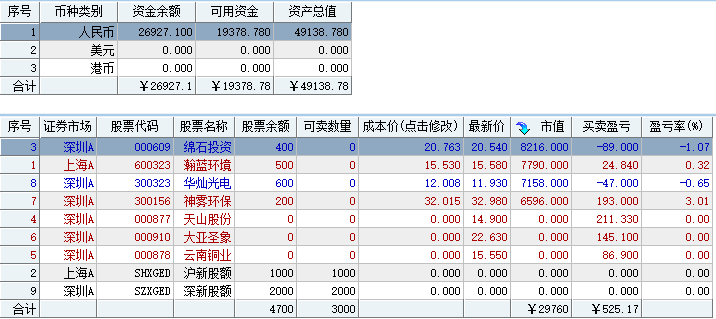