#20170315交易总结： 

##一、	当天走势概况
大盘今天跳空低开在3235.40点，仍然延续昨天的走势在窄幅里震荡，早盘最高价达到3243.71点，下午探底最低达到3227.74点，尾盘又再次拉起，最终收盘在3241.76点，全天上涨2.43点，涨幅0.08%，成交总额与昨天区别不大，有1857.27亿元。市场整体偏谨慎都在等今天的美联储货币政策落地，不过整体的加息预期应该也已经有过近日的消化，可能变化不大，后市等待消息确定，以这个小区间的突破为方向指引；
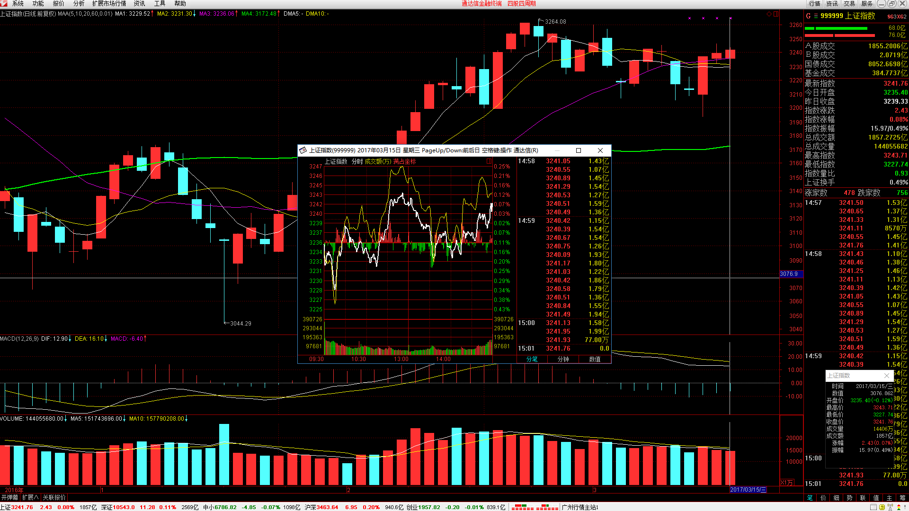

##二、	交易明细
###1、	买卖点截图
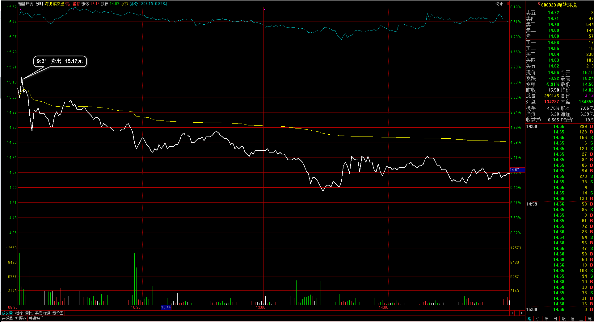
瀚蓝环境：早盘直接低开，开盘上冲就直接出局；
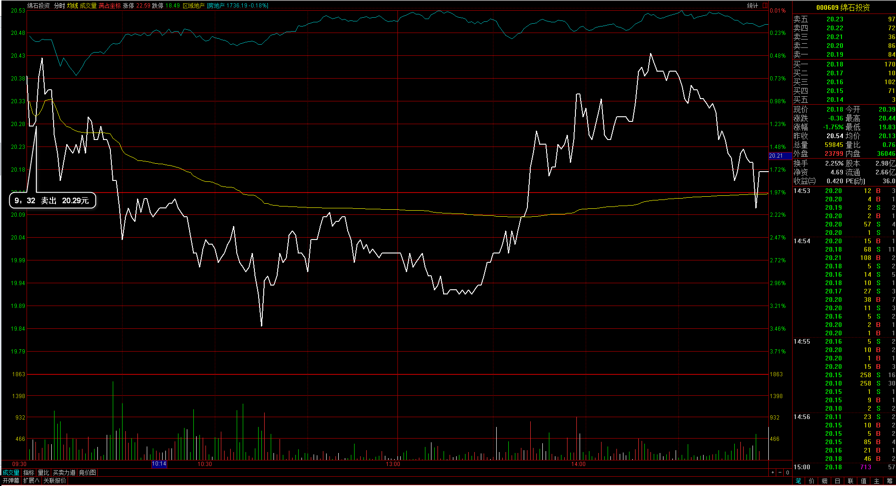
绵石投资：早盘也是低开，开盘后直接清仓处理掉；
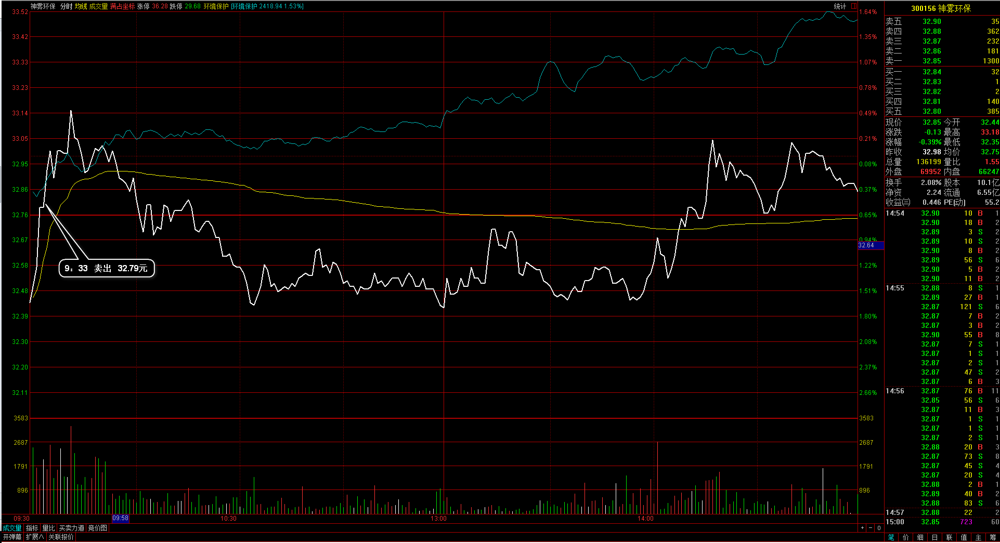
神雾环保：也是跳空低开的，开盘手上个股都在浮亏中，大盘也是低开所以整体判断较弱，也清仓处理；
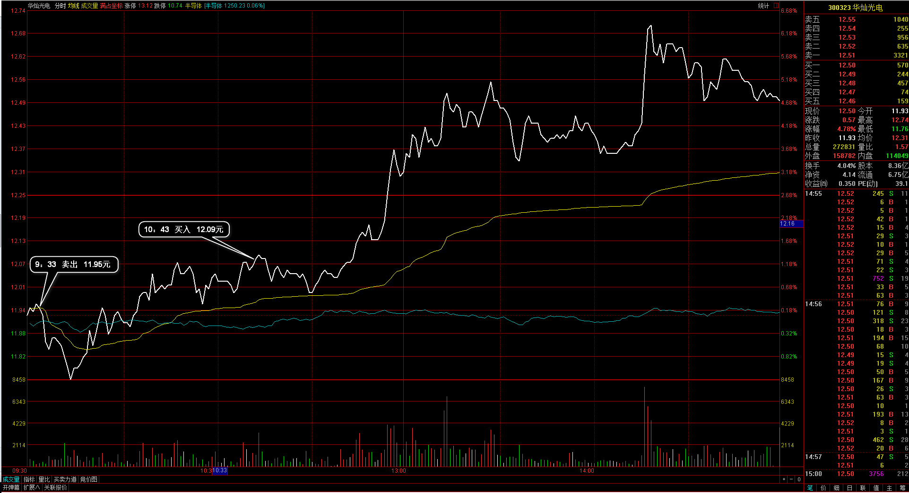
华灿光电：本身早盘向下，于是先清仓，后面发现仍然在向上有可能创新高，再在高位追买进入。体验不错，我能在更高的位置再入场了，之前这种情况是不会再参与的；
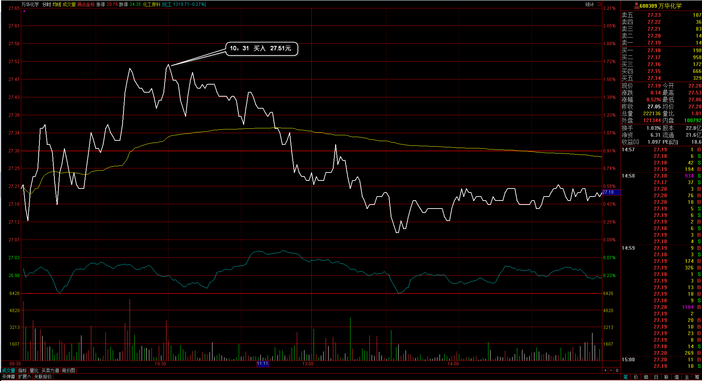
万华化学：也是觉得日线上有可能再向上突破，于是在早盘大盘同时向上并且仍在均价线之上入场；
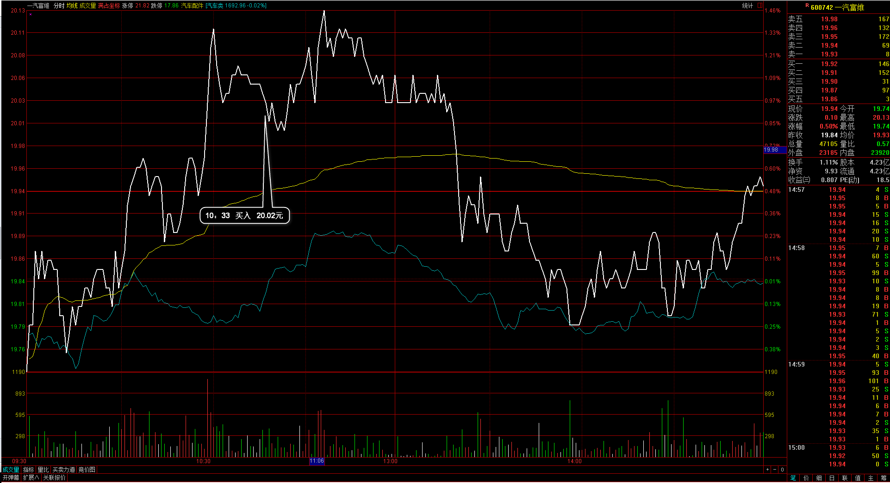
一汽富维：汽车板块预期有向好，在连续向上的过程介入，大盘正好也在向上；
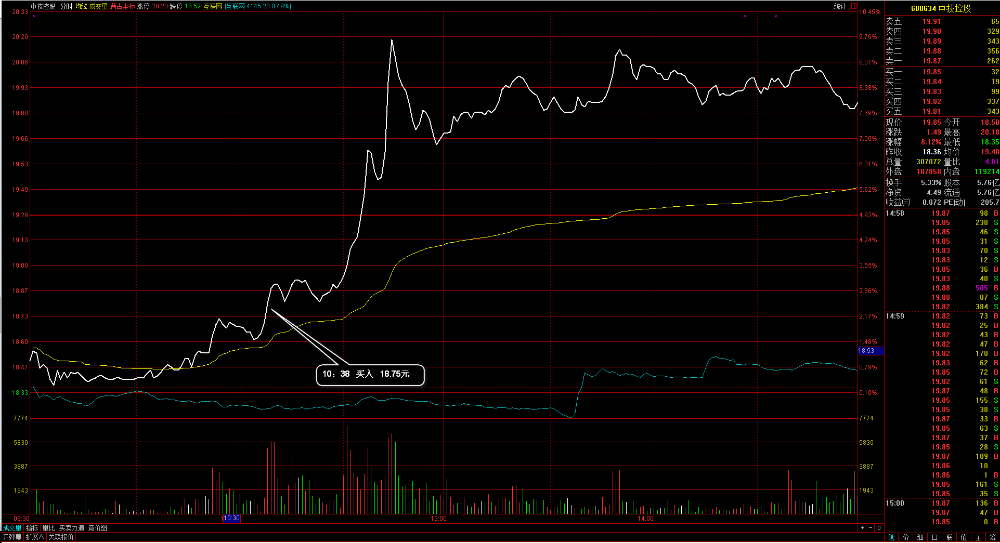
中技控股：前期高位附近，有向上突破的可能，只需要有一根放量大阳起手，于是在早盘向上的过程介入；
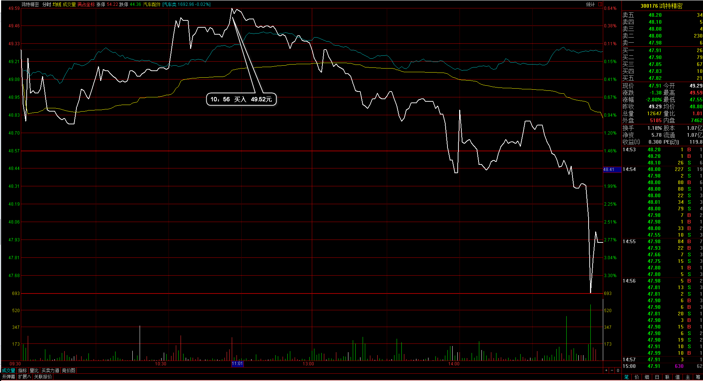
鸿特精密：同样是早盘向上的强势，但向上冲击失败向下，明天需要尽快处理出局；

###2、	成交记录截图
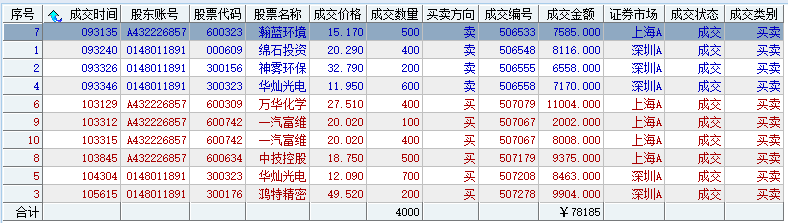

##三、	具体每一轮交易及盈亏情况
###1、	各股交易、持仓明细
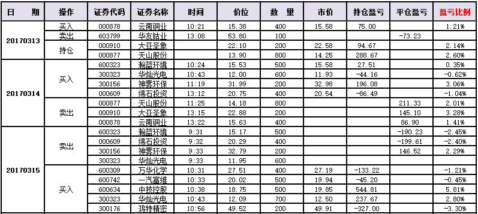 

###2、	平仓分布
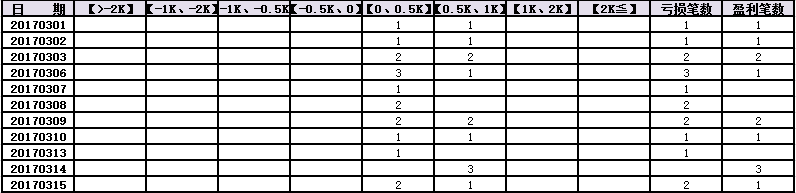

###3、	盈亏比和成功率
 

###4、	账户总计
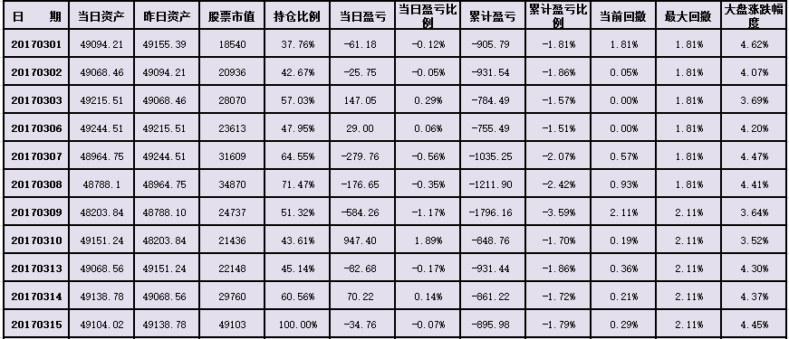

##四、	其他及总结
1、	目前阶段有一点再确认一下，不是着重在盈利的结果，而是体验要做的各种方式，需要执行正确的操作，不要在意每天的盈利波动情况，把关注的重心放在操作个股的入场和出场上来；
2、	今天早盘出局了华灿光电，但在后面仍然看好，能再更高的位置再次追回来，在操作上进了一步，我觉得这主要的区别是之前没有再进入的信号，现在以日内高点的突破都能理解成强势，所以有了再回到场内的交易理解；
3、	有一支个股早盘进入然后直接向下，盘中浮亏达到3%个多点，鸿特精密。这需要我好好复盘，找出不同的情况来，因为不需要有过多的盈利，但防守还是需要有一定的保障；
4、	同样的有一支个股，早盘进入然后向上拉升，最高差3个价位就到涨停板了，比较强势的个股，所以同样也需要另外单独多花时间分析区别；

 

##五、	收盘后账户截图
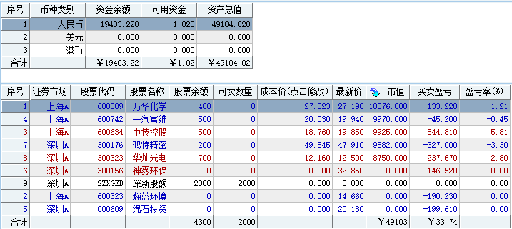