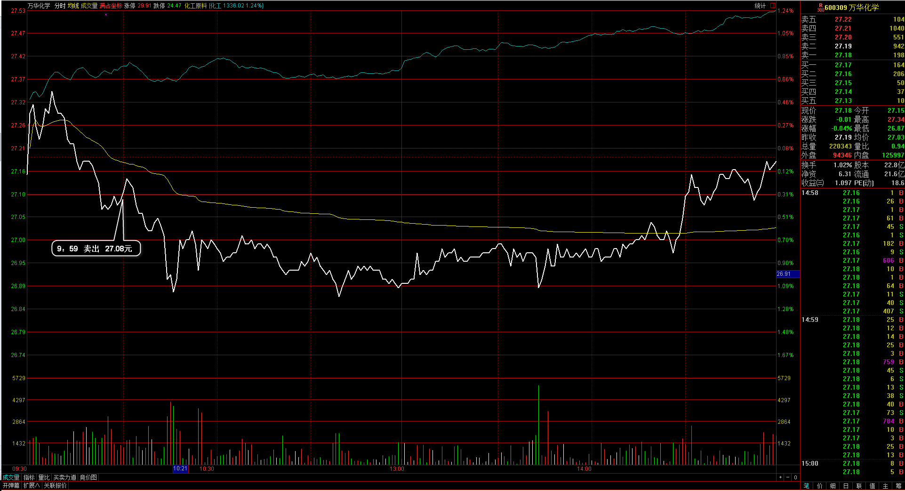

#20170316交易总结： 

##一、	当天走势概况
今天受美联储最终货币政策的公布影响，上证指数跳空高开在3247.16点，开盘就成为了最低价，然后直接向上突破了上月高点，最终日内高点3269.77点，尾盘仍然很强势收在高位，在3268.94点，全天上涨27.18点，涨幅0.84%，成交总额比之前均有放大为2445.08亿元，这一段上涨比较强劲并且直接完成了日内的调整，预期后面还会是向上的延续；

##二、	交易明细
###1、	买卖点截图

鸿特精密：昨天买入后一直在浮亏中，于是早盘向上冲高过程清仓出局；

一汽富维：同样的昨天买入出现了浮亏，但亏损不大早盘向上冲击并没有离场，直到下破日内低点才出局；

万华化学：昨天买在高位，今天高开以为可以再次向上并且大盘向好，实际在破开盘低点位置就应该出局，出场的位置有些偏晚，已经是昨天的最低点了；

鹏起科技：有预期向上突破阶段高点，于是在向上的过程进入，但今天并没有走出直接的预期；

赛摩电气：盘中放量追入，前面也有一个阶段的高点，预期能向上突破，最后突破向上离涨停只差几个价位，最终在尾盘向下回落得有点多；

红相电力：早盘一直有关注，向上突破的过程没追到然后在回落过程再接入，然后就站在日内最高点了；

华灿光电：昨天上涨今天没有能再延续，就只有上午向上冲了一段然后直接回落，下午仍然没有再向上，于是平仓出局；

###2、	成交记录截图

##三、	具体每一轮交易及盈亏情况
###1、	各股交易、持仓明细
 

###2、	平仓分布

###3、	盈亏比和成功率
 

###4、	账户总计

##四、	其他及总结
1、	今天大盘特别的强，很多个股需要直接追入才能入场，但觉得如果能有高点让来攻击，时效性会比较的好，这部分需要自己加强盘后的选股动作；
2、	但仍然会碰到追在高位的情况，不过这样很多机会都可以抓取到，就像是一把双刃剑，我只需要在第二天处理好这个个股就可以了，但如果走真向上走出的个股，这样的可以选择跳到持仓的处理上来解决，做到亏小盈大；
3、	目前仍然没有合适的盈亏胜率，在盘后有想法去了解DDE决策系统来过滤参考，让信号K的表象更有说服力，这个在之后的行情里自己手动来过滤和统计；

 

##五、	收盘后账户截图
