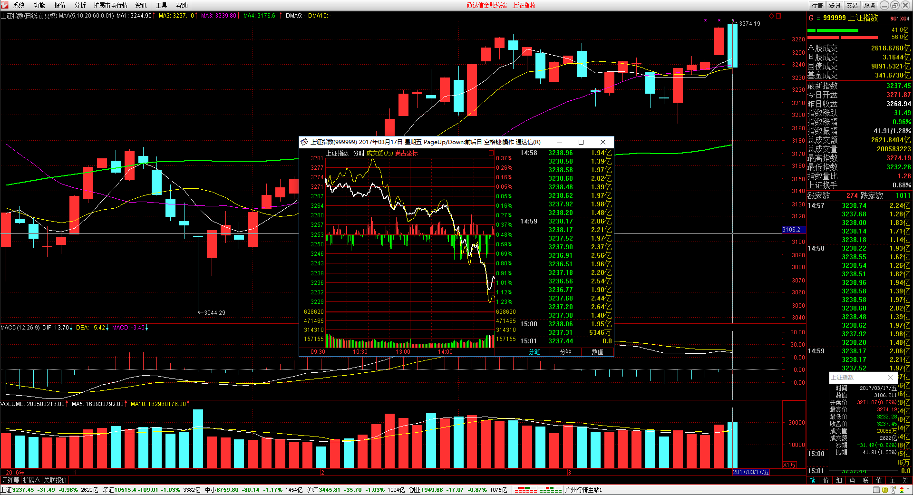

#20170317交易总结： 

##一、	当天走势概况
今天上证指数向上跳空开盘在3271.87点，然后上午是震荡向下，到下午开始加速单边往下，盘中最低点3232.28点，最终收盘在3237.45点，全天下跌-31.49点，跌幅-0.96%，成交总额再次放大为2621.84亿元。全天收完的是一根吞没大阴线，已经把昨天形成的跳空缺口回补，在高位形成了一个2B形态，预期后面会再有回落，需要留意风险；

##二、	交易明细
###1、	买卖点截图

红相电力：早盘低开向下，昨天尾盘已经浮亏所以清仓出场；

赛摩电气：整体上早盘都是清仓的过程，所以开盘后向上都在清仓，个股昨天尾盘回落了比较多，30分钟周期里K线不太好看；

中技控股：拿了三个交易日连续幅度有获得回吐需要，早盘也是冲高就卖出；

鹏起科技：早盘出场后发现后面有突破向上的压力线，于是再入场；

凯众股份：连续的向上，预期前期高点的打破，于是追买买入；

国星光电：向上突破上个交易日高点，追买买入；

天山股份：大目标位是16元，前两日回调完后再介入，于是上冲破昨天高点也站上5日均线位置开仓入场；

新和成：昨天收一根阳包阴，预示着有向上的动力，在今天确认站上开盘价后入场

###2、	成交记录截图

##三、	具体每一轮交易及盈亏情况
###1、	各股交易、持仓明细
 

###2、	平仓分布

###3、	盈亏比和成功率
 

###4、	账户总计

##四、	其他及总结
1、	大盘今天的时节点就是全天的震荡向上，这个过程里重个股轻大盘，可以明显的感受到大盘对个股的杀伤力和拖累，不过手上强的个股就比较强回落有限，而手上弱势的个股就比较不同了，连续的向下单边，最终下跌幅度吃了5%+，如果不是这样的个股盘中的情况会很不同；
2、	连续三天都有中大招也有追到涨停股，可能是双刃剑也可能有办法过滤，这两天都是最弱的被买到最强的也被买到，对于这种情况要着重分析是否可以过滤掉弱势的个股；
3、	今天买入的凯众股份是次新股来着，这样的情况比较不好把握，所以以后在处理次新股的交易上，暂时先规避或者轻仓处理；
4、	需要研究大智慧全推行情，做盘中预警和选股，这一块多花时间了解一下，制作思维导图加快学习进度；

 

##五、	收盘后账户截图
