#20170320交易总结： 

##一、	当天走势概况
大盘跳空高开在3241.11点，上午属于小幅度震荡，然后延续上周的节奏向下杀了一段最低点达到3228.12点，然后开始向上最终收在高点3251.13点附近，收盘3250.81点，全天上涨13.36点，涨幅0.41%，全天总成交额略缩为2139.52亿元。收一根带下影的小阳线，暂时止住了周五的大阴线，后市偏震荡思路；
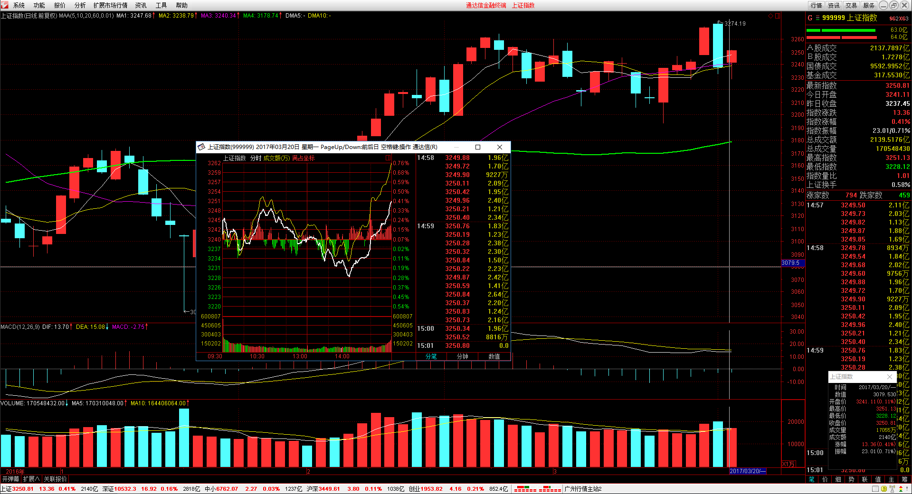

##二、	交易明细
###1、	买卖点截图
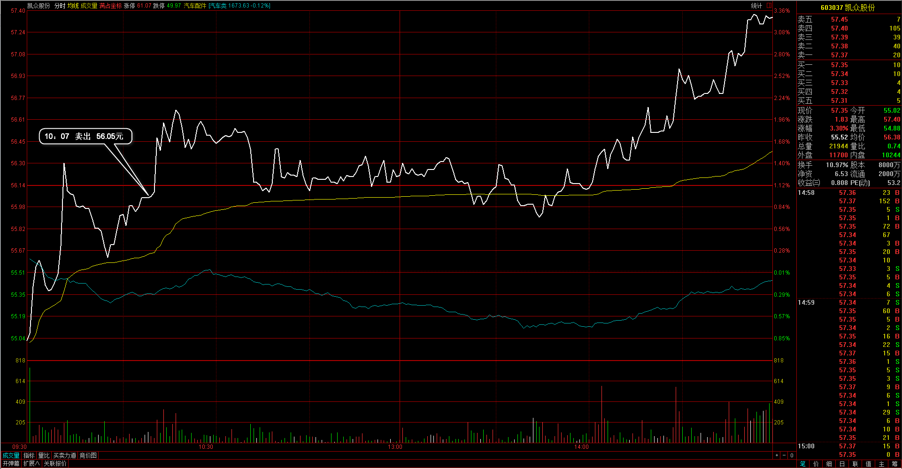
凯众股份：周五已经浮亏过大，所以今天的策略是遇反弹逢高位平仓，向上段时就直接处理掉了；
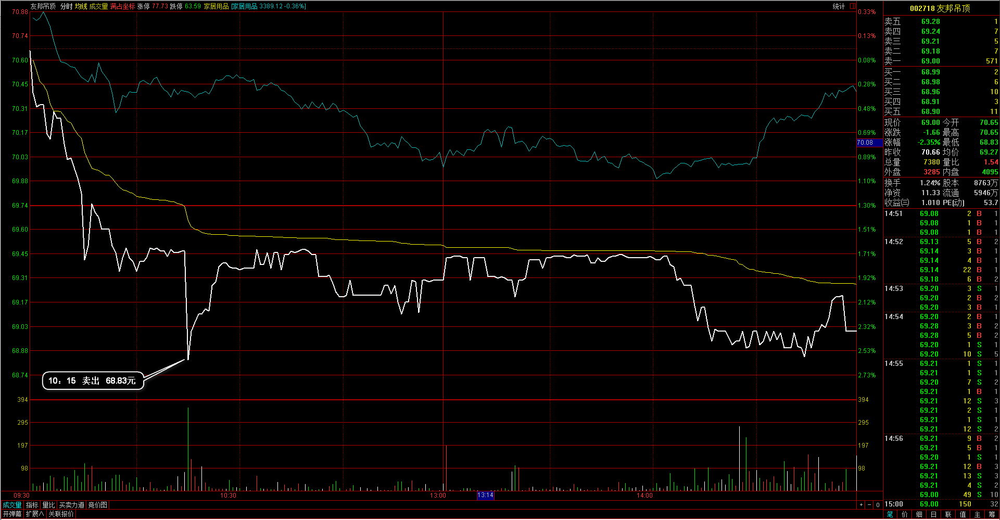
友邦吊顶：手上持仓个股都是等待反弹处理，但这个也被夹在中间，这是直接向上的，当时因为仓位轻没着重关注，导致实际平仓处理的点位比较低；
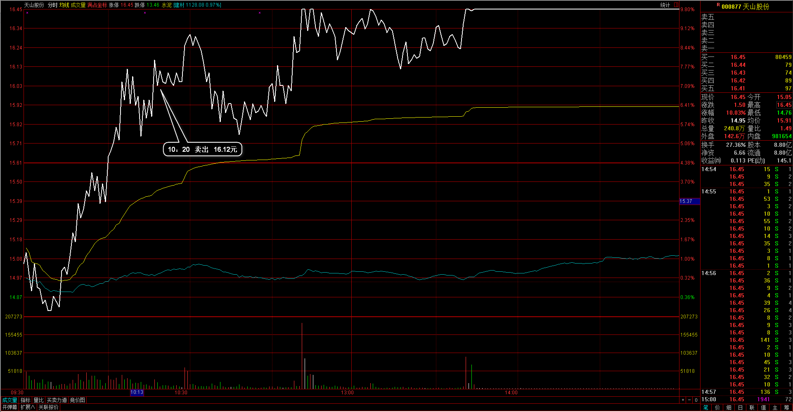
天山股份：目标位16元已经达到，在这附近已经接近涨停，正好大盘也达到反弹目标位，于是先出场；
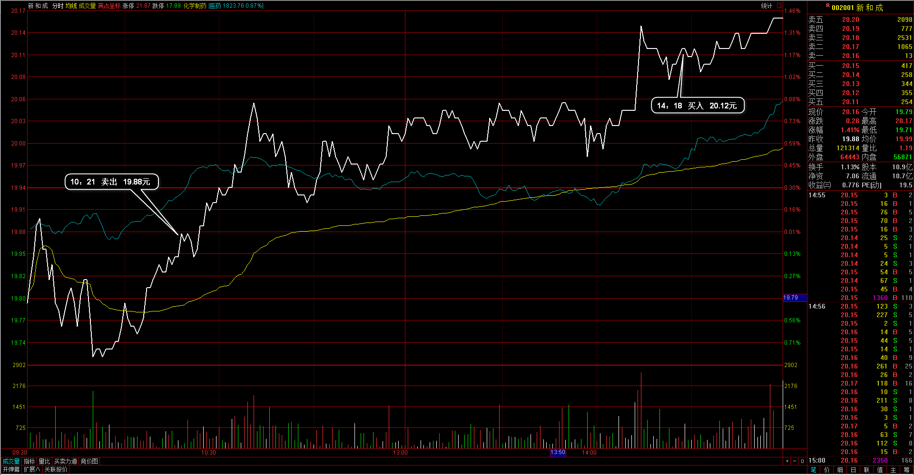
新和成：早盘也是在相对的高点先出局了，然后尾盘发现仍然还在保持向上，于是再进入；
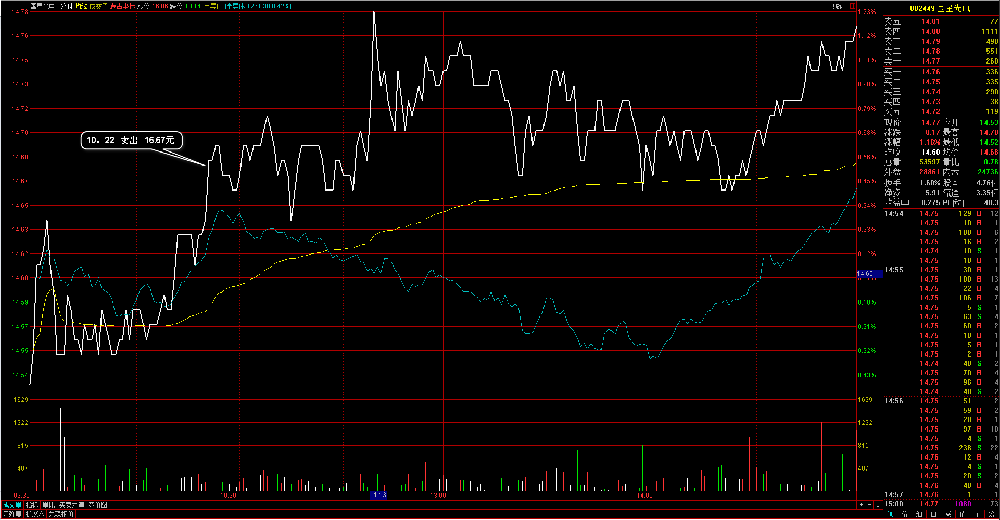
国星光电：向上冲的高位减持，平仓处理；
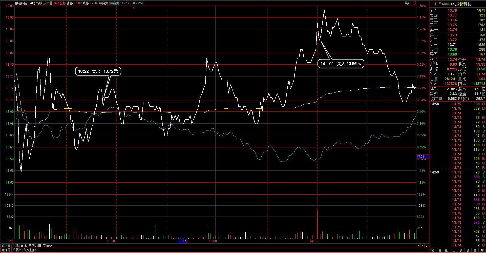
鹏起科技：早盘不确定因素过大，于是在震荡过程先出局，后面发现走出区间，于是再买回个股；
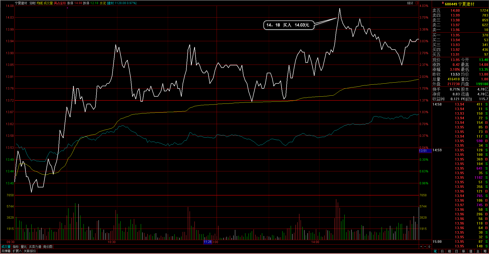
宁夏建材：今天丝绸之路板块反应不错，在其中找到向上突破的个股进入，止损就是前平台低点；

###2、	成交记录截图
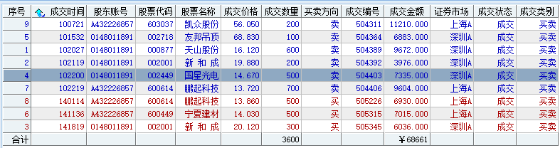

##三、	具体每一轮交易及盈亏情况
###1、	各股交易、持仓明细
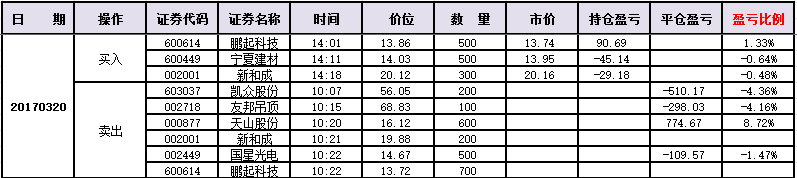 

###2、	平仓分布
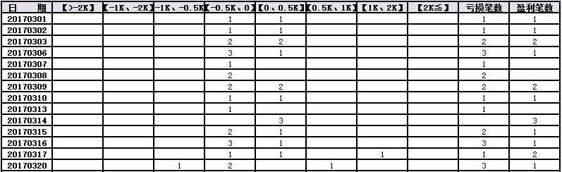

###3、	盈亏比和成功率
 

###4、	账户总计
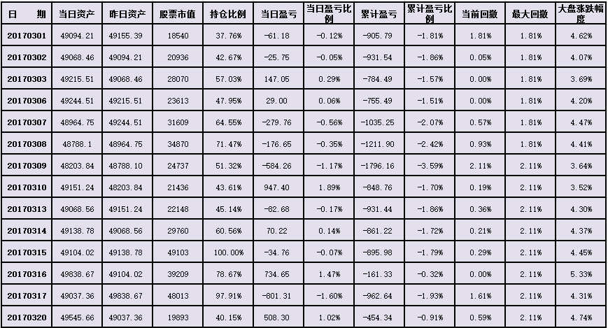

##四、	其他及总结
1、	今天大盘有延续下跌，在开盘前也有想到过这个可能，也觉得可能会有反弹行情走出，但决定前期不追入，等下午的2点时间窗口开始，然后大盘在2点有反弹也不确定，于是决定先在2点位置入一次仓位，然后准备在2点半再入一次，后来听唐老师上课而没有操作后面半小时；
2、	处理手上的反弹个股时，感觉好多都不太好，有的处理在高位有的在最低位，并且有一个感觉容易受整体的影响，一出全出的这种做法，实际应该个股都分开来对应，要按个股的实际支撑阻力位置对待；
3、	早盘处理友邦吊顶这个比较慢了，当时大多持仓都有反弹，这个一直比较弱，开盘就一直向下，最终砍仓在低点，以后需要对每个个股都仔细检查和审核一下，这个也需要跳出整体情况来处理；

 

##五、	收盘后账户截图
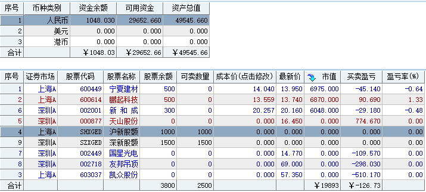