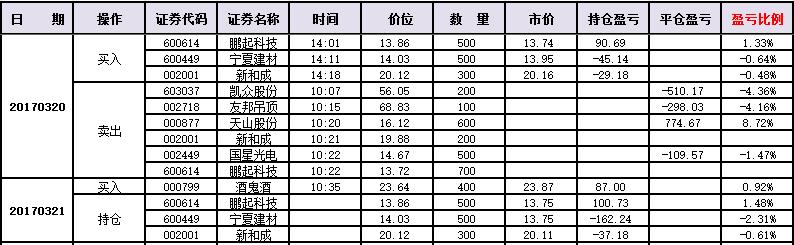

#20170321交易总结： 

##一、	当天走势概况
大盘继续向上，今天开盘不久就直接站在3250之上，开盘在3250.25点，然后全天都是小震荡行情，最高3262.22点，最低点3246.70点，最终收盘在3261.61点，全天上涨10.80点，涨幅0.33%，总成交额变化不大为2191.21亿元。整体上预期行情是在3274~3225之间震荡，向上突破的概率比较高，明天盘中的支撑要留意3250的情况；

##二、	交易明细
###1、	买卖点截图

酒鬼酒：今天整体酿酒板块比较强势，于是在中午收盘前预期酒鬼酒会突破前期高点，在这追入；

###2、	成交记录截图

##三、	具体每一轮交易及盈亏情况
###1、	各股交易、持仓明细
 

###2、	平仓分布

###3、	盈亏比和成功率
 

###4、	账户总计

##四、	其他及总结
1、	今天主要是判断大盘在震荡区间里，以大盘的时节点来处理开平仓，中间上唐老师的课就没怎么动；
2、	在选择今天酿酒板块的上涨情况时，发现板块的突出表现是可以有很多个股走出信号的，比如今天的五粮液和酒鬼酒，盘中还有超讯通信也有信号，由于盘中没有直接盯盘，好多信号位置没有处理；
3、	大盘的基本情况心中有数后，对应在关键的时间窗口只要没有特别大的负面走势，都可以重个股的信号进入的，这一点还需要自己认真处理，特别是在第一信号出来以后，一定要加入提前的预警信号给自己，并且在设定预警信号时要多留意当前的板块情况；

 

##五、	收盘后账户截图
