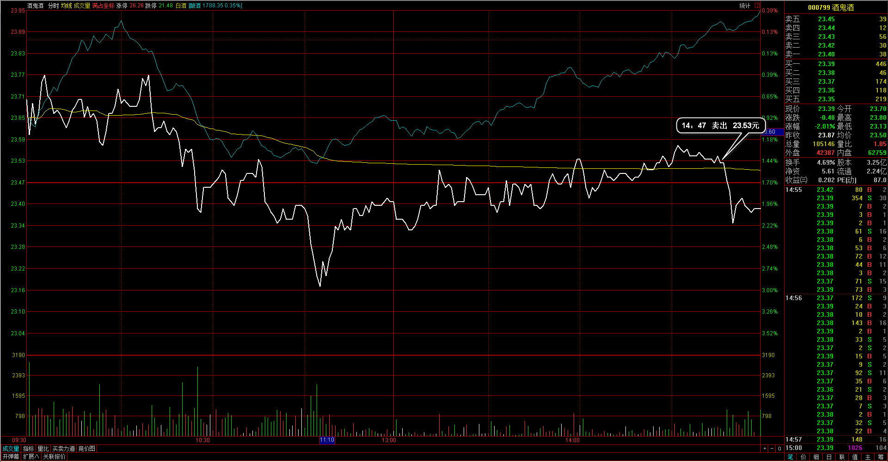

#20170322交易总结： 

##一、	当天走势概况
今天大盘跳空低开在3246.22点，开盘后先向上冲击日内高点达3255.78点，然后回落到盘中最低点3229.13点，最终下午收盘在3245.22点，全天下跌-16.39点，跌幅-0.50%，总成交额为2445.45亿元，略微放大。后市仍然以3274~3225点内震荡，需要等整理完后走出方向；

##二、	交易明细
###1、	买卖点截图

新和成：整体上日线已经走得比较差，调换账户在这里平仓；

酒鬼酒：昨天的热点板块，今天下跌得比较多，其实应该明天再处理，调换账户；

鹏起科技：日线上是突破后整理再向上的个股，实际应该再继续持有；

宁夏建材：以一带一路板块的情况处理到的，以后碰到这种盘中热点不是很连续的，需要明确的越快处理越好，早盘上冲的过程已经超过成本位置，所以这部分应该利用盘中的支撑阻力处理掉手上的持仓，这种板块热点的不连续可以理解成是一种不强势；

###2、	成交记录截图

##三、	具体每一轮交易及盈亏情况
###1、	各股交易、持仓明细
 

###2、	平仓分布

###3、	盈亏比和成功率
 

###4、	账户总计

##四、	其他及总结
1、	止损止盈的小动作需要使用极小的分时支撑阻力位置来处理；
2、	止损止盈做得比较小可以让盈利和止损都相对变得较小，如果是波动比较放大的个股也会有较大的结构走出，这样就并不会单独的受制于波动指标，所以结构可能会是一个不错的建议信号；
3、	同样的根据自己的入场信号K机制，可以把支撑阻力的表现变成事后验证过的情况，而不是达到位置就直接判定有效开始操作，而应该是当表现动作出来后，明确了结果再开始操作，这样也有一个问题就是操作会相对位置来说偏晚，会要丢失一部分波动空间，也就是说如果盈利目标不够大的话操作会比较紧；

 

##五、	收盘后账户截图
