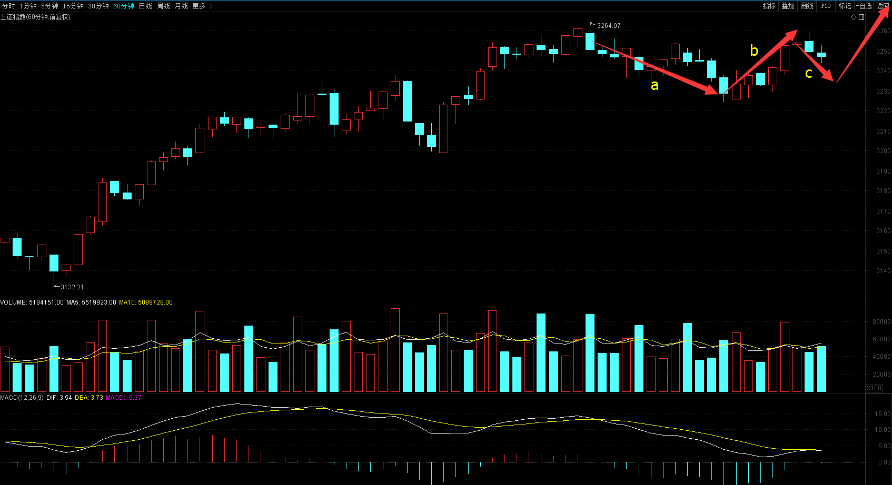
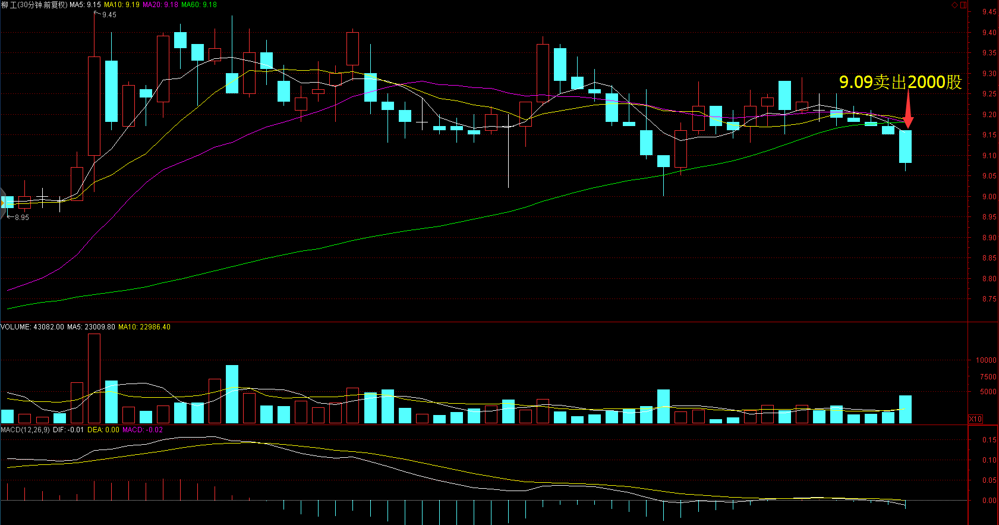
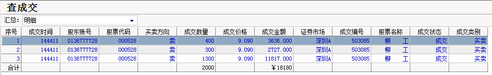
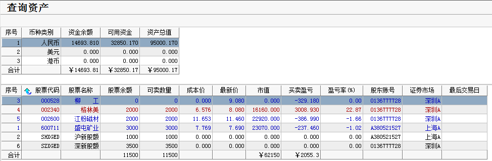

# 2017.03.01交易总结 #
一、	当天走势技术分析回顾

- 今天沪指低开，随后展开一波上涨，午后，震荡回落，收一根带长上影线的小阳线，收盘站上了5日均线，成交量放大，唯一缺陷就是没有收盘站在3252点之上，从60分钟图来看，沪指可能还要震荡下跌一段，走回调浪abc浪的c浪（如下图所示），但由于b浪反弹超过a浪的0.618倍，走平台型调整概率很大，那么c浪一般都不会破a浪的低点，c浪走完将再次反弹挑战前期高点3301点，如果沪指收盘价高于3252点，调整结束。

- 创业板走势和沪指基本同步，收一根放量的小阳线，从60分钟来看，创业板还在走箱体整理，短期可能继续震荡整理。

- 盘面上，快递股下午出现大幅下跌，顺丰控股开板跳水，韵达股份盘中一度接近跌停板，带领沪深两市指数快速回落。钛白粉、西安自贸区、大飞机居板块涨幅榜前列，快递、西藏、银行居板块跌幅榜前列。

二、	交易明细

1.	买卖点截图

柳工在9.09卖出2000股

2.	交易明细

三、	分析每笔交易心态、操作理由、可改进情况
交易总结：

- 今天卖出了柳工。

> 今天持仓踏空，大盘上涨，持有的个股几乎都是低开震荡，卖了又怕涨上去，导致上午没有操作。

> 临近尾盘，柳工的30分钟图跌破了60均线，卖出止损。
持有的股票里，有两只股票都是同一个板块，涨的时候一起涨，跌的时候也是一起跌，持仓尽量持有不同板块的股票，这样可以根据板块轮动来调整。

四、	收盘后账户截图

