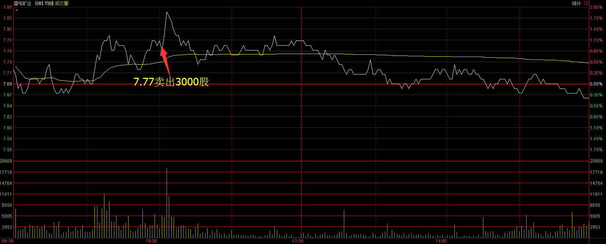
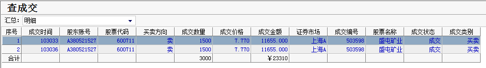
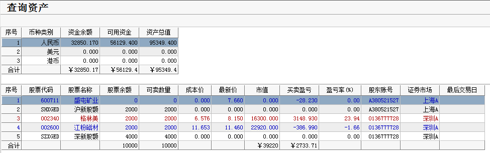

# 2017.03.02交易总结 #
一、	当天走势技术分析回顾

- 今天沪指高开，随后震荡下跌，收一根中阴线，从60分钟图来看，沪指C浪调整有可能到位了，如果早盘能在3222点上方站稳，放量上涨，且在10点30分站上3246，沪指有可能调整结束，如果跌破3222点，震荡调整继续，有可能下跌考验3200点支撑，目前的位置适合多看少动，耐心等待大盘站稳。

- 创业板高开低走，收一根中阴线，kdj指标在高位死叉，预示着还有继续下跌的动能，从60分钟图看，创业板有加速下跌的迹象，明天关注1918点的支撑，如果跌破，可能会回落到下档支撑位1906点附近。

- 盘面上，次新银行股逆势上扬，张家港行、吴江银行涨停，其他次新银行股均有不同城程度上涨。农药、次新股、苹果概念居板块涨幅榜前列，水泥、物流、摘帽概念居跌幅榜前列。

二、	交易明细

1.	买卖点截图

盛屯矿业在7.77卖出3000股

2.	交易明细

三、	分析每笔交易心态、操作理由、可改进情况

交易总结：

- 今天卖出了盛屯矿业。

> 明天开始请假一个星期，早上计划卖出持有股票。

> 盛屯矿业第二次冲高回落的时候卖出。

> 格林美的日线的上涨趋势没有走完，预计震荡整理后，最少还有一波同等级别的上涨行情，持有的仓位也不是特别重，留着没有卖。。

四、	收盘后账户截图

