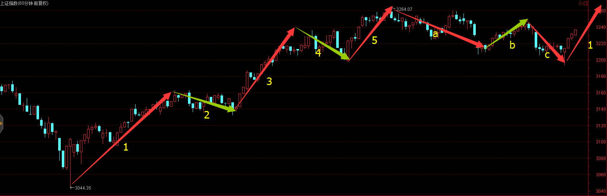
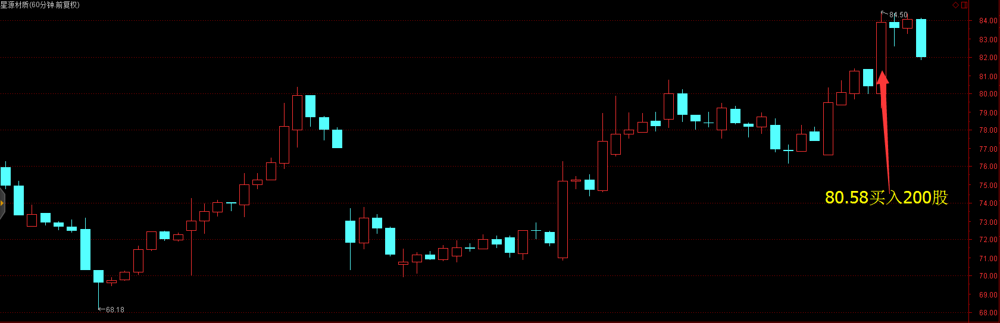
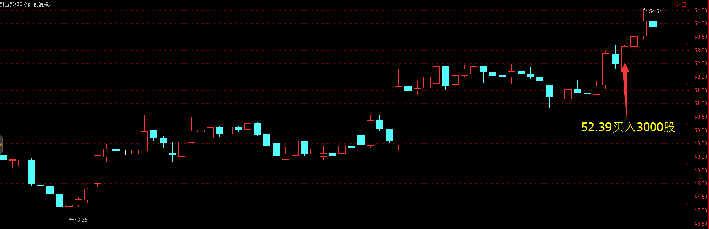
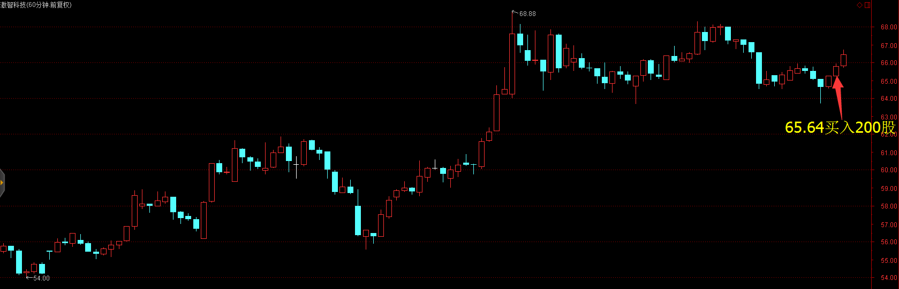
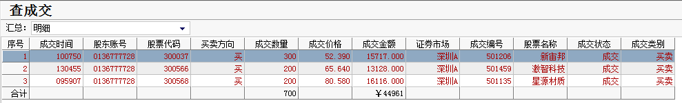
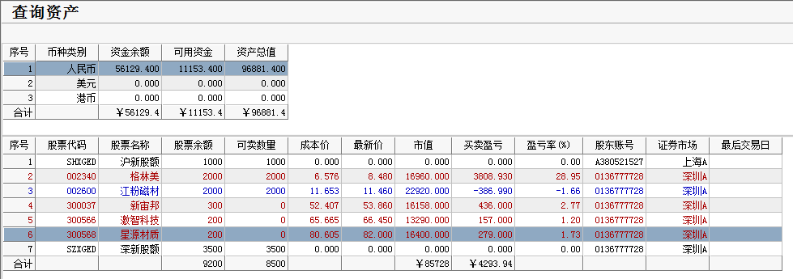

# 2017年3月13号交易计划 #
一、	大盘走势技术面分析：

- 上周五上证指数收一根缩量的星阴线，成交量创近期的新低，市场惜卖情绪明显，星阴线有可能见低，有可能是下跌的中继，如果今天跌破3208，可能会继续调整，如果早盘高开放量上涨，有可能调整结束。

- 创业板收一根缩量的星阴线，kd指标高位死叉，形态类似三只乌鸦，后市可能继续调整，从60分钟来看，调整没有结束，可能要考验60线的支撑。

二、	基本面分析：

1.	浙江九好集团与鞍重股份联手“忽悠式”重组，证监会拟对部分当事人终身市场禁入，对首例沪港通跨境操纵案当事人罚没12亿
2.	这周15只个股限售股解禁，总市值583.4亿。
3.	重庆今年推动国企集团层面混改。
4.	工信部称今年钢铁5000万吨去产能目标不包括地条钢。
5.	2017年1月我国总共进口婴幼儿配方奶粉15091吨，同比下降9.2%，价值21568.76万美元，同比下降8.6%。是过去22个月以来，奶粉进口数量单月增幅首次下降。相关公司可关注贝因美(002570)。
6.	美国非农数据强劲， 美联储周四加息比较确定，上周五美国三大指数上涨。

三、	仓位管理
仓位保持在60%-70%。

四、	今天操作计划：

- 重个股，轻大盘，控制好仓位。

- 大盘没有跌破3208，可适当建仓，重点关注星源材质，新宙邦。

- 大盘在3200站稳，可适当建仓，重点关注星源材质。

- 大盘跌破3200点拉回来见底，建仓。

> 300568 星源材质 早盘回调，站稳买进，如果没有回调，突破高点，回调在80.78上方站稳买进。

> 300037 新宙邦  早盘回调，站稳买进。

> 002340 格林美 观察能否突破，可做高抛低吸。

>重点关注个股：002074国轩高科；000528柳工；000545金浦钛业；300340科恒股份；300073当升科技；002233塔牌集团。

# 2017.03.13交易总结 #
一、	当天走势技术分析回顾

- 今天沪指低开，开盘后杀跌，跌破了3200点，随后震荡单边拉升，收一根带下影线的光头中阳线，收盘站上了3234点，改变了颓势，成交量较前一交易日放大，从60分钟图看，调整浪可能已经结束，后市将展开推动浪的上涨。

- 个股活跃，电气仪表、环境保护、次新股涨幅居前，仅电信运营、酒店餐饮、化纤等少数几个板块下跌。

二、	交易明细

1.	买卖点截图

星源材质在80.58买入200股

新宙邦在52.39买入300股

激智科技在65.64买入200股

2.	交易明细

三、	分析每笔交易心态、操作理由、可改进情况

交易总结：

- 今天买入星源材质、新宙邦和激智科技。

- 锂电池板块上周出现了周线级别的买入信号，行情可能持续数周之久。大盘探底回升的时候，分别买入星源材质和新宙邦，这两只股都是在底部刚开始启动。

- 激智科技出现60分钟的三买，午后开盘买进。

四、	收盘后账户截图

