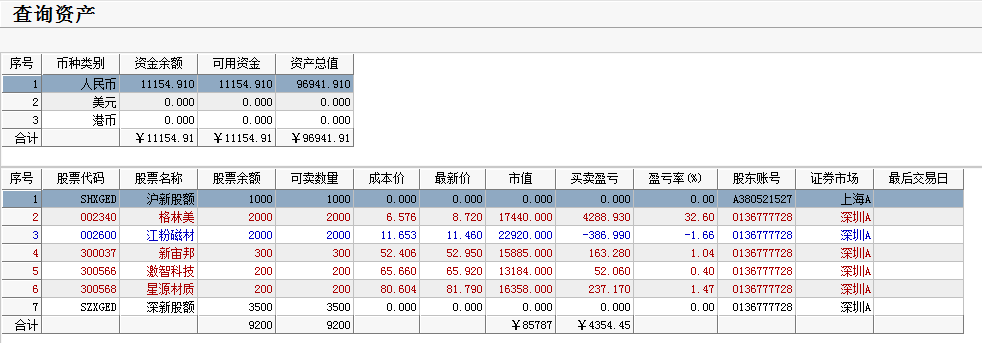

# 2017.03.14交易总结 #
一、	当天走势技术分析回顾

- - 今天沪指小幅低开，全天维持窄幅震荡走势，收一根小阳线，量能较昨日小幅缩量，资金观望情绪明显，短期沪指继续震荡概率比较大，等待美联储议息尘埃落定。

- 创业板低开，随后震荡下跌，网宿科技预计1-3月净利润大幅下降，今天放量大跌，午后跌停，拖累了创业板，创业板收一根放量的中阴线。网宿科技的形态已经走坏，乐视网短期的走势也不乐观，明天有破位下跌的可能，重点关注这些权重股的表现，如果这些权重股大跌，会带动创业板走坏，短期创业板走势不太乐观。

- 盘面上，昨日晚间多家公司披露高送转方案，今日早盘高送转股集体异动，西藏板块、高送转、次新股等板块涨幅居前，电信运营、旅游、智能电视跌幅居前。

二、	交易明细

1.	买卖点截图
没有交易

2.	交易明细
没有交易

三、	分析每笔交易心态、操作理由、可改进情况

交易总结：

- 今天没有操作。

- 早盘的时候，持有的个股都是冲高回落，没有找到好的点位进行操作。

四、	收盘后账户截图

