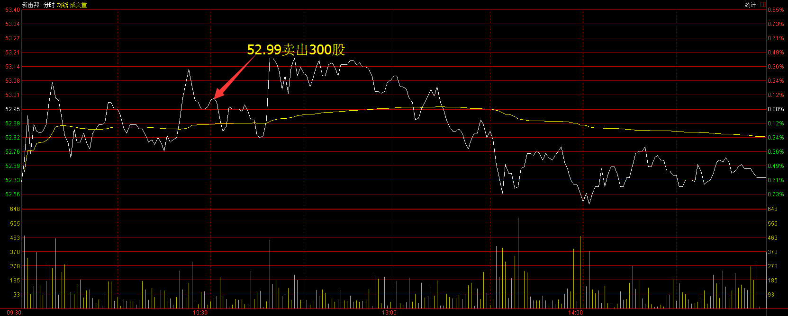
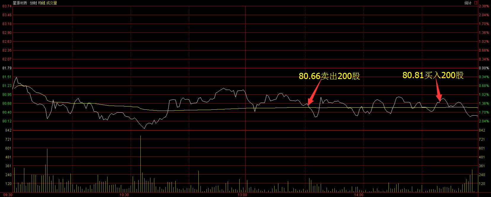
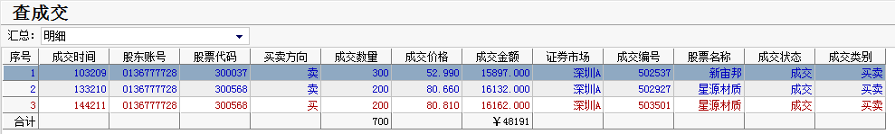
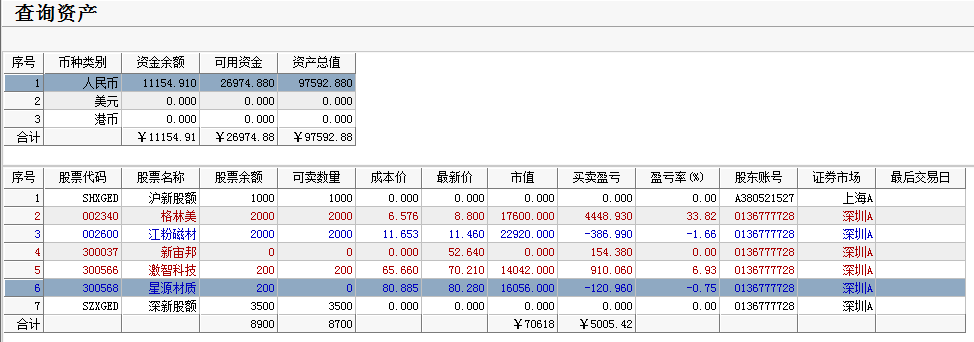

# 2017年3月15号交易计划 #
一、	大盘走势技术面分析：

- 今天沪指小幅低开，全天维持窄幅震荡走势，收一根小阳线，量能较昨日小幅缩量，资金观望情绪明显，短期沪指继续震荡概率比较大，等待美联储议息尘埃落定。

- 创业板低开，随后震荡下跌，网宿科技预计1-3月净利润大幅下降，今天放量大跌，午后跌停，拖累了创业板，创业板收一根放量的中阴线。网宿科技的形态已经走坏，乐视网短期的走势也不乐观，明天有破位下跌的可能，重点关注这些权重股的表现，如果这些权重股大跌，会带动创业板走坏，短期创业板走势不太乐观。

二、	基本面分析：

1.	市场静待美联储加息，欧美股市跌，油价七连跌;
2.	3月上会企业无一被否，IPO过会率提升;
3.	开户数五连增，上周新增投资者逾51万人;
4.	国家统计局报告显示，三、四线城市去库存力度加大，1-2月份非重点城市商品房销售面积同比增长35.9%，增速比上年全年加快14个百分点;
5.	去年5月以来最小降幅！央行2月外汇占款下滑582亿元;
6.	媒体：山西打击煤企超能力生产，严格执行276工作日方案。

三、	仓位管理
仓位保持在70%-90%。

四、	今天操作计划：

- 今天大盘震荡概率比较大，预防创业板下跌，持仓股票可以高抛低吸。

- 002340 格林美 昨天走出盘整区间，关注上涨趋势能否延续。
- 300568 星源材质 关注前高84.50元能否有效突破，考虑做高抛低吸。
- 300037 新宙邦  关注前高54.54元能否有效突破，考虑做高抛低吸。
- 300566 激智科技 关注前高68元能否有效突破，反弹到68元附近乏力先出场。

>重点关注个股：002074国轩高科；000528柳工；000338潍柴动力；000545金浦钛业；300340科恒股份；300073当升科技；002233塔牌集团。

# 2017.03.15交易总结 #
一、	当天走势技术分析回顾

- 今天沪指低开，随后维持窄幅震荡，收一根带下影线的小阳线，从60分钟图来看，沪指3月13号见底回升后，这两天维持收敛的三角形整理，三角形已经走完，明天将继续上涨。

- 创业板低开，维持震荡，午后在创业板权重股乐视网暴力拉升下，创业板指强势反弹翻红，收一根小阳线，创业板这两天维持三角形平台整理，乐视网30分钟图macd底部背驰，反弹将继续，创业板整理完毕有望再次上涨。

- 盘面上，家居用品、家用电器、环保等板块涨幅居前；在线教育、文化振兴、船舶等板块跌幅居前。

二、	交易明细

1.	买卖点截图

新宙邦在52.99卖出300股

星源材质在80.66卖出200股，在80.81买入200股。

2.	交易明细

三、	分析每笔交易心态、操作理由、可改进情况

交易总结：

- 今天卖出了新宙邦，星源材质做了T。

> 早盘创业板比较弱，仓位也比较重，担心大盘下跌的有系统性风险，由于恐惧的心理，新宙邦冲高回落的时候卖出。

> 午后创业板破新低的时候，卖出了星源材质，创业板拉回来的时候把星源材质买回来，卖出星源材质的时候也带有些恐惧心理，今天早上分析大盘震荡是大概率事件，既然震荡是大概率事件，就不应该在大盘低位卖出股票，反而要在低位的时候买入股票，冲高后卖出。

四、	收盘后账户截图

