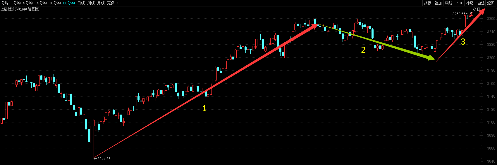
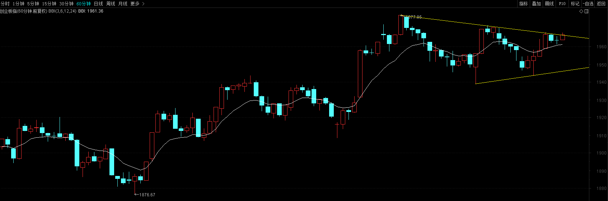
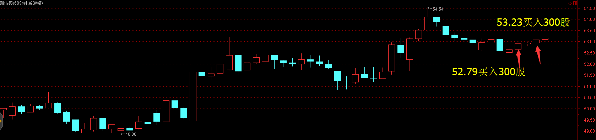
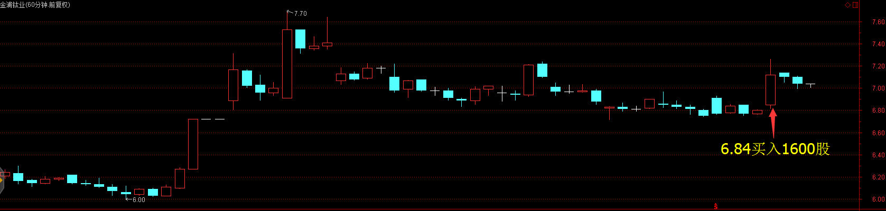
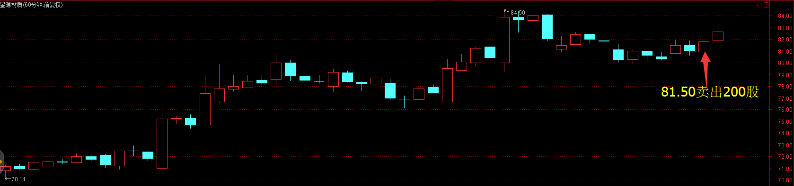
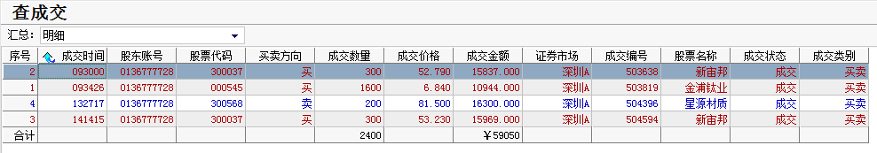
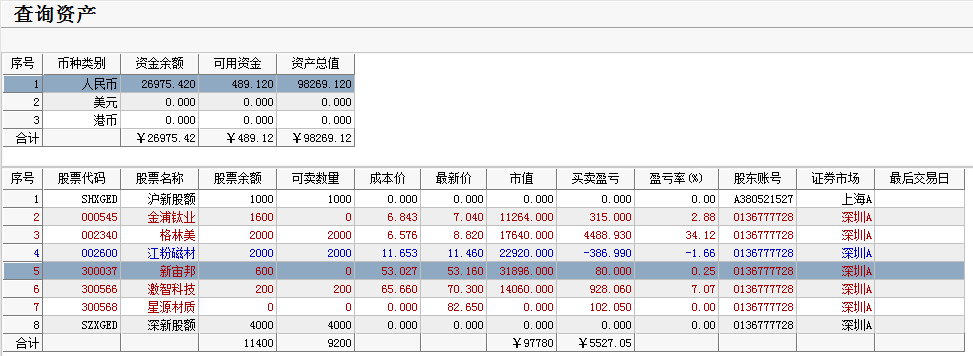

# 2017年3月16号交易计划 #
一、	大盘走势技术面分析：

- 今天沪指低开，随后维持窄幅震荡，收一根带下影线的小阳线，从60分钟图来看，沪指3月13号见底回升后，这两天维持收敛的三角形会回调整理，三角形整理已经走完，明天将继续上涨。 创业板低开，维持震荡，午后在创业板权重股乐视网暴力拉升下，创业板指强势反弹翻红，收一根小阳线，创业板这两天维持三角形平台整理，乐视网30分钟图macd底部背驰，反弹将继续，预计创业板整理完毕有望再次上涨。

二、	基本面分析：

1.	美联储宣布加息25个基点，周三欧美股市普涨，道指收涨逾100点，纳指距离6000点关口仅100点之遥。
2.	智利铜矿工人无期限罢工致铜价飙升，金属板块再次领涨欧美股市。关注有色板块。
3.	多家企业上调钛白粉价格，钛白粉企业一季度盈利有望超预期，华东区金红石型钛白粉每吨再次上涨300元，达到18800元/吨，关注金浦钛业。
4.	社保基金理事会理事长楼继伟表示，社保基金可以忍受更大的年度波动。可能会加大资金流入股市。

三、	仓位管理
仓位保持在80%-90%。

四、	今天操作计划：

- 美联储加息落地，大盘大概率会选择方向上，早上逢低买入股票。

- 002340 格林美 持股。
- 300568 星源材质 关注前高84.50元能否有效突破，考虑做高抛低吸。
- 300566 激智科技 关注前高68元能否有效突破，反弹到68元附近乏力先出场。
- 300037 新宙邦 早盘买入。
- 000545 金浦钛业 早盘买入

>重点关注个股：002074国轩高科；000528柳工；000338潍柴动力；300340科恒股份；300073当升科技；002233塔牌集团。

# 2017.03.16交易总结 #
一、	当天走势技术分析回顾

- 今天沪指高开高走，收一根放量的光头中阳线，沪指收盘创3个月新高，从60分钟来看，沪指已经开始了第二波推动浪上涨，破前高3301的概率很大。

- 创业板收一根光头的小阳线，成交量较昨日稍微放大，创业板权重股乐视网和网宿科技回调，影响了创业板指数，但个股活跃。从60分钟来看，创业板还在走收敛三角形整理，三角形整理一般都是中继形态，整理完毕，后市继续上涨概率较大。

- 盘面上，次新股、证券风向标板块集体发力，次新股、证券、宽带提速等板块涨幅居前，家用电器、酿酒等少数板块下跌。

二、	交易明细

1.	买卖点截图

新宙邦分别在52.79和53.23各买入300股。

金浦钛业在6.849买入1600股。

星源材质在80.66卖出200股。

2.	交易明细

三、	分析每笔交易心态、操作理由、可改进情况

交易总结：

- 今天开盘买入了新宙邦和金浦钛业，卖出了星源材质。

> 新宙邦这一波沿着日线10天均线上涨，早盘在10天均线附近，预期调整结束。
 
> 金浦钛业60分钟图沿着60线上涨，回调到60线附近站稳，早盘高开，钛金属板块集体集体活跃，预计调整结束。

> 午后星源材质冲高回落的时候卖出，错过了后面的一波拉升，二次确认高位下跌，没能跌下去，反而回到高位，这时不应该卖出，如果要下跌就不会回到高点附近。当时判断大盘是震荡，卖出后买入在低位的新宙邦。在没有卖出信号之前，要学会的拿住股票，在没有明显的买入信号之前，要学会不要轻易的买入股票。

四、	收盘后账户截图

